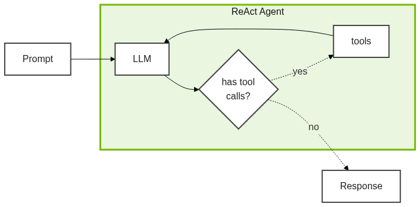

# Introduction to Agents


Welcome to the world of AI agents! In this module, we'll explore how agents apply Large Language Models to solve complex tasks.

<!-- fold:break -->

## What is an Agent?

Large Language Models (LLMs) have an impressive ability to generate text and recall information. On their own, however, they are limited by their training data and cannot interact with the outside world.

**Workflows** extend LLMs by adding pre-defined sequences of operations. Retrieval Augmented Generation (RAG) is a common example: always retrieve documents, then generate a response. The path is fixed by the developer.

**Agents** go further. An agent uses an LLM to *decide* what actions to take. Instead of following a script, the agent reasons about what it needs and chooses the right tools dynamically.

| Approach | Who decides what to do? | Flexibility |
|----------|------------------------|-------------|
| LLM | N/A (single response) | Low |
| Workflow | Developer (hardcoded) | Medium |
| Agent | The LLM itself | High |

<!-- fold:break -->

## Anatomy of an Agent


There are **four key components** fundamental to all agents:

<ul style="margin-left:1em;">
  <li><b>MODEL:</b> The LLM that decides which tools to use and how to respond</li>
  <li><b>TOOLS:</b> Functions that let the agent perform actions (search, calculate, query APIs)</li>
  <li><b>MEMORY/STATE:</b> Information available during and between conversations</li>
  <li><b>ROUTING:</b> The logic that orchestrates flow between reasoning and acting</li>
</ul>

<!-- fold:break -->

## The Model

The model is your agent's brain - it reads the conversation, decides what to do next, and generates responses. Not all LLMs are equally suited for agent work. You want a model that:

- **Supports tool/function calling**: The model needs to output structured tool requests, not just text
- **Follows instructions reliably**: Agents depend on the model respecting system prompts and constraints
- **Reasons well**: Multi-step tasks require the model to plan and adapt

In this workshop, we use **NVIDIA Nemotron 3 Nano (30B)** - a model tuned for a good balance of speed, cost, and reasoning ability. It's hosted on NVIDIA's API catalog, so you can get started without local GPU setup.

### System Prompts

Every agent has a **system prompt** - a special message that defines the agent's personality and behavior. It tells the model:

- **Who it is**: "You are a research assistant..."
- **How to behave**: "Always cite your sources..."
- **When to use tools**: "Search the web when you need current information..."

The same model with different system prompts will behave very differently. We'll see this in action when we build the Report Generation Agent.

<!-- fold:break -->

## Tools

Tools are functions that let your agent interact with the world - searching the web, querying databases, making calculations, or calling APIs. The model doesn't run tools directly; it requests them, and your code executes them.

### Tool Schemas

The LLM needs to know how to use each tool. A **tool schema** describes a tool's name, purpose, and parameters:

```json
{
  "name": "search_web",
  "description": "Search the web for current information",
  "parameters": {
    "query": { "type": "string", "description": "The search query" }
  }
}
```

The quality of your tool descriptions directly affects how well your agent uses them. A vague description like "does stuff with data" won't help the model know when to use it. Be specific about what the tool does and when it should be used.

<!-- fold:break -->

## Memory and State

Memory is what allows agents to maintain context across the conversation. There are two main types:

**Short-term Memory** (Conversation History)
- Everything said in the current conversation
- Tool calls made and their results
- Resets when the conversation ends

**Long-term Memory** (Persistent Knowledge)
- Information that persists across conversations
- Often implemented with databases or vector stores
- Enables personalization and learning

In this module, we focus on short-term memory - the conversation log. In Module 2, you'll see how agents can access external knowledge bases, which is a form of long-term memory.

<!-- fold:break -->

## The Agentic Loop

The core of any agent is a loop where the model decides what happens next:

1. Receive input and available tools
2. Model decides: **respond** or **call a tool**
3. If tool call → execute it, add result to memory, return to step 1
4. If response → return to user

This loop continues until the model decides it has enough information. The model controls the flow, not hardcoded logic.

<!-- fold:break -->

## The ReAct Pattern

**ReAct** (Reasoning + Acting) is the most common agent architecture. The agent alternates between:

- **Thought**: "I need current data on this topic"
- **Action**: Call search tool
- **Observation**: Process search results
- **Thought**: "Now I can answer the question"
- **Action**: Generate response

<center>



</center>

ReAct agents can adapt their approach based on intermediate results, retry failed actions, and decompose complex tasks into steps. This flexibility is what separates agents from fixed workflows.

<!-- fold:break -->

## When to Use Agents

Agents are powerful, but they're not always the right choice. Here's a quick decision framework:

| Use an Agent When... | Use a Simpler Approach When... |
|---------------------|-------------------------------|
| The task path varies based on input | The steps are always the same |
| You need to combine multiple tools dynamically | A single API call or chain suffices |
| Real-time or external information is required | Static data or model knowledge is enough |
| The problem requires multi-step reasoning | Simple transformation or classification |
| User queries are open-ended | Inputs are well-structured |

**Examples of Good Agent Use Cases:**
- Research assistants that search, synthesize, and cite sources
- Customer support bots that check multiple systems (orders, inventory, FAQs)
- Data analysts that choose appropriate queries and visualizations

**Examples Better Suited for Workflows:**
- Document summarization (input → summarize → output)
- Sentiment classification (single model call)
- Template-based content generation

### The Tradeoff

Agents add **flexibility** but also add **cost**:
- **More latency**: Multiple LLM calls take time
- **More tokens**: Reasoning traces use context window
- **More complexity**: More decision points mean more ways to fail

The key question: Does the adaptability justify the overhead for your use case?

<!-- fold:break -->

## Things That Can Go Wrong

Agents aren't perfect. A few things to be aware of:

- **Hallucination**: The model might make up information, especially when tools return no results
- **Infinite loops**: An agent might keep calling tools without making progress
- **Tool misuse**: The model might call tools with incorrect arguments or at the wrong time
- **Cost runaway**: Complex queries can trigger many tool calls, increasing API costs

These aren't reasons to avoid agents - they're reasons to test and monitor them. In Module 3, you'll learn systematic ways to catch these issues.

<!-- fold:break -->

## Do It Yourself

Ready to see these components in action?

Check out the
<button onclick="openOrCreateFileInJupyterLab('code/1-build-an-agent/intro_to_agents.ipynb');"><i class="fa-solid fa-flask"></i> Introduction to Agents</button>
notebook where you'll build your first agent from scratch!

Once you've completed the notebook, continue to [Report Generation Agent](report_generation_agent.md) to see a production-ready implementation using LangChain.


