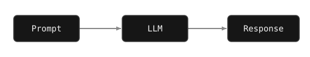
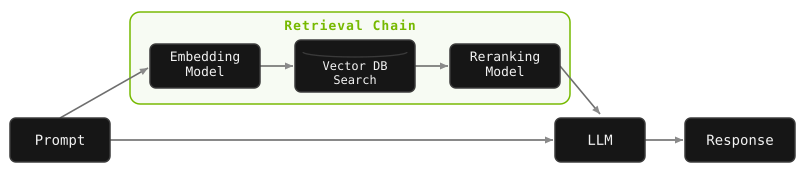
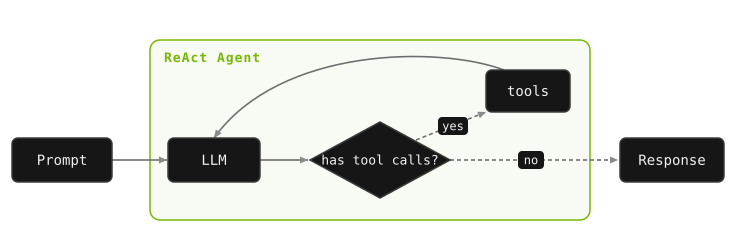
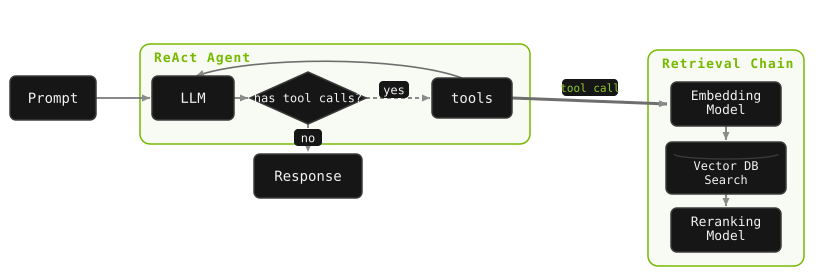

Retrieval Augmented Generation (RAG) is a powerful approach for working with unstructured data in LLM-powered applications. As the AI field evolves, RAG continues to see use, but its implementation is different. Agentic RAG provides flexibility, scalability, and accuracy that would not be practical with traditional RAG.

In this lesson, we will go over a brief history of LLM use and understand why agentic RAG is so important.

<!-- fold:break -->

## LLM Inference

The simplest method for interacting with LLMs is directly prompting them and allowing the model to provide a response. The architecture is simple, but you are limited to only what the model knew at training time.

<!-- fold:break -->

## LLM with RAG

Retrieval augmented generation (RAG) is a useful technique that improves accuracy of LLMs by providing them with additional context at inference time. Typically, this data is recalled from a custom Vector Database.

Unstructured documents can be indexed and saved into the Vector Database. They are then searched by context similarity with the prompt.

<!-- fold:break -->

  
WHERE TRADITIONAL RAG HITS LIMITS

  
RAG works well, but the LLM has no say in how retrieval happens:

  
NO CONTROL The LLM can't control how data is retrieved or choose between different data sources.

  
ALWAYS RETRIEVES It runs the same retrieval step every time, whether the query needs it or not.

  
HARD TO SCALE Supporting multiple datasets or sources gets unwieldy.

  
<b>Agentic RAG</b> fixes this by letting the model decide <i>when and how</i> to use retrieval as a tool - looking things up only when it needs more context to answer a question.

<!-- fold:break -->

## ReAct Agent Architecture

ReAct Agents are a simple agentic architecture that add tool calling support to traditional LLMs. We will use this to build our RAG Agent.

The prompt is provided to the LLM. If the model requests any tool calls, those tools will be run, added to the chat history, and sent back to the model to be invoked again. When no tools are requested, the model's response is sent back.

<!-- fold:break -->

## Agentic RAG Architecture

To make a ReAct Agent do RAG, just give it the Retrieval Chain as a tool. The agent can then decide when and how to search for information.

You can also add more tools for different data sources if needed. This makes your architecture more flexible.

  
CHECK YOUR UNDERSTANDING

  
A user sends your agentic RAG system a simple greeting like "Hi there!". What happens?

  <button class="dx-quiz-opt" data-fb="That's traditional RAG - it runs the same retrieval step for every query. The whole point of agentic RAG is that the model decides whether retrieval is even needed.">It runs the knowledge-base retrieval step, as it does for every query</button>
  <button class="dx-quiz-opt" data-right data-fb="Right. In agentic RAG the model treats retrieval as a tool and only invokes it when the query needs outside context - a greeting doesn't, so it just responds.">The model can skip retrieval entirely and just respond, since no lookup is needed</button>
  <button class="dx-quiz-opt" data-fb="Embeddings are computed to store documents during ingestion, not to answer a greeting. At query time the model decides whether to call the retrieval tool at all.">It must embed the greeting and search the vector database before replying</button>

<!-- fold:break -->

## Let's Build One

Now that we have a basic understanding of RAG, ReAct Agents, and how to plumb them up, let's go build one of our own.

Continue to the [Building Agentic RAG](agentic_rag.md) section to get started!
