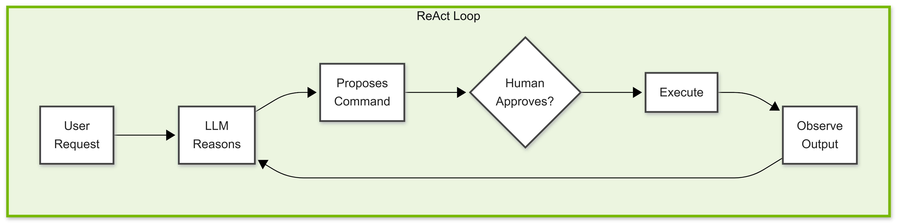
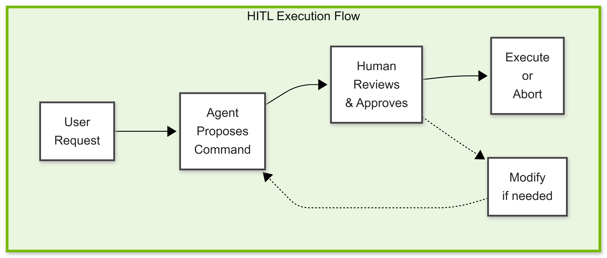

# The Bash Agent


A **Bash Agent** translates natural language into shell commands to be executed in a terminal window. Ask the agent *"list all Python files"* and it generates `find . -name "*.py"`.

This is the same ReAct agentic pattern from Module 1, applied to a different domain. The agent reasons about your request, selects appropriate commands, and executes them—with your approval.

<!-- fold:break -->

## Why a Bash Agent?

We chose this agent use case for customization because:

1. **Observable outputs** — Shell commands are concrete and verifiable. Unlike creative writing, we can objectively check if a command like `langgraph new --template react-agent-python` is correct.

2. **Clear improvement target** — The base model knows generic bash but not LangGraph CLI. This gap is measurable and fixable with training.

3. **Real-world applicability** — Many developers want agents that understand their specific CLIs, APIs, and toolchains.

<!-- fold:break -->

## Agent Architecture

The agent follows the **ReAct pattern** from Module 1—Reason, Act, Observe in a loop—with a critical addition: human approval before any command runs.



**LangGraph** orchestrates this state machine. The human-in-the-loop gate is what makes this agent safe to use on a real system—more on that below.

<!-- fold:break -->

## Human-in-the-Loop

A bash agent that can execute arbitrary shell commands is powerful—and dangerous. Without safeguards, a single hallucinated command could delete files, expose secrets, or corrupt your system. 

**Human-in-the-loop (HITL)** execution is an essential design pattern for agents that take real-world actions.

<!-- fold:break -->

### The Problem with Autonomous Execution

Consider what happens when an agent executes commands immediately:

```
User: "Clean up old log files"
Agent thinks: "I'll remove files older than 7 days"
Agent executes: rm -rf /var/log/*    ← Oops, deleted everything!
```

Even well-trained models can:
- **Hallucinate dangerous commands** — Especially for unfamiliar domains
- **Misinterpret intent** — "Clean up" could mean archive, compress, or delete
- **Make subtle errors** — Wrong path, missing flags, incorrect arguments

The consequences range from inconvenient to catastrophic. For agents with real-world capabilities, **failing safely is more important than succeeding quickly**.

<!-- fold:break -->

### The HITL Pattern

Human-in-the-loop execution adds a confirmation step between generation and execution:



**The agent never executes directly.** Instead, it proposes a command and waits for human approval. This simple change provides:

| Benefit | Description |
|---------|-------------|
| **Catch errors** | Human spots hallucinated or incorrect commands |
| **Verify intent** | Confirm the command matches what you actually wanted |
| **Learn from mistakes** | See what the agent gets wrong before it causes harm |
| **Build trust** | Gain confidence in the agent's capabilities over time |
| **Modify on the fly** | Adjust the proposed command before execution |

<!-- fold:break -->

### What HITL Looks Like in Practice

When you run the bash agent, every command goes through confirmation:

```
You: Create a new react agent project

Agent: I'll create a new LangGraph project with the react-agent template.

Proposed command: langgraph new ./myapp --template react-agent-python

Execute? [y/N]: _
```

You can:
- **Approve (`y`)** — Execute the command as proposed
- **Reject (`n` or Enter)** — Abort without executing
- **Review** — Take time to verify the command is correct

This pause is intentional. It forces you to read and understand what's about to happen.

<!-- fold:break -->

### Beyond HITL: Defense in Depth

HITL is your first line of defense, but production systems often add more layers:

1. **Allowlists** — Only permit known-safe commands (implemented in our agent's config)
2. **Input validation** — Parse and verify command structure before execution
3. **Sandboxing** — Execute in isolated environments where damage is contained
4. **Audit logging** — Record all commands for review and accountability

> 💡 **Looking Ahead**: Module 5 covers **deep agents**—autonomous agents that tackle complex, multi-step tasks. You'll also learn about **sandboxing**, running agents in isolated containers where even dangerous commands can't harm your real system. HITL catches mistakes; sandboxing contains them.

<!-- fold:break -->

## Build the Agent

Let's build out our baseline bash agent. Open <button onclick="openOrCreateFileInJupyterLab('code/4-agent-customization/bash_agent.ipynb');"><i class="fa-solid fa-flask"></i> bash_agent.ipynb</button>

### Exercise: Human-in-the-loop Wrapper

<button onclick="goToLineAndSelect('code/4-agent-customization/bash_agent.ipynb', 'class ExecOnConfirm');"><i class="fas fa-code"></i> ExecOnConfirm</button> — Implement the HITL confirmation gate for command execution.

This is the HITL pattern from above, implemented as a wrapper around the `Bash` tool. If the user confirms via `self._confirm_execution(cmd)`, return `self.bash.exec_bash_command(cmd)`. Otherwise, return a dictionary with `"error"` set to `"User declined."` so the agent knows the command was rejected.

<details>
<summary>🆘 Need some help?</summary>

```python
if self._confirm_execution(cmd):
    return self.bash.exec_bash_command(cmd)
return {"error": "User declined."}
```
</details>

<!-- fold:break -->

### Exercise: Create React Agent

<button onclick="goToLineAndSelect('code/4-agent-customization/bash_agent.ipynb', 'agent = create_react_agent');"><i class="fas fa-code"></i> create_react_agent</button> — Assemble the ReAct agent from model, tools, and prompt.

LangGraph's `create_react_agent` wires together the Reason-Act-Observe loop from Module 1. Implement `agent` with `model` set to `llm`, `tools` set to a list containing your `ExecOnConfirm`-wrapped bash command, and `prompt` set to `config.system_prompt`.

> 💡 We pass `ExecOnConfirm(bash).exec_bash_command` as the tool — not `bash.exec_bash_command` directly — so every command goes through human approval.

<details>
<summary>🆘 Need some help?</summary>

```python
agent = create_react_agent(
    model=llm,
    tools=[
        ExecOnConfirm(bash).exec_bash_command,
        get_skill,              # Load skills for structured workflows
        list_available_skills,  # List available skills
    ],
    prompt=config.system_prompt,
    checkpointer=InMemorySaver(),
)
```
</details>

<!-- fold:break -->

### Exercise: Run Loop

<button onclick="goToLineAndSelect('code/4-agent-customization/bash_agent.ipynb', 'result = agent.invoke');"><i class="fas fa-code"></i> agent.invoke</button> — Send the user's message into the agent loop.

`agent.invoke()` kicks off the full ReAct cycle — reason, propose a tool call, wait for HITL approval, observe the result, and repeat. Implement `result` by invoking the agent with a single message where `"role"` is `"user"` and `"content"` is the `user` input variable.

<details>
<summary>🆘 Need some help?</summary>

```python
result = agent.invoke(
    {"messages": [{"role": "user", "content": user}]},
    config={"configurable": {"thread_id": "cli"}},  # one ongoing conversation
)
```
</details>

<!-- fold:break -->

## Running the Agent

After completing the exercises, run your agent in the <button onclick="openNewTerminal();"><i class="fas fa-terminal"></i> terminal</button>:

Make sure you're in the `code/4-agent-customization` directory:

```bash
cd code/4-agent-customization
```

And start the agent you just built: 

```bash
python3 -m bash_agent.main_langgraph
```

Try a sample query: `"List all files"` → `ls`

<!-- fold:break -->

### Superpowers Skills

The Bash Agent includes skills from the [Superpowers](https://github.com/obra/superpowers) framework—structured workflows that guide the agent through complex tasks.

| Skill | Purpose |
|-------|---------|
| `systematic-debugging` | 4-phase root cause analysis before fixing bugs |
| `test-driven-development` | RED-GREEN-REFACTOR workflow |
| `brainstorming` | Socratic design refinement |
| `writing-plans` | Create detailed implementation plans |
| `executing-plans` | Execute plans with checkpoints |

<!-- fold:break -->

### How to Use

The agent can load skills on demand:

- *"List available skills"* — See all skills
- *"Load the systematic-debugging skill"* — Get the full workflow
- *"I have a bug, what skill should I use?"* — Get recommendations

Skills transform the agent from a simple command executor into a methodical problem-solver that follows proven workflows.

<!-- fold:break -->

## The Gap We'll Fix

Now that we've built our baseline bash agent, let's identify the gap we'll close through customization. Try these prompts and note what the base agent produces:

| Prompt | What You Might Get | What It Should Be |
|--------|-------------------|-------------------|
| *"Create a new LangGraph project with the react template"* | Hallucinated or generic command | `langgraph new ./myapp --template react-agent-python` |
| *"Start a dev server on port 8080"* | Wrong flags or syntax | `langgraph dev --port 8080` |
| *"Build a docker image tagged v2"* | Missing LangGraph-specific flags | `langgraph build --tag v2` |

The base model knows generic bash but has never seen the LangGraph CLI. It guesses—and guesses wrong. By the end of this module, that same agent will reliably produce correct commands because the knowledge will be **baked into the model's weights**.

Now let's take a look at [Synthetic Data Generation](sdg.md) to get started with the customization pipeline.
