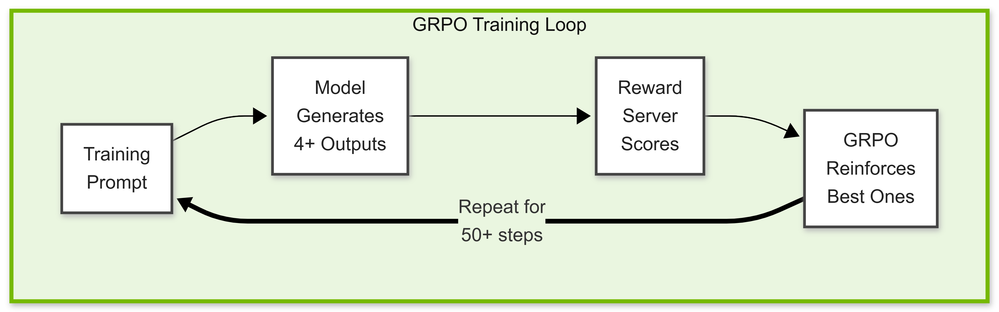

# GRPO Training


You have your dataset. Now how do you teach the model with it?

| Approach | How It Works | Best For |
|----------|--------------|----------|
| **SFT (Supervised Fine-Tuning)** | "Memorize: input X → output Y" | Simple tasks, abundant data |
| **GRPO (RL-based)** | "Try multiple outputs, learn which score highest" | Complex tasks, verifiable correctness |

**GRPO (Group Relative Policy Optimization)** is a form of reinforcement learning with verifiable rewards (RLVR) that generates multiple candidate responses per prompt, scores them with a reward function, and reinforces the better ones. This exploration often discovers solutions that pure imitation would miss.

<!-- fold:break -->

## Verifiable Rewards

In Module 3, you learned about LLM-as-judge for evaluation. That works for subjective qualities (helpfulness, tone). But for **structured outputs**, we can do better.

CLI commands are either correct or wrong—no subjectivity. A reward server can check:
- Is the JSON valid?
- Is `command` one of `[new, dev, up, build, dockerfile]`?
- Are the parameters correct for that command type?

This is **RLVR (RL with Verifiable Rewards)**:
- **Objective** — No judge bias or inconsistency
- **Fast** — Milliseconds per verification
- **Scalable** — No human annotators needed

The NeMo Gym server runs these checks and returns reward scores to guide training.

<!-- fold:break -->

## Understanding GRPO

**Click on each of the following questions to learn more.**

<details>
<summary><strong>How does GRPO actually work?</strong></summary>

GRPO (Group Relative Policy Optimization) is a form of reinforcement learning that learns from *relative* performance within a group of outputs:

1. **Generates multiple outputs** (typically 4-8) for each training prompt
2. **Scores each output** using a reward function (in our case, the NeMo Gym verifier)
3. **Computes advantages** — how much better each output is compared to the group average
4. **Updates weights** to increase probability of higher-reward outputs

**The key insight**: Instead of saying "memorize this exact answer," GRPO says "explore the output space and learn which patterns score higher." This exploration often discovers better solutions than pure imitation.

**Mathematical intuition**:
```
Advantage = (reward - group_mean) / group_std
Loss = -log(probability) * advantage
```

Outputs that score above the group average get reinforced; below-average outputs get suppressed. The model learns *what makes outputs good*, not just specific answers.

**Why "Group Relative"?** By comparing within a group rather than to a fixed baseline, GRPO adapts to the model's current ability level. Early in training when all outputs are poor, it still finds the *relatively* better ones to reinforce.

</details>

<details>
<summary><strong>SFT vs GRPO: When to use which?</strong></summary>

| Aspect | SFT (Supervised Fine-Tuning) | GRPO (RL-based) |
|--------|------------------------------|-----------------|
| **Learning signal** | "Copy this exact output" | "Outputs like this score higher" |
| **Data requirement** | Need perfect gold outputs | Need reward signal (can be noisy) |
| **Exploration** | None — imitates only | Yes — tries variations |
| **Overfitting risk** | High if data is small | Lower due to exploration |
| **Best for** | Abundant high-quality data | Verifiable correctness, structured outputs |

**Use SFT when:**
- You have thousands of human-verified examples
- The task has one clearly correct answer format
- You want fast, predictable training

**Use GRPO when:**
- You can programmatically verify correctness
- The output space has multiple valid solutions
- You want the model to discover optimal patterns

**For CLI agents**: GRPO excels because CLI commands are verifiable (they either parse correctly or don't), and there may be multiple valid ways to express the same command.

</details>

<details>
<summary><strong>How do I know training is working?</strong></summary>

**Key metrics to monitor during training:**

| Metric | Healthy Range | Warning Signs |
|--------|---------------|---------------|
| **Mean Reward** | Increasing over steps | Flat or decreasing after warmup |
| **Reward Std** | Decreasing over time | Remains high (model still uncertain) |
| **Loss** | Decreasing, then stabilizing | Oscillating wildly or exploding |
| **Gradient Norm** | Stable, typically < 10 | Exploding (> 100) or vanishing (< 0.001) |

**Red flags and what they mean:**

| Pitfall | Symptom | Solution |
|---------|---------|----------|
| **Sparse rewards** | Mean reward stuck near 0 | Add partial credit for almost-correct outputs |
| **Reward hacking** | High training reward, poor real performance | Add more validation components; test on held-out data |
| **Inconsistent rewards** | Same output gets different scores | Ensure reward function is deterministic |
| **High Learning Rate** | Rewards spike and then crash | Learning rate too high; reduce by 2-5x |
| **Slow verification** | Training takes forever | Optimize reward code; batch requests to server |
| **Reward scale issues** | Gradients explode or vanish | Normalize rewards to [0, 1] range |

</details>

<!-- fold:break -->

## Reward Engineering

Your reward function is the most important piece of GRPO training. It defines what "good" means—get it wrong, and your model learns the wrong behaviors.

### Principles of Good Rewards

**Click on each of the following principles to learn more.**

<details>
<summary><strong>1. Verifiable — Check with code, not vibes</strong></summary>

The power of RLVR is that rewards are *objective*. For CLI commands:

```python
# Good: Code-verifiable
def reward(output):
    try:
        parsed = json.loads(output)
        if parsed["command"] in VALID_COMMANDS:
            return 1.0
    except:
        pass
    return 0.0

# Bad: Subjective (requires LLM judge)
def reward(output):
    return llm_judge("Is this a good CLI command?", output)
```

LLM judges add latency, cost, and inconsistency. For structured outputs, code verification is always better.

</details>

<details>
<summary><strong>2. Granular — Partial credit beats binary pass/fail</strong></summary>

A binary reward (1.0 or 0.0) provides sparse signal. The model doesn't know *how close* it was.

```python
# Binary (sparse signal)
reward = 1.0 if perfect_match else 0.0

# Granular (rich signal)
reward = (
    0.2 * json_is_valid +      # Got the format right
    0.3 * command_is_valid +    # Picked a real command
    0.5 * flags_are_correct     # Parameters match
)
```

With granular rewards, a response with correct JSON but wrong command scores 0.2 instead of 0.0. This gradient helps the model learn incrementally.

</details>

<details>
<summary><strong>3. Aligned — Reward what you actually care about</strong></summary>

Models optimize for the reward you give, not the reward you intended. Be careful of:

- **Reward hacking**: Model finds shortcuts that score high but miss the point
- **Proxy gaming**: Optimizing a measurable proxy instead of true goal
- **Distributional shift**: Training rewards don't match deployment conditions

**Example of misaligned reward:**
```python
# Intended: Reward correct CLI commands
# Actual: Rewards ANY valid JSON
def bad_reward(output):
    try:
        json.loads(output)
        return 1.0  # Oops—empty {} scores perfectly!
    except:
        return 0.0
```

Always test your reward function on edge cases before training.

</details>

<!-- fold:break -->

### Anatomy of Our Reward Function

The NeMo Gym verifier computes a **composite reward** with multiple components:

| Component | Weight | What It Checks |
|-----------|--------|----------------|
| `json_format_reward` | 0.2 | Is the output valid JSON? |
| `command_reward` | 0.3 | Is `command` one of the valid CLI commands? |
| `flag_accuracy_reward` | 0.5 | Are the flags/parameters correct for this command? |

**Why these weights?** Flags carry the most information (many possible values), so they get the highest weight. JSON format is easiest, so it gets the lowest. Commands are intermediate.

<!-- fold:break -->

## The Full Training Loop



To make this concrete, here's what happens in a single training step. The model sees: *"Create a new project with the react template"* and generates 4 candidates:

| # | Model Output | Reward |
|---|-------------|--------|
| 1 | `{"command": "new", "template": "react-agent-python", "path": "./myapp"}` | **0.95** |
| 2 | `{"command": "new", "template": "wrong-template"}` | **0.50** |
| 3 | `{"command": "create", "template": "react"}` | **0.20** |
| 4 | `not valid json` | **0.00** |

GRPO computes that Response #1 scored above the group average and reinforces its patterns. Response #4 scored far below, so those patterns are suppressed. Over many steps, the model converges toward reliably producing correct outputs.

<!-- fold:break -->

## GRPO: Hands-on Implementation

Open a <button onclick="openNewTerminal();"><i class="fas fa-terminal"></i> terminal</button> window — Start reward server:

```bash
cd code/4-agent-customization/nemo_gym_resources/langgraph_cli
uvicorn app:app --host 0.0.0.0 --port 8000
```

Then open the following notebook: <button onclick="openOrCreateFileInJupyterLab('code/4-agent-customization/02_grpo_training.ipynb');"><i class="fa-solid fa-flask"></i> 02_grpo_training.ipynb</button>

<!-- fold:break -->

### Exercise: Reward Function

<button onclick="goToLineAndSelect('code/4-agent-customization/02_grpo_training.ipynb', 'def reward_fn');"><i class="fas fa-code"></i> reward_fn</button> — Call the NeMo Gym `/verify` endpoint to score model outputs.

This is the bridge between GRPO and verifiable rewards: each model completion gets sent to the NeMo Gym server, which returns a composite reward score (JSON format + command correctness + flag accuracy). Implement `resp` by posting to `verify_endpoint` with `json` set to `verify_request`, then extract `reward` from the response JSON (defaulting to `0.0`).

<details>
<summary>🆘 Need some help?</summary>

```python
resp = requests.post(verify_endpoint, json=verify_request)
reward = resp.json().get("reward", 0.0)
```
</details>

<!-- fold:break -->

### Exercise: Training Config

<button onclick="goToLineAndSelect('code/4-agent-customization/02_grpo_training.ipynb', 'training_args = GRPOConfig');"><i class="fas fa-code"></i> GRPOConfig</button> — Configure the GRPO hyperparameters.

These three settings control the core training dynamics: `num_generations` is how many candidate outputs GRPO generates per prompt (more = richer comparison signal), `learning_rate` controls the step size for weight updates, and `max_steps` caps the total training iterations. Implement `training_args` with `num_generations=4`, `learning_rate=1e-5`, and `max_steps=50`.

<details>
<summary>🆘 Need some help?</summary>

```python
training_args = GRPOConfig(
    num_generations=4,
    learning_rate=1e-5,
    max_steps=50,
)
```
</details>

<!-- fold:break -->

### Exercise: GRPO Trainer

<button onclick="goToLineAndSelect('code/4-agent-customization/02_grpo_training.ipynb', 'trainer = GRPOTrainer');"><i class="fas fa-code"></i> GRPOTrainer</button> — Wire up the model, reward function, and dataset into the trainer.

The `GRPOTrainer` orchestrates the full training loop shown above: generate completions, score them via the reward function, and reinforce the best ones. Implement `trainer` with `model`, `reward_funcs` as a single-item list containing `reward_fn`, and `train_dataset`.

<details>
<summary>🆘 Need some help?</summary>

```python
trainer = GRPOTrainer(
    model=model,
    reward_funcs=[reward_fn],
    train_dataset=train_dataset,
)
```
</details>

<!-- fold:break -->

### Train the Agent

Run `trainer.train()` notebook cell — should take around **~60-70 min** to complete on an A100/H100.

The customized model should appear in this location when completed: `outputs/grpo_langgraph_cli/merged_model/`. 

<!-- fold:break -->

## Troubleshooting

If you're running into issues, click on any of the following to learn more. 

<details>
<summary><strong>Rewards not improving</strong></summary>

**Possible causes and fixes:**

1. **Reward function bug**
   - Test manually: `reward_fn([{"content": '{"command": "new"}'}])`
   - Should return > 0 for valid outputs

2. **Learning rate too low**
   - Try increasing by 2x or 5x
   - Default 1e-5 is conservative; 5e-5 often works better

3. **Data lacks diversity**
   - Check: Are all training examples similar?
   - SDG should produce varied phrasings and command types

4. **Not enough training steps**
   - 50 steps is a minimum; try 100-200 for complex tasks

5. **Model capacity too small**
   - Larger base models learn faster (but cost more)

</details>

<details>
<summary><strong>Training crashes with OOM (Out of Memory)</strong></summary>

**Solutions in order of preference:**

1. Reduce `num_generations` from 4 to 2
2. Reduce `per_device_train_batch_size` to 1
3. Increase `gradient_accumulation_steps` to compensate
4. Enable gradient checkpointing (usually on by default)
5. Use 8-bit or 4-bit quantization if model supports it
6. Reduce `max_seq_length` if your prompts allow

**Memory usage scales with:** batch_size × num_generations × seq_length

</details>

<details>
<summary><strong>Model outputs garbage after training</strong></summary>

**Possible causes:**

1. **Catastrophic forgetting** — Learning rate too high destroyed base capabilities
   - Solution: Lower learning rate by 5-10x

2. **Overfit to reward function** — Model found degenerate solutions
   - Solution: Add more diverse training data; regularize

3. **Trained too long** — Passed optimal point
   - Solution: Use validation set to detect overfitting; save checkpoints

**Recovery:**
- Start from an earlier checkpoint (before degradation)
- Reduce learning rate significantly
- Add more training data variety

</details>

<details>
<summary><strong>Validation reward much lower than training reward</strong></summary>

This indicates **overfitting** — the model memorized training examples rather than learning generalizable patterns.

**Solutions:**
1. Add more training data (SDG can generate more)
2. Increase `weight_decay` for regularization
3. Reduce training steps / use early stopping
4. Ensure training and validation have similar distributions

</details>

<!-- fold:break -->


Congrats, you now have successfully customized your Bash agent using Reinforcement Learning with Verifiable Rewards (RLVR) and Group Relative Policy Optimization (GRPO)!

Now that we've completed training the agent, let's run it again and see whether or not it's learned the new Langgraph CLI domain. Head over to [Run Customized Agent](run_customized.md) and get started!
