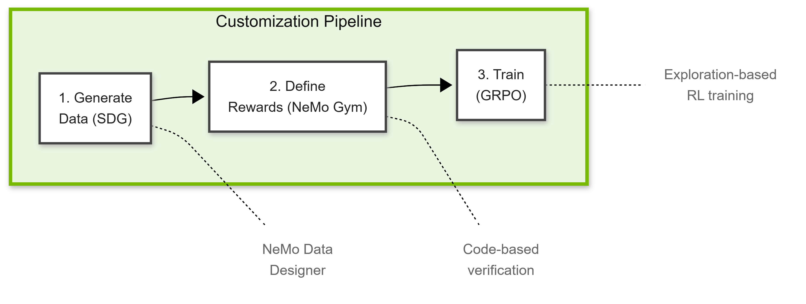

# Introduction to Customization

In Module 3, you learned to **measure** agent performance — faithfulness, relevance, tone, and so on. But what happens when the metrics reveal problems?

Typically, you may have three overarching options:
1. **Prompt engineering** — Tweak the agent's instructions (quick but limited)
2. **Add tools/skills** — Give the agent more functionality (expand capability)
3. **Train the agent** — Fundamentally improve its understanding (specialize knowledge)

Options 1 and 2 were covered in Modules 1 and 2. These work well for many issues, but some problems resist surface-level fixes. When a model fundamentally doesn't understand your domain, this is where training the agent shines. 

<!-- fold:break -->

## Model Customization

Before diving into the specifics, let's build intuition for what "training" actually means in this context. Let's begin with models. 

A pretrained language model already understands grammar, reasoning, and general knowledge. Customization doesn't start from scratch—it **specializes** what the model already knows. This is why customization works even with small datasets: you're teaching domain expertise, not language itself.

There are two main approaches to training:

| Approach | How It Learns |
|----------|---------------|
| **SFT (Supervised Fine-Tuning)** | "Memorize: input X → output Y" |
| **GRPO (RL-based)** | "Try multiple answers, learn which score highest" |

SFT works well with abundant, high-quality examples. **GRPO** works better when you can programmatically verify correctness—which is exactly our case with CLI commands.

<!-- fold:break -->

## Agent Customization

Now, let's apply this to agents. When your agent needs domain expertise, you have two architectural choices:

### Path A: Skills & MCP (Runtime Knowledge)

In Module 2, you added **Skills** (dynamic instructions the agent loads) and **MCP** (tools the agent calls). This works well for:

- General-purpose capabilities (web search, calendar, email)
- Workflows that are repeatable and/or change frequently
- Knowledge that's too large to train on
- Use cases that can afford a bit of latency

**The limitation**: Every skill and tool competes for the model's attention. With 5 tools, selection is easy. With 50+, models start picking wrong tools, hallucinating parameters, or forgetting which tool does what.

> 💡 **Key question**: Can prompt engineering and tools get you 90% of the way? If so, the upfront cost of training may not be justified. If the model consistently fails despite high quality prompts, training is the right investment.

<!-- fold:break -->

### Path B: Training (Baked-in Knowledge)

Training writes knowledge directly into the model's weights. The model doesn't *consult* an expert—it *becomes* one. This works well for:

- Stable, well-defined domains (your specific CLI, your API)
- Workflows that are one-time, set-and-forget, or don't change frequently
- Tasks requiring precise structured output
- High-frequency use cases where latency matters

**The trade-off**: Upfront investment in data and compute, but permanent capability with no runtime overhead.

| Approach | Best For | When to Use |
|----------|----------|-------------|
| **Skills/MCP** | Breadth, flexibility | Many simple tools, changing procedures |
| **Training** | Depth, precision | Your core domain, structured outputs |

> 💡 **Rule of thumb**: Use Skills/MCP for breadth. Use training for depth. Many production systems combine both.

<!-- fold:break -->

## The Customization Pipeline

Training an agent requires three components working together:

### 1. Training Data (NeMo Data Designer)

You need examples of what the agent should do. For a CLI agent:
- **Input**: "Create a new react agent project"
- **Output**: `{"command": "new", "template": "react-agent-python", "path": "./myapp"}`

**The cold-start problem**: You don't have real user logs yet. **Synthetic Data Generation (SDG)** solves this by programmatically creating diverse, realistic examples from templates and variations.

<!-- fold:break -->

### 2. Success Metrics (NeMo Gym)

How does the model know if its output is good? In Module 3, you used LLM-as-judge. For well-structured outputs like CLI commands, we can do better: **code-based verification**.

A reward server checks:
- Is the JSON valid?
- Is `<command>` a real CLI command?
- Are the parameters correct for that command?

This is **RLVR (Reinforcement Learning with Verifiable Rewards)** — objective, consistent, and scalable.

<!-- fold:break -->

### 3. Training Algorithm (GRPO)

Traditional fine-tuning says "memorize this answer." **GRPO (Group Relative Policy Optimization)** says "try multiple answers and learn which ones score higher."

The model generates 4+ candidate responses per prompt. The reward server scores each one. The model learns to produce higher-scoring outputs. This exploration-based learning often beats pure imitation from other conventional methods like SFT.

| Step | Tool | What It Does |
|------|------|--------------|
| Generate data | **NeMo Data Designer** | Creates input/output training pairs |
| Define rewards | **NeMo Gym** | Verifies outputs with code |
| Train model | **GRPO** | Learns from reward signals |

<!-- fold:break -->

Ready to turn your built agents into specialized experts? Let's continue to [The Bash Agent](bash_agent.md) to learn about the agent example we'll use.
