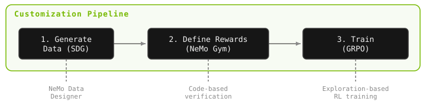

In Module 3, you learned to **measure** agent performance — faithfulness, relevance, tone, and so on. But what happens when the metrics reveal problems?

Typically, you have three overarching levers:

  
THREE WAYS TO IMPROVE AN AGENT

  <ul>
    <li>PROMPT ENGINEERING tweak the agent's instructions - quick, but limited.</li>
    <li>ADD TOOLS / SKILLS give the agent more functionality - expands capability.</li>
    <li>TRAIN THE AGENT fundamentally improve its understanding - specializes knowledge.</li>
  </ul>

Options 1 and 2 were covered in Modules 1 and 2. These work well for many issues, but some problems resist surface-level fixes. When a model fundamentally doesn't understand your domain, this is where training the agent shines. 

<!-- fold:break -->

## Model Customization

Before diving into the specifics, let's build intuition for what "training" actually means in this context. Let's begin with models. 

A pretrained language model already understands grammar, reasoning, and general knowledge. Customization doesn't start from scratch—it **specializes** what the model already knows. This is why customization works even with small datasets: you're teaching domain expertise, not language itself.

There are two main approaches to training:

  
<h4>SFT - SUPERVISED FINE-TUNING</h4>Memorize: input X produces output Y. Works well with abundant, high-quality examples.

  
<h4>GRPO - RL-BASED</h4>Try multiple answers, learn which score highest. Better when you can programmatically verify correctness.

SFT works well with abundant, high-quality examples. **GRPO** works better when you can programmatically verify correctness—which is exactly our case with CLI commands.

<!-- fold:break -->

## Agent Customization

Now, let's apply this to agents. When your agent needs domain expertise, you have two architectural choices:

### Path A: Skills & MCP (Runtime Knowledge)

In Module 2, you added **Skills** (dynamic instructions the agent loads) and **MCP** (tools the agent calls). This works well for:

- General-purpose capabilities (web search, calendar, email)
- Workflows that are repeatable and/or change frequently
- Knowledge that's too large to train on
- Use cases that can afford a bit of latency

**The limitation**: Every skill and tool competes for the model's attention. With 5 tools, selection is easy. With 50+, models start picking wrong tools, hallucinating parameters, or forgetting which tool does what.

> 💡 **Key question**: Can prompt engineering and tools get you 90% of the way? If so, the upfront cost of training may not be justified. If the model consistently fails despite high quality prompts, training is the right investment.

<!-- fold:break -->

### Path B: Training (Baked-in Knowledge)

Training writes knowledge directly into the model's weights. The model doesn't *consult* an expert—it *becomes* one. This works well for:

- Stable, well-defined domains (your specific CLI, your API)
- Workflows that are one-time, set-and-forget, or don't change frequently
- Tasks requiring precise structured output
- High-frequency use cases where latency matters

**The trade-off**: Upfront investment in data and compute, but permanent capability with no runtime overhead.

  
<h4>SKILLS / MCP</h4>BREADTH Best for many simple tools and changing procedures - flexibility at runtime.

  
<h4>TRAINING</h4>DEPTH Best for your core domain and structured outputs - precision baked into the weights.

> 💡 **Rule of thumb**: Use Skills/MCP for breadth. Use training for depth. Many production systems combine both.

<!-- fold:break -->

  
CHECK YOUR UNDERSTANDING

  
Your agent already does the job with good prompts and a couple of tools, and the metrics look fine. Should you train it?

  <button class="dx-quiz-opt" data-right data-fb="Right. If prompting and tools get you ~90% of the way, the upfront cost of training usually isn't justified. Train when the model fundamentally doesn't understand your domain.">Probably not - if prompts and tools already work, training's upfront cost isn't justified</button>
  <button class="dx-quiz-opt" data-fb="Training is not a free upgrade - it costs data and compute. Reach for it only when prompting and tools genuinely fall short.">Yes - training always improves performance</button>
  <button class="dx-quiz-opt" data-fb="They are complementary, not exclusive. Many production systems use prompts and tools for breadth and training for depth.">Yes - training replaces prompts and tools</button>
  <button class="dx-quiz-opt" data-fb="Hardware is a logistics question, not the deciding factor. The real question is whether the model lacks domain understanding that prompts and tools cannot supply.">Only if you have a spare GPU</button>

<!-- fold:break -->

## The Customization Pipeline

Training an agent requires three components working together:

  
<h4>1 &middot; GENERATE DATA</h4>NeMo Data Designer Synthetic input/output pairs that cover the whole command space - no real user logs needed.

  
<h4>2 &middot; DEFINE REWARDS</h4>NeMo Gym Code-based verification scores each output - objective, fast, no judge bias.

  
<h4>3 &middot; TRAIN</h4>GRPO The model generates candidates, the reward server scores them, the best are reinforced.

### 1. Training Data (NeMo Data Designer)

You need examples of what the agent should do. For a CLI agent:
- **Input**: "Create a new react agent project"
- **Output**: `{"command": "new", "template": "react-agent-python", "path": "./myapp"}`

**The cold-start problem**: You don't have real user logs yet. **Synthetic Data Generation (SDG)** solves this by programmatically creating diverse, realistic examples from templates and variations.

<!-- fold:break -->

### 2. Success Metrics (NeMo Gym)

How does the model know if its output is good? In Module 3, you used LLM-as-judge. For well-structured outputs like CLI commands, we can do better: **code-based verification**.

A reward server checks:
- Is the JSON valid?
- Is `<command>` a real CLI command?
- Are the parameters correct for that command?

This is **RLVR (Reinforcement Learning with Verifiable Rewards)** — objective, consistent, and scalable.

<!-- fold:break -->

### 3. Training Algorithm (GRPO)

Traditional fine-tuning says "memorize this answer." **GRPO (Group Relative Policy Optimization)** says "try multiple answers and learn which ones score higher."

The model generates 4+ candidate responses per prompt. The reward server scores each one. The model learns to produce higher-scoring outputs. This exploration-based learning often beats pure imitation from other conventional methods like SFT.

| Step | Tool | What It Does |
|------|------|--------------|
| Generate data | **NeMo Data Designer** | Creates input/output training pairs |
| Define rewards | **NeMo Gym** | Verifies outputs with code |
| Train model | **GRPO** | Learns from reward signals |

<!-- fold:break -->

Ready to turn your built agents into specialized experts? Let's continue to [The Bash Agent](bash_agent.md) to learn about the agent example we'll use.
