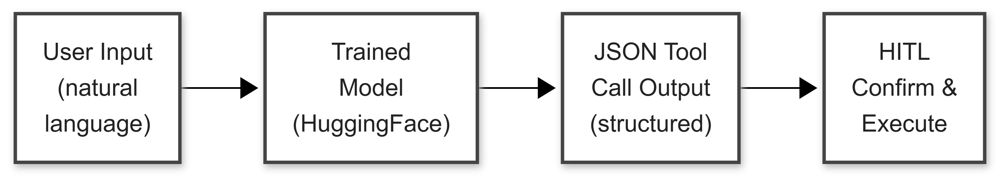

# Run Customized Agent


Congratulations, you've now completed the customization pipeline:
1. ✅ Built a base agent (generic bash knowledge)
2. ✅ Generated training data (SDG for LangGraph CLI)
3. ✅ Trained with GRPO (verifiable rewards)

Now you have a **specialized agent**. The training baked LangGraph CLI knowledge directly into the model's weights—it doesn't need to consult tools or documentation to know LangGraph CLI commands.

<!-- fold:break -->

But how do we actually *use* the trained model? The training notebook saved a merged model checkpoint. Now we need to:
1. **Load the trained model** instead of the generic base model
2. **Use the right prompt format** — the model was trained with a specific JSON system prompt, and we need to match that at inference time
3. **Wire up the same HITL execution** — the model is smarter, but safety patterns still apply

<!-- fold:break -->

## From Training to Inference

During GRPO training, the model learned to map natural language requests to structured JSON tool calls. At inference time, the flow looks like this:



The key difference from the base agent in `bash_agent.ipynb`: instead of calling a remote NIM model via API, we're running the trained model **locally** with HuggingFace Transformers. The `HuggingFaceLLM` class handles model loading, tokenization, and parsing the structured JSON output.

<!-- fold:break -->

## Run the Agent: Hands-on Implementation

Open the following notebook: <button onclick="openOrCreateFileInJupyterLab('code/4-agent-customization/03_run_agent.ipynb');"><i class="fa-solid fa-flask"></i> 03_run_agent.ipynb</button>

### Exercise: Load Model

<button onclick="goToLineAndSelect('code/4-agent-customization/03_run_agent.ipynb', 'llm = HuggingFaceLLM');"><i class="fas fa-code"></i> HuggingFaceLLM</button> — Load the trained model for local inference.

The `HuggingFaceLLM` class wraps HuggingFace Transformers to provide the same interface as the NIM-based LLM from the base agent. It loads the trained checkpoint from `config.model_path` (which points to `outputs/grpo_langgraph_cli/merged_model`), handles tokenization, and parses structured JSON tool calls from the model's output.

Implement `llm` by instantiating `HuggingFaceLLM` with the `config` object.

<details>
<summary>🆘 Need some help?</summary>

```python
llm = HuggingFaceLLM(config)
```
</details>

<!-- fold:break -->

### Exercise: System Prompt

<button onclick="goToLineAndSelect('code/4-agent-customization/03_run_agent.ipynb', 'messages = Messages');"><i class="fas fa-code"></i> Messages</button> — Initialize conversation with the JSON system prompt.

Implement `messages` by creating a `Messages` instance with `config.json_system_prompt`.

This is a subtle but critical detail: the model was trained with `config.json_system_prompt`, which instructs it to produce **structured JSON tool calls**. If you use the generic `config.system_prompt` instead, the model's output format won't match what it learned during GRPO training, and performance will degrade.

> 💡 **Why this matters**: During training, the system prompt was part of every input. The model learned to produce correct outputs *conditioned on that specific prompt*. Changing the prompt at inference time is like studying for one exam and sitting for a different one.

<details>
<summary>🆘 Need some help?</summary>

```python
messages = Messages(config.json_system_prompt)
```
</details>

<!-- fold:break -->

### Exercise: Execute with Human-in-the-Loop

<button onclick="goToLineAndSelect('code/4-agent-customization/03_run_agent.ipynb', 'tool_result = bash.exec_bash_command');"><i class="fas fa-code"></i> exec_bash_command</button> — Execute the command after user confirmation.

Even though the trained model is more accurate, the HITL pattern from `bash_agent.md` still applies. A smarter model reduces the frequency of errors but doesn't eliminate them—especially for edge cases outside the training distribution. The `confirm_execution()` function prompts the user before any command runs.

Implement the execution block: if the user confirms the command, execute it with `bash.exec_bash_command(command)` and store the result in `tool_result`.

<details>
<summary>🆘 Need some help?</summary>

```python
if confirm_execution(command):
    tool_result = bash.exec_bash_command(command)
```
</details>

<!-- fold:break -->

## Run the Agent Interactively

After completing the exercises, start your new agent in the <button onclick="openNewTerminal();"><i class="fas fa-terminal"></i> terminal</button>:

Make sure you're in the `code/4-agent-customization` directory:

```bash
cd code/4-agent-customization
```

And start your customized bash agent:

```bash
python3 -m bash_agent.main_hf
```

<!-- fold:break -->

### Test the Customized Agent

Try some of the following commands and compare how the trained agent performs versus the base agent you ran earlier:

| Request | Before Training | After Training |
|---------|-----------------|----------------|
| "List files" | ✅ `ls` | ✅ `ls` |
| "Create a react agent" | ❌ Hallucinated command | ✅ `langgraph new ./myapp --template react-agent-python` |
| "Start dev server on 8080" | ❌ Wrong parameters | ✅ `langgraph dev --port 8080` |
| "Build image tagged v2" | ❌ Missing flags | ✅ `langgraph build --tag v2` |

Notice that generic bash commands (like `ls`) work the same — GRPO training added LangGraph expertise without destroying existing capabilities. This is because GRPO's exploration-based learning reinforces correct patterns rather than overwriting the model's knowledge wholesale.

<!-- fold:break -->

## Measuring the Improvement

The reward function you built for GRPO training doubles as an evaluation metric. Run your validation set against both the base and trained models to quantify the improvement:

| Metric | Base Model | Trained Model |
|--------|-----------|---------------|
| **JSON Format Accuracy** | ~30% | ~95% |
| **Command Correctness** | ~10% | ~90% |
| **Flag Accuracy** | ~5% | ~85% |
| **Overall Mean Reward** | ~0.15 | ~0.90 |

This closes the loop with Module 3: the same evaluation mindset applies, but now your reward function provides **objective, automated scoring** rather than relying on an LLM judge.

<!-- fold:break -->

### What If Results Aren't Good Enough?

If the trained model still makes mistakes, apply the iterative improvement cycle from Module 3:

1. **Analyze failure patterns** — Which commands or flags fail most? Use the reward function's component scores (JSON format, command correctness, flag accuracy) to pinpoint weak spots.
2. **Generate targeted data** — SDG can oversample weak areas. If `dockerfile` commands have low accuracy, generate more examples with diverse `output_path` values.
3. **Adjust reward weights** — If the model gets commands right but flags wrong, increase the `flag_accuracy_reward` weight to focus training attention there.
4. **Train longer** — 50 steps is a starting point. Extending to 100-200 steps often improves edge case handling.

The pattern is always: **measure → diagnose → fix → retrain → re-measure**.

<!-- fold:break -->

## Module Wrap-Up


Training is powerful, but it's not the only way to customize an agent — and it's not always the right one. A well-prompted agent with the right tools solves most problems. Training fills the gap when the model fundamentally doesn't understand your domain, and no amount of prompting or tooling can bridge that gap. In practice, the best agents combine all of these: good prompts set the baseline, tools extend reach, training deepens expertise, and evaluation tells you when to invest in each.

Congratulations! You've completed the Agent Customization module. Let's recap what you've accomplished. 

<!-- fold:break -->

### What You Learned

| Topic | Key Takeaway |
|-------|--------------|
| **Why Customize** | Training beats Skills/MCP for depth; use both for breadth + depth |
| **The Pipeline** | SDG → GRPO → Deployment is a repeatable pattern |
| **Synthetic Data** | Schema-driven generation ensures coverage, diversity, and validity |
| **Verifiable Rewards** | Code-based verification is faster and more consistent than LLM judges |
| **GRPO Training** | Exploration-based learning discovers better solutions than imitation |
| **Safe Execution** | Allowlists and human-in-the-loop protect against dangerous commands |

<!-- fold:break -->

### The Generalizable Pattern

Everything you learned extends beyond LangGraph CLI:

| Domain | Output Schema | Verification |
|--------|---------------|--------------|
| **kubectl** | Kubernetes resource specs | `kubectl apply --dry-run` |
| **terraform** | HCL resource definitions | `terraform validate` |
| **SQL** | Query structure | Database execution / EXPLAIN |
| **docker** | Container commands | Docker CLI validation |
| **Your internal CLI** | Your Pydantic models | Your validation logic |

The pattern is always:
1. **Define schema** — What are valid outputs?
2. **Generate data** — Cover the output space systematically
3. **Design rewards** — How do you verify correctness with code?
4. **Train with GRPO** — Let the model explore and learn

<!-- fold:break -->

### The Full Workshop Arc

Each module in this workshop so far introduced a different customization lever while enabling you to complete agent development lifecycle: 

| Module | What You Learned | Key Capability | Customization Lever |
|--------|-----------------|----------------|----------------|
| **Module 1** | Build agents with ReAct | Agent fundamentals | System Prompt Engineering | 
| **Module 2** | Extend with RAG, tools, and skills | Agent capabilities | Adding MCP Tools and Skills | 
| **Module 3** | Measure and evaluate systematically | Agent quality | Recognizing Customization Opportunities | 
| **Module 4** | Customize through training | Agent expertise | Adding Domains of Knowledge | 

This is the same cycle production teams follow: build, extend, measure, improve. Each module's skills compound—evaluation informs customization, customization produces measurable improvement, and the cycle continues.

<!-- fold:break -->

### What's Next?

**Immediate extensions:**
- Expand SDG to cover more commands and edge cases
- Increase training steps for better performance
- Add more sophisticated reward components

**Production considerations:**
- Deploy trained model behind an API
- Set up continuous evaluation monitoring
- Plan retraining schedule as CLI evolves

**Advanced topics:**
- Multi-turn conversations with trained models
- Combining Skills + trained models for breadth + depth
- Distillation from larger models to smaller ones

<!-- fold:break -->

### Final Thoughts

Agent customization isn't magic—it's engineering. You've learned a systematic approach: measure the gap (Module 3), generate targeted data (SDG), define success criteria (rewards), and train (GRPO). This cycle applies wherever you need agents with domain expertise.

The best agents aren't built in one pass. They're refined iteratively through measurement and improvement. You now have the tools to make that process systematic.

Happy building!
