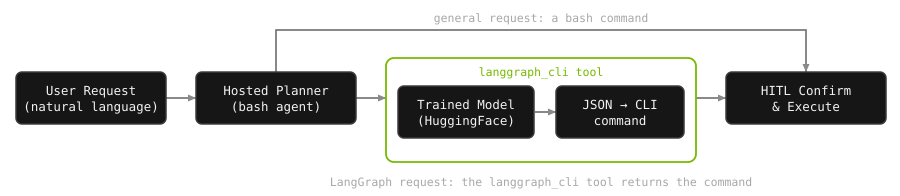

<div class="dx-hero" data-eyebrow="MODULE 04 / 05 - HANDS ON" data-title="Run Customized Agent" data-meta="TIME::30 min|EXERCISES::3|MODEL::trained Nano 9B"></div>


Congratulations, you've now completed the customization pipeline:
1. ✅ Built a base agent (generic bash knowledge)
2. ✅ Generated training data (SDG for LangGraph CLI)
3. ✅ Trained with GRPO (verifiable rewards)

The saved model is a candidate **specialized agent**. Use its held-out results to check what improved, and continue reviewing commands before execution.

<!-- fold:break -->

But how do we actually *use* the trained model? The training notebook saved a merged model checkpoint. The trained model does one job well: it turns a LangGraph CLI request into the exact command. On its own it cannot list files or read a README. So instead of replacing the general bash agent, we give the agent the trained model **as a tool**:
1. **Load the trained model** locally
2. **Use the right prompt format** — the model was trained with a specific JSON system prompt, and the tool must use exactly that prompt
3. **Wire both tools into the agent** — the hosted model keeps planning and running bash commands, calls your model for LangGraph requests, and every command still waits for your approval

<!-- fold:break -->

## From Training to Inference

During GRPO training, the model learned to map natural language requests to structured JSON tool calls. At inference time, the flow looks like this:



The key difference from the base agent in `bash_agent.ipynb`: alongside the hosted model, the trained model runs **locally** with HuggingFace Transformers, behind a `langgraph_cli` tool. The `HuggingFaceLLM` class handles model loading, tokenization, and parsing the structured JSON output into a command. A small specialist model behind a tool adds depth without losing the general agent's breadth.

<!-- fold:break -->

## Run the Agent: Hands-on Implementation

Open the following notebook: <button onclick="openOrCreateFileInJupyterLab('code/4-agent-customization/03_run_agent.ipynb');"><i class="fa-solid fa-flask"></i> 03_run_agent.ipynb</button>

### Exercise: Load Model

<button onclick="goToLineAndSelect('code/4-agent-customization/03_run_agent.ipynb', 'llm = HuggingFaceLLM');"><i class="fas fa-code"></i> HuggingFaceLLM</button> — Load the trained model for local inference.

The `HuggingFaceLLM` class wraps HuggingFace Transformers to provide the same interface as the NIM-based LLM from the base agent. It loads the trained checkpoint from `config.model_path` (which points to `outputs/grpo_langgraph_cli/merged_model`), handles tokenization, and parses structured JSON tool calls from the model's output.

Implement `llm` by instantiating `HuggingFaceLLM` with the `config` object.

<details class="dx-peek is-solution">
<summary>🆘 Need some help?</summary>

```python
llm = HuggingFaceLLM(config)
```
</details>

<!-- fold:break -->

### Exercise: System Prompt

<button onclick="goToLineAndSelect('code/4-agent-customization/03_run_agent.ipynb', 'messages = ');"><i class="fas fa-code"></i> Messages</button> — Inside the `langgraph_cli` tool, start the conversation with the JSON system prompt. Each call sends one request to the trained model and returns one command; the tool never runs it.

Implement `messages` by creating a `Messages` instance with `config.json_system_prompt`.

This is a subtle but critical detail: the model was trained with `config.json_system_prompt`, which instructs it to produce **structured JSON tool calls**. If you use the generic `config.system_prompt` instead, the model's output format won't match what it learned during GRPO training, and the format can change; keep the prompt fixed for a fair comparison.

> 💡 **Why this matters**: During training, the system prompt was part of every input. The model learned to produce correct outputs *conditioned on that specific prompt*. Changing the prompt at inference time is like studying for one exam and sitting for a different one.

<details class="dx-peek is-solution">
<summary>🆘 Need some help?</summary>

```python
messages = Messages(config.json_system_prompt)
```
</details>

<!-- fold:break -->

### Exercise: Give the Agent Both Tools

<button onclick="goToLineAndSelect('code/4-agent-customization/03_run_agent.ipynb', 'tools=');"><i class="fas fa-code"></i> tools</button> — Give the agent confirmed bash execution and your specialist.

Whether or not held-out accuracy improves, the HITL pattern from `bash_agent.md` still applies. Training does not guarantee safe commands, so the specialist's commands run through the same confirmation step as every other command: `ExecOnConfirm` asks you before anything runs.

Implement `tools` as a list of `ExecOnConfirm(bash).exec_bash_command` and your `langgraph_cli` tool.

<details class="dx-peek is-solution">
<summary>🆘 Need some help?</summary>

```python
tools=[ExecOnConfirm(bash).exec_bash_command, langgraph_cli],
```
</details>

<!-- fold:break -->

## Run the Agent Interactively

After completing the exercises, run Step 7 in the notebook, or start the same agent in a <button onclick="openNewTerminal();"><i class="fas fa-terminal"></i> terminal</button>. Shut down the training notebook's kernel first to free GPU memory.

Make sure you're in the `code/4-agent-customization` directory:

```bash
cd code/4-agent-customization
```

And start your customized bash agent:

```bash
python3.12 -m bash_agent.main_hf
```

Add `--cli-only` to talk to the trained model alone: each request becomes one LangGraph command, with no general bash.

<!-- fold:break -->

### Test the Customized Agent

Start with a general request such as *“List the files in this directory”*: the hosted model answers it with bash. Then try LangGraph requests such as *“Create a react-agent project in ./myapp”*, *“Start the dev server on port 8080”*, and *“Build an image tagged myapp:v2”*: the agent calls `langgraph_cli` and shows you the trained model's command before running it. Check each command before approving.

<!-- fold:break -->

## Measuring the Improvement

Open `outputs/grpo_langgraph_cli/held_out_comparison.json`, written by the training notebook. It compares the **same local 9B model before and after training** on untouched validation rows, using the same JSON prompt, greedy decoding, token budget and verifier. Compare exact-match rate and inspect the saved failures; an improvement is a result to measure, not a promise.

The hosted starter agent uses a different model and tool setup, so its chat demonstrations are not a fair training baseline. This carries Module 3's evaluation approach into customization. The verifier checks labels, not whether running a command is safe.

<!-- fold:break -->

### What If Results Aren't Good Enough?

If the trained model still makes mistakes, apply the iterative improvement cycle from Module 3:

1. **Analyze failure patterns** — Which commands or flags fail most? The `/verify` response breaks out `command_correct` and `flag_accuracy` (and whether the output parsed as valid JSON at all), so you can pinpoint weak spots.
2. **Generate targeted data** — SDG can oversample weak areas. If `dockerfile` commands have low accuracy, generate more examples with diverse `output_path` values so the reward signal on that command is denser.
3. **Refine the reward signal** — the reward is *gate-then-grade* (invalid JSON or wrong command → −1; otherwise `(correct − wrong − extra) / total_flags`), so there are no weights to tune. If the model gets commands right but flags wrong, extend `score_cli_output`'s flag normalization (e.g. treat equivalent flag spellings as matches) or add more of those flag combinations to the training data.
4. **Check training length** — 50 steps is a starting point. Try more steps only if held-out performance improves; longer runs can overfit.

The pattern is always: **measure → diagnose → fix → retrain → re-measure**.

<!-- fold:break -->

## Module Wrap-Up


Prompts, tools, and training offer different ways to improve an agent. Use held-out results to decide which change helps, and check for regressions as well as gains.

Congratulations! You've completed the Agent Customization module. Let's recap what you've accomplished. 

<!-- fold:break -->

<div class="dx-island dx-reveal">
  <p class="dx-island-title">WHAT YOU LEARNED</p>
  <ul>
    <li><b>Why customize</b> - training, prompts, and tools are complementary; measure which helps.</li>
    <li><b>The pipeline</b> - SDG to GRPO to deployment is a repeatable pattern.</li>
    <li><b>Synthetic data</b> - samplers control the request space; schemas and label checks catch different errors.</li>
    <li><b>Verifiable rewards</b> - code can check exact criteria, but only the criteria you define.</li>
    <li><b>GRPO training</b> - relative rewards guide updates; measure whether they improve held-out tasks.</li>
    <li><b>Reviewed execution</b> - check commands before approving them; the name allowlist is not a filesystem sandbox.</li>
  </ul>
</div>

<!-- fold:break -->

### The Generalizable Pattern

Everything you learned extends beyond LangGraph CLI:

| Domain | Output Schema | Verification |
|--------|---------------|--------------|
| **kubectl** | Kubernetes resource specs | `kubectl apply --dry-run` |
| **terraform** | HCL resource definitions | `terraform validate` |
| **SQL** | Query structure | Database execution / EXPLAIN |
| **docker** | Container commands | Docker CLI validation |
| **Your internal CLI** | Your Pydantic models | Your validation logic |

The pattern is always:
1. **Define schema** — What are valid outputs?
2. **Generate data** — Cover the output space systematically
3. **Design rewards** — How do you verify correctness with code?
4. **Train with GRPO** — Let the model explore and learn

<!-- fold:break -->

### The Full Workshop Arc

Each module in this workshop so far introduced a different customization lever while enabling you to complete agent development lifecycle: 

<div class="dx-bento dx-reveal">
  <div class="dx-cell"><h4>MODULE 1</h4>Build agents with ReAct - agent fundamentals. <span class="dx-chip">System Prompts</span></div>
  <div class="dx-cell"><h4>MODULE 2</h4>Extend with RAG, tools, and skills - agent capabilities. <span class="dx-chip">MCP + Skills</span></div>
  <div class="dx-cell"><h4>MODULE 3</h4>Measure and evaluate systematically - agent quality. <span class="dx-chip">Evaluation</span></div>
  <div class="dx-cell"><h4>MODULE 4</h4>Customize through training - agent expertise. <span class="dx-chip">Training</span></div>
</div>

This is the same cycle production teams follow: build, extend, measure, improve. Each module's skills compound—evaluation informs customization, customization is tested for measurable improvement, and the cycle continues.

<!-- fold:break -->

### What's Next?

**Immediate extensions:**
- Expand SDG to cover more commands and edge cases
- Compare training lengths on held-out tasks
- Add more sophisticated reward components

**Production considerations:**
- Deploy trained model behind an API
- Set up continuous evaluation monitoring
- Plan retraining schedule as CLI evolves

**Advanced topics:**
- Extending a single-request translator to multi-turn conversations
- Combining Skills + trained models for breadth + depth
- Distillation from larger models to smaller ones

<!-- fold:break -->

<div class="dx-island dx-reveal">
  <p class="dx-island-title">FINAL THOUGHTS</p>
  <p>Agent customization isn't magic - it's engineering. You've learned a systematic approach: measure the gap (Module 3), generate targeted data (SDG), define success criteria (rewards), and train (GRPO). This cycle applies wherever you need agents with domain expertise.</p>
  <p>The best agents aren't built in one pass. They're refined iteratively through measurement and improvement. You now have the tools to make that process systematic.</p>
  <p>Happy building! 🚀</p>
</div>

<!-- fold:break -->

## What's Next?

<div class="dx-bento dx-reveal">
  <div class="dx-cell is-wide"><h4>MODULE 05: DEEP AGENTS</h4><span class="dx-chip is-green">NEXT UP</span> Autonomous agents that plan, delegate to sub-agents, and tackle long-horizon multi-step tasks - plus sandboxing to contain them.</div>
  <div class="dx-cell"><h4>MODULE 06: AGENT SAFETY</h4>Run agents that touch real systems safely - sandboxing, guardrails, and operator controls.</div>
  <div class="dx-cell"><h4>MODULE 07: AGENT HARNESSES</h4>Same model, different harness - how the scaffolding around an agent shapes what it can do.</div>
</div>
