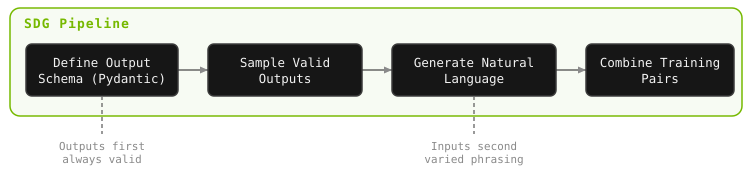

<div class="dx-hero" data-eyebrow="MODULE 04 / 03 - SYNTHETIC DATA" data-title="Synthetic Data Generation" data-meta="DURATION::3-4 hrs|MODEL::Nemotron Nano 9B (GRPO-trained)|GPU::A100-80GB+ recommended"></div>

Training requires examples—lots of them. Each example shows the model:
- **Input**: What the user says (*"Create a new project with the react template"*)
- **Output**: What the agent should produce (`{"command": "new", "template": "react-agent-python", ...}`)

But where do these examples come from?

<div class="dx-bento dx-reveal">
  <div class="dx-cell is-wide"><h4>REAL USER LOGS</h4>Authentic patterns - but you don't have them yet for a brand-new CLI.</div>
  <div class="dx-cell"><h4>MANUAL WRITING</h4>High quality, but slow, expensive, and limited in diversity.</div>
  <div class="dx-cell"><h4>SYNTHETIC (SDG)</h4>Fast, scalable, diverse - it just requires careful design.</div>
</div>

For a new domain like the LangGraph CLI, we don't have the real logs from the agent. Manual writing doesn't scale. **SDG is the answer.**

<!-- fold:break -->

## Why Synthetic Data Works


**The Cold Start Problem:** New CLI tools face a chicken-and-egg problem:
- You need training data to build a good agent
- You need users to generate real training data
- You need a good agent to attract users

SDG breaks this cycle:

1. **Define the space** — Your Pydantic schema describes all valid outputs
2. **Sample systematically** — Samplers ensure every corner of the space is covered
3. **Generate natural language** — An LLM creates realistic user phrasings
4. **Result**: Real training data without real users

**Why this works**: The model doesn't need *authentic* user phrasing—it needs to learn the *mapping* from intent to command. Synthetic variations are sufficient to learn that mapping, and you can always fine-tune later with real data once you have it.

<!-- fold:break -->

**SDG vs. LLM Prompting:** You might wonder: "Why not just ask GPT to generate 200 training examples?"

<div class="dx-bento dx-reveal">
  <div class="dx-cell is-wide"><h4>LLM PROMPTING</h4><span class="dx-chip">LOW CONTROL</span> Random coverage with likely gaps, may hallucinate invalid outputs, drifts toward common patterns.</div>
  <div class="dx-cell is-wide"><h4>NeMo DATA DESIGNER</h4><span class="dx-chip">HIGH CONTROL</span> Coverage guaranteed by samplers, validity guaranteed by the schema, diversity controlled by config.</div>
</div>

**The key difference**: Data Designer generates outputs *first* (from your schema), then creates matching inputs. LLM prompting generates inputs and hopes the outputs are valid.

<details>
<summary><strong>Click me to see an example</strong></summary>

```python
# LLM prompting approach (risky)
examples = llm("Generate 100 LangGraph CLI training examples")
# Problem: LLM might invent commands that don't exist!

# Data Designer approach (controlled)
outputs = sample_from_schema(CLIToolCall, n=100)  # Always valid
inputs = llm(f"Write a user request for: {output}")  # Input varies, output fixed
```

</details>

<div class="dx-island dx-quiz dx-reveal">
  <p class="dx-island-title">CHECK YOUR UNDERSTANDING</p>
  <p class="dx-quiz-q">Why does NeMo Data Designer generate the structured OUTPUT first, then write a matching user request - instead of prompting an LLM for input/output pairs directly?</p>
  <button class="dx-quiz-opt" data-right data-fb="Right. Sampling outputs from the Pydantic schema makes every example valid by construction; LLM-first generation can invent commands or flags that do not exist.">Sampling outputs from the schema guarantees every example is valid; LLM-first can hallucinate invalid commands</button>
  <button class="dx-quiz-opt" data-fb="Speed isn't the point - both approaches call an LLM. The point is guaranteed validity and coverage.">Because generating JSON is faster than generating natural language</button>
  <button class="dx-quiz-opt" data-fb="LLMs are great at phrasing requests - that's exactly the step Data Designer uses them for. The risk is on the output side.">Because LLMs cannot write natural-language requests</button>
  <button class="dx-quiz-opt" data-fb="Backwards - the schema is the whole foundation. Outputs are sampled FROM it, which is what guarantees validity.">To avoid having to define a schema at all</button>
</div>

**What makes Training Data "Good Enough"?** Training data quality matters more than quantity. Here's what to aim for:

**Minimum viable dataset:**
- At least 10-20 examples per command type
- At least 3-5 variations of each flag combination
- Total of 100-300 examples for simple CLIs

**Quality checklist:**
- [ ] Every command type appears multiple times
- [ ] Every flag appears in various combinations
- [ ] Edge cases are represented (empty paths, special characters, max values)
- [ ] Negative examples if needed (invalid commands → error response)

**Diminishing returns**: Beyond 500-1000 examples, adding more data helps less. Focus on diversity over quantity.

<!-- fold:break -->

## How SDG Works

**NeMo Data Designer** generates training data programmatically:

1. **Define the output schema** — A Pydantic model describing valid CLI commands
2. **Configure samplers** — Distributions for each field (which commands? which templates? which ports?)
3. **Generate natural language** — An LLM creates realistic user requests for each command
4. **Combine into examples** — Input/output pairs ready for training



This is different from just prompting an LLM to "make up examples." Data Designer ensures coverage, diversity and validity of training data. 

<!-- fold:break -->

### Data Quality Checklist

Before training, verify your synthetic data meets these criteria. **Click each item to learn more.**

<details>
<summary><strong>Coverage</strong></summary>

- [ ] Does every command type appear? (`new`, `dev`, `up`, `build`, `dockerfile`)
- [ ] Does every flag appear for each relevant command?
- [ ] Are edge cases represented? (null values, boundary values)

</details>

<details>
<summary><strong>Balance</strong></summary>

- [ ] Are command types roughly balanced?
- [ ] No single command should be > 40% of data unless that matches real usage

**Quick diagnostic:**
```python
from collections import Counter
commands = [json.loads(ex["output"])["command"] for ex in data]
print(Counter(commands))
# Good: Counter({'new': 55, 'dev': 48, 'up': 52, 'build': 45, 'dockerfile': 50})
# Bad:  Counter({'new': 180, 'dev': 10, 'up': 5, 'build': 3, 'dockerfile': 2})
```

</details>

<details>
<summary><strong>Diversity</strong></summary>

- [ ] Do inputs vary in phrasing, not just slot values?
- [ ] Mix of formal and casual language?
- [ ] Different sentence structures (imperative, question, description)?

**Examples of good diversity:**
```
"Create a new project with react template"      (imperative)
"I want to start a react agent project"         (statement)
"Can you set up a react-agent-python project?"  (question)
"Initialize react-agent-python in ./myapp"      (technical)
```

</details>

<details>
<summary><strong>Validity</strong></summary>

- [ ] Do all outputs parse as valid JSON?
- [ ] Do all outputs pass schema validation?
- [ ] Do command/flag combinations make sense?

```python
# Validate all outputs
for ex in data:
    output = json.loads(ex["output"])
    CLIToolCall(**output)  # Raises if invalid
print("All outputs valid!")
```

</details>

<!-- fold:break -->

<div class="dx-island dx-reveal">
  <p class="dx-island-title">PREFER A HEAD START?</p>
  <p>We recommend generating your own dataset for the hands-on experience. But if you'd rather move ahead quickly, a starter set is provided - it also makes a good reference when you build your own:</p>
  <p>📁 Sample Training Data (225 examples): <button onclick="openOrCreateFileInJupyterLab('code/4-agent-customization/data/langgraph_cli/train.jsonl');"><i class="fa-brands fa-python"></i> train.jsonl</button></p>
</div>

<!-- fold:break -->

## SDG: Hands On Implementation

Open the <button onclick="openOrCreateFileInJupyterLab('code/4-agent-customization/01_synthetic_data_generation.ipynb');"><i class="fa-solid fa-flask"></i> 01_synthetic_data_generation.ipynb</button> notebook. 

### Exercise: Output Schema

<button onclick="goToLineAndSelect('code/4-agent-customization/01_synthetic_data_generation.ipynb', 'class CLIToolCall');"><i class="fas fa-code"></i> CLIToolCall</button> — Define the Pydantic model for CLI commands.

This schema is what Data Designer samples from to generate valid outputs — every synthetic example is guaranteed to conform to it. Define `CLIToolCall` as a `BaseModel` with `command` (str), `template` (optional str), `path` (optional str), and `port` (optional int) fields. Optional fields should default to `None`.

<details>
<summary>🆘 Need some help?</summary>

```python
class CLIToolCall(BaseModel):
    command: str = Field(None, description="CLI command: new, dev, up, build, or dockerfile")
    template: Optional[str] = Field(None, description="Template name for 'new' command")
    path: Optional[str] = Field(None, description="Project path for 'new' command")
    port: Optional[int] = Field(None, description="Port for 'dev' or 'up' command")
```
</details>

<!-- fold:break -->

### Exercise: Template Sampler

<button onclick="goToLineAndSelect('code/4-agent-customization/01_synthetic_data_generation.ipynb', 'react-agent-python');"><i class="fas fa-code"></i> template sampler</button> — Configure the template values the sampler draws from.

Samplers control the distribution of generated outputs — they’re what ensures your dataset covers the full output space rather than clustering around common cases. Add the following to the `values` list in `CategorySamplerParams`: `"react-agent-python"`, `"memory-agent-python"`, `"retrieval-agent-python"`, `"data-enrichment-agent-python"`, `"new-langgraph-project-python"`.

<details>
<summary>🆘 Need some help?</summary>

```python
params=CategorySamplerParams(values=[
    "react-agent-python", 
    "memory-agent-python", 
    "retrieval-agent-python", 
    "data-enrichment-agent-python",
    "new-langgraph-project-python"
])
```
</details>

<!-- fold:break -->

### Exercise: Train/Val Split

<button onclick="goToLineAndSelect('code/4-agent-customization/01_synthetic_data_generation.ipynb', 'train_test_split');"><i class="fas fa-code"></i> train_test_split</button> — Split the dataset for training and validation.

The validation set is held out during GRPO training and used to detect overfitting — if training reward climbs but validation reward plateaus, the model is memorizing rather than generalizing. Use `train_test_split` to split `dataset_df` with `test_size` set to `0.1` (10% for validation) and `random_state` seed set to `42` (or some other number).

<details>
<summary>🆘 Need some help?</summary>

```python
train_df, val_df = train_test_split(dataset_df, test_size=0.1, random_state=42)
```
</details>

<!-- fold:break -->

## Inspecting Your Data

Before moving to training, spot-check a few examples from your generated data in <button onclick="openOrCreateFileInJupyterLab('code/4-agent-customization/data/langgraph_cli/train.jsonl');"><i class="fa-brands fa-python"></i> train.jsonl</button>:

<div class="dx-island dx-reveal">
  <p class="dx-island-title">SPOT-CHECK BEFORE YOU TRAIN</p>
  <ul>
    <li><b>Do the inputs sound natural?</b> They should read like a real user, not robotic templates.</li>
    <li><b>Do the outputs parse correctly?</b> Every output should be valid JSON matching the <code>CLIToolCall</code> schema.</li>
    <li><b>Is there variety?</b> Scan for repetitive phrasing - if many examples start the same way, the model may latch onto those patterns instead of intent.</li>
  </ul>
</div>

A few minutes of inspection now can save hours of debugging during training. If your data contains invalid outputs, the reward function will score them as failures—confusing the training signal rather than strengthening it.

<!-- fold:break -->

Double check that you have successfully generated synthetic data for the LangGraph CLI.

```
data/langgraph_cli/
├── train.jsonl    # 225 examples
└── val.jsonl      # 25 examples
```

With this data, we are now ready to begin the customization. Check out [GRPO Training](grpo_training.md) to learn more and get started!
