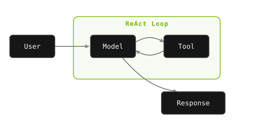

<div class="dx-hero" data-eyebrow="MODULE 05 / 01 - CONCEPTS" data-title="Introduction to Deep Agents" data-meta="READ::12 min|CONCEPTS::4"></div>

In Modules 1 through 4, we built increasingly capable agents — from a report generator to a RAG-powered help desk to a customized bash agent. Each used the same fundamental pattern: a **ReAct loop** where a single model reasons, calls a tool, observes the result, and repeats.

These agents are powerful, but they're **shallow**. In this module, we'll explore what happens when we go *deep*.

<!-- fold:break -->

## The Story So Far

Here's a quick recap of what you've accomplished across the workshop:

<div class="dx-bento dx-reveal">
  <div class="dx-cell"><h4>MODULE 1</h4><span class="dx-big">Report agent</span>ReAct loop with tool calling</div>
  <div class="dx-cell"><h4>MODULE 2</h4><span class="dx-big">RAG help desk</span>Retrieval + generation</div>
  <div class="dx-cell"><h4>MODULE 3</h4><span class="dx-big">Evaluation</span>LLM-as-judge, RAGAS metrics</div>
  <div class="dx-cell"><h4>MODULE 4</h4><span class="dx-big">Custom CLI agent</span>Domain specialization via SDG + RLVR</div>
</div>

But all of these agents share a common architecture: a **single model in a single loop**, with all state living inside the context window. We call these "shallow" agents — not because they're simple, but because their reasoning stays within a single layer of execution.

<!-- fold:break -->

### The Shallow Agent Pattern

Every agent we've built so far follows the same architecture:



One model. One context window. One tool at a time. The bash agent from Module 4 pushed this pattern to its limit — it could execute shell commands, but it still operated in a single flat loop.

<!-- fold:break -->

#### Shallow Agent Capabilities

Your ReAct agents are genuinely capable. They can:

- **Dynamically select tools** — Choose the right tool for each step based on reasoning
- **Execute multi-step tasks** — Chain together 5-15 tool calls to complete a task
- **Ground responses** — Use retrieved information rather than hallucinating
- **Produce structured output** — Generate formatted reports, JSON, or other structured results

These capabilities cover a wide range of real-world tasks. For focused problems that fit within a single conversation — answering questions, generating short reports, triaging requests — shallow agents are often the right choice.

<!-- fold:break -->

<div class="dx-island dx-reveal">
  <p class="dx-island-title">WHERE SHALLOW AGENTS BREAK DOWN</p>
  <p>For simple tasks, the flat loop is fine. But real production work - research a topic, write code, test it, fix the bugs, and document it - outgrows the architecture, because a shallow agent can't:</p>
  <p><span class="dx-chip">NO PLANNING</span> Break down a complex task or track progress over long time horizons.</p>
  <p><span class="dx-chip">NO DELEGATION</span> Spawn a sub-agent to handle a sub-task in parallel.</p>
  <p><span class="dx-chip">NO FILE MEMORY</span> Read, write, edit, search, and organize files across a project.</p>
  <p><span class="dx-chip">NO CONTEXT MGMT</span> Summarize long conversations to avoid running out of tokens.</p>
  <p>These four gaps map directly onto the four pillars of deep agents - exactly what the next page covers.</p>
</div>

<details>
<summary><strong>A concrete example of shallow agent breakdown</strong></summary>

Consider asking your Module 1 report generation agent: "Research the competitive landscape of AI agent frameworks, comparing at least 10 frameworks across architecture, pricing, ecosystem, and adoption. Produce a detailed report with citations."

Here's what would likely happen:

1. The agent searches for the first few frameworks and gets good results
2. By framework 5-6, earlier search results are being pushed out of context
3. The agent starts repeating searches it already did (it forgot the results)
4. The comparison table becomes inconsistent (some frameworks have pricing info, others don't)
5. The final report is patchy — strong on the last few frameworks researched, weak on the first ones

A human researcher would take notes, organize by subtopic, and check their work against their outline. The shallow agent can't do any of this.

</details>

> Think about how a human handles complex tasks. You don't try to hold everything in your head. You:
> - Write down a plan and check items off as you go
> - Delegate specialized work to colleagues
> - Take notes and refer back to them
> - Follow established procedures for common workflows
> 
> These are exactly the capabilities that deep agents add to the LLM loop.

<!-- fold:break -->

## What Makes an Agent "Deep"?

A **deep agent** goes beyond the flat ReAct loop. It has built-in capabilities that make it autonomous enough to handle complex, multi-step tasks without constant human guidance:

| Capability | Shallow Agent | Deep Agent |
|---|---|---|
| **Planning** | Limited to CoT reasoning | `write_todos` for task breakdown and tracking |
| **File System** | Limited tooling (e.g., read) | Full suite: `read`, `write`, `edit`, `ls`, `glob`, `grep` |
| **Shell Access** | Possible with custom implementation | Built-in `execute` with sandboxing |
| **Sub-Agents** | None | `task` tool to delegate work to specialized agents |
| **Context Management** | Fixed window, truncation | Auto-summarization when conversations get long |
| **Skills** | Primarily relies on system prompts | Loadable markdown methodology files |

Deep agents aren't just agents with more tools — they're agents with an **architecture** designed for complex, autonomous work.

<!-- fold:break -->

### From Bash Agent to Deep Agent


Remember the bash agent from Module 4? It could translate natural language into shell commands. That was a big step — an agent touching the real system.

Now imagine that agent with the following capabilities:

1. **Plan** — "I need to research GPU optimization, write a benchmark script, run it, analyze results, and write a report."
2. **Execute** — Write files, run commands, read outputs, debug errors
3. **Delegate** — "Let me send the research task to a sub-agent while I start writing the code."
4. **Adapt** — If the context gets too long, summarize and continue
5. **Learn** — Load skills (markdown files) that teach it specific domains and methodologies

That's a deep agent. And that's what we'll build in this module.

<!-- fold:break -->

## The Deep Agents Library

We'll use [**langchain-ai/deepagents**](https://github.com/langchain-ai/deepagents) — an open-source agent harness built on LangChain and LangGraph. It's designed to be batteries-included:

```python
from deepagents import create_deep_agent

agent = create_deep_agent(
    model=model,
    tools=[tavily_search],
    system_prompt="You are a helpful assistant.",
    backend=LocalShellBackend(root_dir="/workspace"),
)
```

One function call gives you an agent with planning, filesystem access, shell execution, sub-agents, and context management — all wired up and ready to go.

> To learn more about NVIDIA's integrations with LangChain, check out [these docs](https://docs.langchain.com/oss/python/integrations/providers/nvidia). 

<div class="dx-island dx-quiz dx-reveal">
  <p class="dx-island-title">CHECK YOUR UNDERSTANDING</p>
  <p class="dx-quiz-q">What actually makes an agent deep rather than shallow?</p>
  <button class="dx-quiz-opt" data-fb="A bigger model reasons better, but a deep agent built on the same model still beats a shallow one. The difference is architecture, not raw model size.">It runs on a larger, more capable model</button>
  <button class="dx-quiz-opt" data-fb="More tools help, but a shallow agent can have many tools too. Depth comes from how the agent is structured, not the size of its toolbox.">It is given access to many more tools</button>
  <button class="dx-quiz-opt" data-right data-fb="Right. Planning, delegation, external memory, and skills are capabilities layered around the loop - the same model becomes a deep agent through structure.">It adds planning, delegation, memory, and skills around the loop</button>
  <button class="dx-quiz-opt" data-fb="A longer window delays overflow but does not solve it. Deep agents manage context with external memory and summarization, not just a bigger window.">It uses a much longer context window</button>
</div>

<!-- fold:break -->

## What You'll Learn


Here's what's ahead in this module, page by page:

**[What Are Deep Agents?](deep_agents)** — The four pillars of deep agent architecture, real-world applications, and how the deepagents library implements it all.

**[Set Up the Agent Builder](setup_agent_builder)** — Get the Deep Agent Builder UI running so you have an interactive environment for the hands-on exercises.

**[Build a Deep Agent](build_deep_agents)** — Hands-on with the deepagents library. You'll build a deep agent step by step, filling in the core functions that power it, and test it using an interactive UI with drag-and-drop tools.

**[Sandboxing and Security](sandboxing_security)** — How to run autonomous agents safely. You'll learn about sandboxing patterns, security architecture, and defense-in-depth strategies for production deployment.

> Head over to [What Are Deep Agents](deep_agents) to dive into the architecture!
