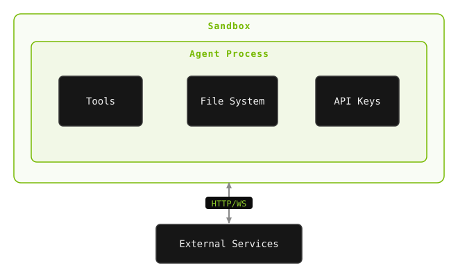
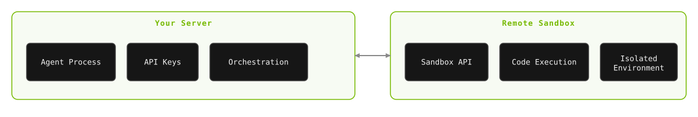

<div class="dx-hero" data-eyebrow="MODULE 05 / 05 - SECURITY" data-title="Sandboxing and Security" data-meta="READ::20 min|DEMOS::2|TAKEAWAY::defense in depth"></div>


Your deep agent can read files, write code, and execute shell commands. That's incredibly powerful — and incredibly dangerous. In this section, we'll see exactly *why* sandboxing matters, explore different approaches, and understand the security principles that make agents production-ready.

<!-- fold:break -->

## Security Matters for Deep Agents

Three characteristics of deep agents amplify security concerns compared to the shallow agents you built in earlier modules:

1. **Extended autonomy** — Deep agents run for minutes to hours without human oversight. A shallow agent completes in seconds, giving you time to catch mistakes. A deep agent might execute dozens of steps before you see any output.

2. **Code execution** — Deep agents run shell commands, write files, install packages, and spawn sub-processes. A hallucinated `rm -rf /` or a fabricated `pip install malicious-package` isn't a hypothetical — it's a well-documented risk.

3. **Cascading effects** — In a multi-agent system, a single sub-agent error can propagate through the entire hierarchy. A researcher sub-agent that follows a malicious link could compromise the orchestrator's entire workspace.

The key insight: **once an agent passes control to a subprocess, only OS-level enforcement can ensure containment**. Application-level controls — prompt instructions like "don't delete files" — are insufficient because the model can hallucinate past them, and subprocess execution bypasses them entirely.

<div class="dx-island dx-reveal">
  <p class="dx-island-title">WHAT CAN GO WRONG</p>
  <p>These are not hypotheticals - each is a documented failure mode for autonomous agents:</p>
  <p><span class="dx-chip">DESTRUCTIVE COMMANDS</span> The agent generates and runs rm -rf /important/data while trying to clean up.</p>
  <p><span class="dx-chip">SUPPLY CHAIN</span> It fabricates a package name that happens to match a malicious package on a public registry.</p>
  <p><span class="dx-chip">DATA EXFILTRATION</span> A compromised sub-agent leaks data via DNS tunneling or encoded HTTP requests.</p>
  <p><span class="dx-chip">RESOURCE EXHAUSTION</span> An agent stuck in a retry loop spawns thousands of sub-processes.</p>
</div>

<!-- fold:break -->

### The Problem: Agents See Everything

Without sandboxing, your agent operates directly on the host system. It has the same access as the process running it. Let's see what that means.

#### Demo: No Sandbox

In the Deep Agent Builder UI, make sure **Sandbox Mode is OFF** (you'll see "⚠️ No Sandbox" in the header). Build an agent with Shell Execution and File I/O and ask:

> *"What files are in my workspace?"*

The agent will respond with something like:

<div class="dx-term dx-reveal">
  <span class="dx-term-title">no sandbox - agent runs on the host</span>
  <span class="dx-term-line" data-kind="prompt">What files are in my workspace?</span>
  <span class="dx-term-line" data-kind="tool" data-delay="300">ls /tmp/deepagent_workspace</span>
  <span class="dx-term-line" data-kind="answer" data-delay="350">passwords.txt    ssn_records.txt</span>
</div>

<!-- fold:break -->

Now ask it to read one:

> *"Read the contents of passwords.txt"*

The agent will happily return:

<div class="dx-term dx-reveal">
  <span class="dx-term-title">no sandbox - reading a host file</span>
  <span class="dx-term-line" data-kind="prompt">Read the contents of passwords.txt</span>
  <span class="dx-term-line" data-kind="tool" data-delay="300">read_file(passwords.txt)</span>
  <span class="dx-term-line" data-kind="answer" data-delay="350">admin:SuperSecret123!</span>
  <span class="dx-term-line" data-kind="answer" data-delay="120">root:P@ssw0rd_2026</span>
  <span class="dx-term-line" data-kind="answer" data-delay="120">db_user:mysql_prod_xK9#mN2</span>
</div>

**This is the problem.** The agent can see — and exfiltrate — every file on the host system that the process has access to.

<!-- fold:break -->

### The Solution: Sandboxing

**Sandboxing** isolates the agent's execution environment from the host system. The agent operates inside a container or VM that has no access to the host's files, network, or credentials.

#### Demo: With Sandbox

Click "Build a New Agent". Now recreate your deep agent and toggle **Sandbox Mode ON** in the Settings panel (you'll see "🔒 Sandboxed" in the header). 

Build a new agent and ask the same question:

> *"What files are in my workspace?"*

The agent responds:

<div class="dx-term dx-reveal">
  <span class="dx-term-title">sandboxed - fresh container, no host mounts</span>
  <span class="dx-term-line" data-kind="prompt">What files are in my workspace?</span>
  <span class="dx-term-line" data-kind="tool" data-delay="300">ls /workspace</span>
  <span class="dx-term-line" data-kind="answer" data-delay="350">The workspace at /workspace is empty - no files present. The host filesystem is not visible from inside the container.</span>
</div>

**The sensitive files don't exist inside the sandbox.** The agent runs in a fresh Docker container with no host mounts. It literally cannot see your files.

<!-- fold:break -->

## The Security Spectrum

Not all isolation is equal. Approaches range from trusting the model entirely to full hardware virtualization. Understanding this spectrum helps you choose the right level for your use case.

<div class="dx-island dx-reveal">
  <p class="dx-island-title">THE SECURITY SPECTRUM - ISOLATION STRENGTH</p>
  <div class="dx-tax">
    <div class="dx-tax-row" style="--dx-w:8"><span class="dx-tax-name">Prompt-only</span><div class="dx-tax-track"><div class="dx-tax-fill">none</div></div><span class="dx-tax-note">dev/testing only</span></div>
    <div class="dx-tax-row" style="--dx-w:28"><span class="dx-tax-name">Deno runtime</span><div class="dx-tax-track"><div class="dx-tax-fill">grants</div></div><span class="dx-tax-note">lightweight scripting</span></div>
    <div class="dx-tax-row" style="--dx-w:48"><span class="dx-tax-name">Bubblewrap / Seatbelt</span><div class="dx-tax-track"><div class="dx-tax-fill">FS + net</div></div><span class="dx-tax-note">desktop agents (Claude Code)</span></div>
    <div class="dx-tax-row" style="--dx-w:68"><span class="dx-tax-name">Docker + seccomp</span><div class="dx-tax-track"><div class="dx-tax-fill">process</div></div><span class="dx-tax-note">most production</span></div>
    <div class="dx-tax-row" style="--dx-w:85"><span class="dx-tax-name">gVisor</span><div class="dx-tax-track"><div class="dx-tax-fill">syscall</div></div><span class="dx-tax-note">high-security</span></div>
    <div class="dx-tax-row" data-tier="max" style="--dx-w:100"><span class="dx-tax-name">Firecracker VM</span><div class="dx-tax-track"><div class="dx-tax-fill">full VM</div></div><span class="dx-tax-note">maximum isolation</span></div>
  </div>
</div>

> Our demo uses **Docker containers** for agent execution sandboxing and isolation.

<!-- fold:break -->

### Choosing an Isolation Level

As you move down the table, isolation increases but so does complexity and overhead. The right choice depends on your **threat model**: who is running the agent, what data it can access, and what the consequences of a breach would be.

Ask these questions:

1. **Who controls the agent's inputs?** If only trusted developers, you can use lighter isolation. If end users can influence prompts, you need stronger boundaries.
2. **What data can the agent access?** PII, credentials, or financial data demands stronger isolation than public information.
3. **Does the agent execute code?** Any code execution — even "just" shell commands — requires at minimum container-level isolation.
4. **What are the consequences of a breach?** A leaked API key is bad. A deleted production database is catastrophic. Match isolation to impact.

</details>

<!-- fold:break -->

## Patterns for Agent Sandboxing

Before choosing a sandbox **technology**, you need to choose a sandbox **pattern**. This architectural decision affects security, latency, and how quickly you can iterate.

### Pattern 1 — Agent IN Sandbox

The **agent itself** runs inside the sandbox. It communicates with external systems — the LLM API, databases, user interfaces — over HTTP or WebSocket connections.



**Pros:** Mirrors local development; simple architecture — everything runs in one place.

**Cons:** API keys live inside the sandbox (security risk); container rebuilds needed for every agent update; all tools inherit the sandbox's full permissions.

**Best for:** Prototyping and tight coupling between agent and execution environment.

<!-- fold:break -->

### Pattern 2 — Sandbox as Tool

The **agent runs locally** (or on your server), and code execution is **delegated** to remote sandboxes via API calls. The sandbox is just another tool the agent can call.



**Pros:** API keys stay outside the sandbox; instant agent updates without container rebuilds; clean separation of agent state and execution; enables parallel sandbox execution; sandbox failures don't crash the agent.

**Cons:** Network latency per execution call; more moving parts to manage.

**Best for:** Most production deployments. This is the pattern used by the deepagents library.

| Dimension | Agent IN Sandbox | Sandbox as Tool |
|-----------|-----------------|-----------------|
| **Credential security** | Keys inside sandbox | Keys stay external |
| **Update speed** | Requires rebuild | Instant |
| **Failure isolation** | Agent + sandbox coupled | Independent |
| **Parallel execution** | Complex | Natural |

> Our demo uses **Pattern 2** — the agent runs on the system and delegates execution to a Docker container.

<!-- fold:break -->

### How Our Sandbox Works

Our implementation uses **Docker containers** as the isolation boundary — the agent runs on the system and delegates code execution to an isolated container.

```python
class DockerSandboxBackend(SandboxBackendProtocol):
    def __init__(self):
        self._container = docker_client.containers.run(
            "python:3.11-slim",
            command="sleep infinity",
            detach=True,
            working_dir="/workspace",
            mem_limit="512m",
            nano_cpus=1_000_000_000,  # 1 CPU
            # No host mounts — fully isolated
        )
```

Key properties:
- **No host mounts** — The container has its own filesystem
- **Resource limits** — 512MB RAM, 1 CPU
- **Auto-cleanup** — Container is destroyed when the session ends
- **Full protocol compliance** — Implements `SandboxBackendProtocol` so all deepagents tools work transparently

When the agent calls `ls`, `read_file`, `write_file`, or `execute`, those operations happen *inside the container*, not on your machine.

<!-- fold:break -->

## Types of Sandboxes

There are several approaches to sandboxing, each with different tradeoffs:

| Approach | Isolation Level | Startup Time | Cost | Best For |
|---|---|---|---|---|
| **Local Docker** | Container-level | ~1 second | Free | Development, demos |
| **Daytona** (OSS) | Container + orchestration | ~2-5 seconds | Self-hosted | Teams, CI/CD |
| **Modal** | Serverless container | ~3-10 seconds | Pay-per-use | Cloud production |
| **Runloop** | Full VM | ~5-15 seconds | Pay-per-use | Maximum isolation |
| **No sandbox** | None | 0 | Free | Trusted environments only |

Learn more about a few options by clicking each of the examples below. 

<details>
<summary><strong>1. Docker Containers</strong></summary>

Docker is a common approach for agent sandboxing in development. It provides:

- **Namespace isolation** — Each container has its own filesystem, process tree, and network stack
- **Seccomp profiles** — Restrict which system calls the container can make
- **Read-only filesystems** — Prevent the agent from modifying the container image
- **Resource limits** — Cap CPU, memory, and network bandwidth

**Strengths:** Fast startup (~1s), massive ecosystem, familiar to most developers.

**Limitations:** Shared kernel — container escape vulnerabilities, while rare, do exist. Not suitable for truly untrusted code without additional hardening.

</details>

<details>
<summary><strong>2. Firecracker MicroVMs</strong></summary>

Full hardware virtualization with ~150ms startup time. **E2B** is a leading agent sandboxing platform built on Firecracker.

- Each agent gets its own **kernel** — the strongest isolation available
- MicroVMs are lightweight (as little as 5MB memory overhead)
- Startup time rivals containers, not traditional VMs
- Full Linux environment with arbitrary package installation

**When to use:** Untrusted code execution, maximum security requirements, or any scenario where you can't trust the code your agent generates.

</details>

<details>
<summary><strong>3. OS-Level Sandboxing</strong></summary>

Lightweight sandboxing built into the operating system:

- **Bubblewrap** (Linux) — Creates unprivileged containers using Linux namespaces
- **Seatbelt** (macOS) — Apple's sandbox framework restricting filesystem, network, and IPC access

These are used by **Claude Code** for local execution — restricting which filesystem paths the agent can access, blocking network connections to unauthorized hosts, and limiting system call access.

**When to use:** Local and desktop agent deployments where you need lightweight isolation without full containerization.

</details>

<!-- fold:break -->

## Defense in Depth


No single layer of security is sufficient. Effective security for deep agents requires **multiple overlapping controls**, so that a failure in any one layer is caught by another. This principle — **defense in depth** — is the foundation of secure agent deployment.

Here are the layers, from closest to the user to closest to the hardware:

| Layer | Control | Example |
|-------|---------|---------|
| 1 | **Human-in-the-loop** | Approval gates for critical operations (Module 4 HITL) |
| 2 | **Permission systems** | Allowlists for tools, commands, and file paths |
| 3 | **Application sandboxing** | Restrict agent capabilities at the framework level |
| 4 | **Container/VM isolation** | OS-level containment (Docker, Firecracker) |
| 5 | **Network controls** | Default-deny egress, DNS monitoring |
| 6 | **Audit logging** | Record all agent actions for post-hoc review |

The key principle: assume any single layer can fail. HITL can be bypassed by batch operations. Permission systems can have gaps. Containers can have escape vulnerabilities. But all six failing simultaneously is extraordinarily unlikely.

<details>
<summary><strong>Show me an example of a layered defense. Click me!</strong></summary>

Consider a deep research agent deployed in production:

1. **HITL** — Users must approve the research plan before execution begins
2. **Permissions** — The agent can only use `web_search` and `file_write` tools; no shell access
3. **Application sandbox** — The LangChain framework restricts file writes to `/workspace/output/`
4. **Container** — The agent runs in a Docker container with read-only root filesystem
5. **Network** — Egress is limited to the LLM API and approved search domains; all other traffic is blocked
6. **Audit** — Every tool call, API request, and file write is logged with timestamps

If the agent is tricked by a prompt injection attack into trying to exfiltrate data, it would need to bypass the application file path restriction, escape the container's filesystem boundary, evade network egress controls, and avoid detection in the audit logs — all simultaneously.

</details>

<!-- fold:break -->

## Agent Security Principles


Beyond sandboxing, here are the fundamental security principles for production agents. Click on each of them to learn more: 

<details>
<summary><strong>1. Trust the Sandbox, Not the Model</strong></summary>

From the [deepagents security docs](https://github.com/langchain-ai/deepagents):

> *"Deep Agents follows a 'trust the LLM' model. The agent can do anything its tools allow. Enforce boundaries at the tool/sandbox level, not by expecting the model to self-police."*

Never rely on the model to avoid dangerous actions. It *will* hallucinate. Enforce limits at the infrastructure level.

</details>

<details>
<summary><strong>2. Principle of Least Privilege</strong></summary>

Give the agent only the tools it needs. If it doesn't need shell access, don't enable it. If it doesn't need file write, use read-only mode.

</details>

<details>
<summary><strong>3. Credential Isolation</strong></summary>

API keys, database passwords, and tokens should **never** be accessible to the agent. Use environment variables outside the sandbox, and don't mount credential files into containers.

</details>

<details>
<summary><strong>4. Audit Everything</strong></summary>

Every tool call, every file write, every command execution should be logged. LangSmith provides tracing and monitoring for this — you can review every action the agent took after the fact.

</details>

<details>
<summary><strong>5. Rate Limiting</strong></summary>

Prevent runaway agents from making thousands of API calls or running infinite loops. Set recursion limits on the graph and timeouts on tool execution.

</details>

<details>
<summary><strong>6. Adversarial Testing</strong></summary>

Before deploying, probe your agent with inputs designed to trigger unsafe behavior — prompt injection, harmful instructions, and edge cases. If you haven't tried to break it, you don't know it's safe.

</details>

<details>
<summary><strong>7. Environment Separation</strong></summary> 

Use distinct configurations for development, staging, and production. Never test with production credentials or data.

</details>

<div class="dx-island dx-quiz dx-reveal">
  <p class="dx-island-title">CHECK YOUR UNDERSTANDING</p>
  <p class="dx-quiz-q">Your agent keeps generating dangerous shell commands. What is the right way to contain it?</p>
  <button class="dx-quiz-opt" data-fb="The model can hallucinate right past any instruction, and a subprocess bypasses prompt rules entirely. Application-level controls are necessary but never sufficient.">Add a rule to the system prompt telling it never to run destructive commands</button>
  <button class="dx-quiz-opt" data-fb="Lowering temperature reduces randomness but not capability - one bad command is still catastrophic. Enforce limits at the infrastructure level.">Lower the model temperature so it behaves more predictably</button>
  <button class="dx-quiz-opt" data-right data-fb="Right. Once an agent passes control to a subprocess, only OS-level enforcement can guarantee containment. A sandbox with no host mounts means the dangerous command has nothing to destroy.">Run it in a sandbox with no host mounts and resource limits</button>
  <button class="dx-quiz-opt" data-fb="A bigger model is still a model - it will still occasionally hallucinate. Safety comes from the boundary around the agent, not the agent's own judgment.">Switch to a larger, more capable model</button>
</div>

<!-- fold:break -->

## Module Wrap-Up

You now have the complete toolkit — from building your first agent to deploying autonomous deep agents safely and securely.

### What You Learned

<div class="dx-bento dx-reveal">
  <div class="dx-cell"><h4>WHAT DEEP AGENTS ARE</h4>Same LLM loop plus planning, delegation, memory, and skills.</div>
  <div class="dx-cell"><h4>SHALLOW VS DEEP</h4>Shallow for focused tasks; deep for complex, long-horizon work.</div>
  <div class="dx-cell"><h4>REAL-WORLD USE</h4>Deep research, coding agents, analysis pipelines.</div>
  <div class="dx-cell"><h4>SECURITY</h4>OS-level isolation is essential for deep agent safety.</div>
</div>

<!-- fold:break -->

### The Full Workshop Arc

<div class="dx-bento dx-reveal">
  <div class="dx-cell"><h4>MODULE 1</h4><span class="dx-big">ReAct</span>Agent fundamentals - tool selection.</div>
  <div class="dx-cell"><h4>MODULE 2</h4><span class="dx-big">RAG + tools</span>Agent capabilities - data security and access.</div>
  <div class="dx-cell"><h4>MODULE 3</h4><span class="dx-big">Evaluation</span>Agent quality - adversarial test cases.</div>
  <div class="dx-cell"><h4>MODULE 4</h4><span class="dx-big">Customization</span>Agent expertise - human-in-the-loop.</div>
  <div class="dx-cell is-wide"><h4>MODULE 5 - YOU ARE HERE</h4><span class="dx-big">Deep agents</span>Agent autonomy - OS-level sandboxing.</div>
</div>

Each level of capability demands a corresponding level of security. Deep agents sit at the far end of this spectrum — the most capable and the most in need of containment.

<!-- fold:break -->

### What to Explore Next

<div class="dx-bento dx-reveal">
  <div class="dx-cell is-wide"><h4>EXPLORE NEXT</h4><p><span class="dx-chip is-green">START HERE</span> <a href="https://github.com/NVIDIA/NeMo-Agent-Toolkit">NVIDIA NeMo Agent Toolkit</a> - open-source, framework-agnostic library for connecting, evaluating, and profiling AI agents, with built-in RAG and trajectory evaluators.</p></div>
  <div class="dx-cell is-wide"><h4>GO DEEPER</h4><p><a href="https://github.com/NVIDIA-AI-Blueprints/aiq">AI-Q Research Assistant Blueprint</a> - an open reference for enterprise deep agents that connect to your data, reason with SOTA models, and deliver trusted business insights.</p></div>
</div>

> **Congratulations!** You've completed Module 5: Deep Agents.
