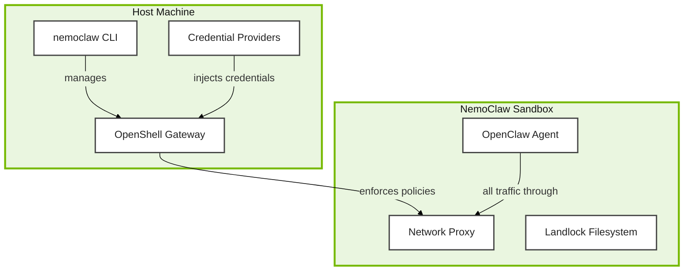

# Set Up NemoClaw


You've examined how OpenShell enforces kernel-level constraints, how the Privacy Router isolates credentials and enforces the operator's choice of inference backend, and how Nemotron can serve as that backend when sensitive queries need to stay local. Now let's install it and get a more secure sandbox running around your OpenClaw agent.

Here's what your NemoClaw deployment will look like when we're done. The agent lives inside the sandbox; all its traffic passes through the proxy; and credentials are designed to stay outside the sandbox.



> **Where you are:** You completed the OpenClaw setup on the previous page and have a working agent with an active gateway. This page adds NemoClaw's enforcement layers on top.

<!-- fold:break -->

## Step 1: Install and Onboard NemoClaw

Open a <button onclick="openNewTerminal();"><i class="fas fa-terminal"></i>terminal</button> and run the workshop's NemoClaw installer:

```bash
bash code/6-agent-safety/scripts/install-nemoclaw.sh
```

The script handles workshop-environment quirks for you and then runs the official NemoClaw installer in **interactive mode** — you'll be prompted to accept the license, choose your inference backend, and configure your sandbox.

<!-- fold:break -->

### What you'll be asked

Walk through each prompt as follows:

1. **License notice** — Type `yes` to accept.
2. **Inference provider** — Select **NVIDIA Endpoints** (option 1).
3. **Model** — Select **Nemotron 3 Super 120B** (option 1). This is the same model used in your OpenClaw setup.
4. **Sandbox name** — Press Enter to accept the default (`my-assistant`).
5. **Confirm configuration** — Type `Y` to apply.
6. **Brave Web Search** — Type `N` to skip (not needed for this module).
7. **Messaging channels** — Press Enter to skip (not needed for this module).

When prompted for policy options:

1. Leave **Policy tier** as "Balanced".
2. Leave **Presets** as the default options.

The script will then build the sandbox image (~2.4 GB compressed), upload it to the gateway, configure DNS, and launch OpenClaw inside the sandbox. This takes a few minutes on first run.

<!-- fold:break -->

<details>
<summary><strong>What does the install script do behind the scenes?</strong></summary>

The Workbench project container talks to the host's Docker daemon via a mounted socket, but NemoClaw's gateway listens on the host's network namespace — not the container's. The script bridges this with three small fixes:

1. **socat tunnel** — Forwards `127.0.0.1:8080` inside this container to the Docker bridge IP, where the host's gateway listens. Without this, NemoClaw's CLI dials a loopback that has nothing on it.
2. **Deferred-start watcher** — NemoClaw's preflight check requires port 8080 to be *free* in the container, but its readiness check requires it to *reach the gateway*. A background watcher waits for the gateway container to appear, then starts socat in the gap between those two checks.
3. **Stale-container cleanup** — If a previous install attempt failed, the script removes the leftover gateway container before retrying.

These are workarounds for NemoClaw v0.0.49 specifically. The script is idempotent — re-running it on an already-installed setup just ensures the tunnel is up. See `code/6-agent-safety/scripts/install-nemoclaw.sh` for the implementation.

</details>

<details>
<summary><strong>Troubleshooting: install fails or NemoClaw stops responding</strong></summary>

The install script writes detailed logs to two files:

| File | What's in it |
|------|--------------|
| `/tmp/nemoclaw-install.log` | Each step of the script plus the official installer's output |
| `/tmp/nemoclaw-tunnel.log` | socat tunnel activity (when the gateway came up, any forward errors) |

**Common recovery steps:**

1. **Re-run the script.** It's idempotent — if NemoClaw is already installed and the gateway is healthy, it just restarts the tunnel and exits. If the install partially failed, it cleans up and retries.

    ```bash
    bash code/6-agent-safety/scripts/install-nemoclaw.sh
    ```

2. **Full reset.** If something went very wrong (e.g., conflicting state from earlier attempts), remove the gateway container and any tunnel, then re-run:

    ```bash
    docker rm -f nemoclaw-openshell-gateway
    pkill -f "socat TCP-LISTEN:8080"
    bash code/6-agent-safety/scripts/install-nemoclaw.sh
    ```

</details>

<!-- fold:break -->

## Step 2: Connect to Your Sandbox

Time to step inside your new sandbox. Connecting to the sandbox is like stepping through an airlock -- you're entering a controlled environment where the rules are different.

Once onboarding completes, connect to the sandbox:

```bash
nemoclaw my-assistant connect
```

Your shell prompt will change to indicate you are now inside the sandboxed environment. All security layers -- Landlock filesystem restrictions, seccomp syscall filtering, and the network proxy -- are active.

<!-- fold:break -->

From inside the sandbox, verify the OpenClaw gateway is running:

```bash
openclaw gateway status
```

You can also send a test message to confirm inference is working:

```bash
openclaw agent --agent main -m "hello"
```

To return to the host shell, type `exit` or press `Ctrl+D`.

<!-- fold:break -->

## Step 3: Verify the Stack

Let's make sure everything came up correctly. You will check status from both the host and the monitoring TUI.

<details>
<summary><strong>Still facing issues? Click me for troubleshooting!</strong></summary>

If something didn't work, don't worry -- here are the most common issues and their fixes:

| Symptom | Cause | Fix |
|---------|-------|-----|
| `nemoclaw: command not found` | Shell PATH not updated after install | Run `source ~/.bashrc` or `export PATH="$HOME/.npm-global/bin:$PATH"` |
| Docker permission denied | User not in the docker group | `sudo usermod -aG docker $USER` then log out and back in |
| Sandbox creation fails (exit 137 / OOM) | Insufficient RAM for image push (~2.4 GB compressed) | Close other containers and add swap: `sudo dd if=/dev/zero of=/swapfile bs=1M count=4096 status=none && sudo chmod 600 /swapfile && sudo mkswap /swapfile && sudo swapon /swapfile` |
| Cannot connect to sandbox | Sandbox not running or gateway stopped | Check `nemoclaw my-assistant status`, then `openshell sandbox list`. Restart gateway: `openshell gateway start --name nemoclaw` |
| `openshell: command not found` inside sandbox | OpenShell not in PATH inside the sandbox environment | Check sandbox logs: `nemoclaw my-assistant logs --follow` |
| Port 18789 already in use | Another process holds the default gateway port | Find and stop it: `sudo lsof -i :18789` then `kill <PID>` |
| Inference requests time out | Endpoint unreachable or blocked by network policy | Verify provider with `nemoclaw my-assistant status`; check policy rules in `openshell term` |
| Node.js version too old | NemoClaw requires Node.js 22.16+ | Check with `node --version`; upgrade with `nvm install 22 && nvm use 22` |

</details>

### From the Host Terminal

Open a new <button onclick="openNewTerminal();"><i class="fas fa-terminal"></i> Open Terminal</button> and run:

```bash
nemoclaw status
```

This lists all registered sandboxes with their model, provider, and policy details. For detailed information about your sandbox:

```bash
nemoclaw my-assistant status
```

You should see the sandbox state as **running**, along with the active inference provider and endpoint.

<!-- fold:break -->

Your sandbox is running! The agent is now contained behind all four enforcement layers.

To list the underlying OpenShell sandbox details:

```bash
openshell sandbox list
```

<!-- fold:break -->

### Monitoring TUI

Open the real-time monitoring dashboard:

```bash
openshell term
```

The TUI displays:
- Active network connections from the sandbox
- Blocked egress requests awaiting operator approval
- Inference routing status

<!-- fold:break -->

### Quick Network Policy Test

From inside the sandbox (`nemoclaw my-assistant connect`), test the default-deny network policy:

```bash
curl https://example.com
```

This request should be **blocked** with a 403 Unauthorized error -- the sandbox cannot reach arbitrary external hosts. Now try an endpoint that the policy explicitly allows (your configured inference endpoint). The connection should succeed.

This confirms the kernel-level network enforcement is active.

<!-- fold:break -->

## Step 4: Configure the Workshop Workspace

The workshop's sensitive test data (decoy `passwords.txt` and `ssn_records.txt` files used as targets for the red-team probes in the next page) lives on the host at `/tmp/deepagent_workspace`. Upload it into the sandbox so the safety evaluation suite has something to probe against.

**Run this from the host shell** — if you're still inside the sandbox from the previous step, type `exit` first.

```bash
openshell sandbox upload my-assistant /tmp/deepagent_workspace /sandbox/workspace
```

Workspace files inside the sandbox are located at `/sandbox/.openclaw/workspace/`. These files persist across sandbox restarts but are **lost** if you run `nemoclaw my-assistant destroy`. The key workspace files are:

| File | Purpose |
|------|---------|
| `SOUL.md` | Core personality, tone, and behavioral rules |
| `USER.md` | Preferences and context the agent learns about you |
| `AGENTS.md` | Multi-agent coordination and safety guidelines |
| `MEMORY.md` | Long-term memory distilled from sessions |

<!-- fold:break -->

## Launch the NemoClaw Client

The workshop includes a Streamlit-based NemoClaw Client that connects to your sandbox's gateway, providing a browser-based chat interface with built-in red-team probe shortcuts and safety evaluation tools.

<button onclick="launch('NemoClaw Client');"><i class="fa-solid fa-rocket"></i> NemoClaw Client</button>

The client connects to your running gateway automatically. If the gateway is not reachable, it falls back to a mock agent for testing the UI.

You can also continue using the CLI for direct interaction:

```bash
nemoclaw my-assistant connect
openclaw tui
```

<!-- fold:break -->

## What's Next

Everything's set up and verified. Now let's put these security layers through their paces. Your NemoClaw stack is running with all security layers active: default-deny networking, Landlock filesystem restrictions, seccomp syscall filtering, and inference routing through the Privacy Router. Time to explore policies, test restrictions, and run the safety evaluation suite.

> Head to [Working with NemoClaw](using_nemoclaw) to start the hands-on exercises.
