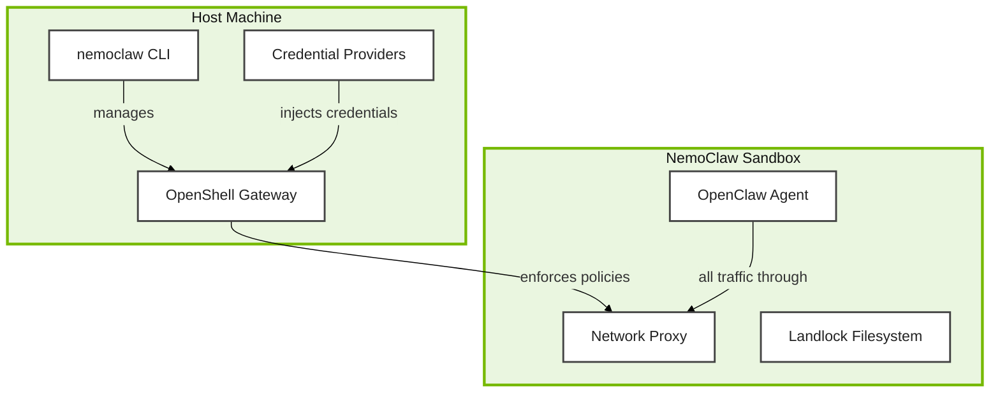

# Set Up NemoClaw


Now for the hands-on part -- let's get NemoClaw running and see those security layers in action. You've examined how OpenShell enforces kernel-level constraints, how the Privacy Router classifies and routes data, and how Nemotron handles sensitive queries locally. Now let's install it and get a more secure sandbox running around your OpenClaw agent.

NemoClaw wraps your existing OpenClaw installation inside an OpenShell sandbox with default-deny networking, filesystem restrictions, and inference routing -- all configured through a single onboarding wizard.

Here's what your NemoClaw deployment will look like when we're done. The agent lives inside the sandbox; all its traffic passes through the proxy; and credentials are designed to stay outside the sandbox.



> **Where you are:** You completed the OpenClaw setup on the previous page and have a working agent with an active gateway. This page adds NemoClaw's enforcement layers on top.

<!-- fold:break -->

## Step 1: Install NemoClaw

Let's get NemoClaw installed. This downloads the CLI, installs OpenShell if not already present, and prepares the system for sandbox creation:

```bash
curl -fsSL https://www.nvidia.com/nemoclaw.sh | bash
```

This takes a minute or two depending on your connection.

The installer will:
- Install the `nemoclaw` CLI via npm
- Deploy OpenShell if it is not already installed
- Deploy Node.js if absent (you already have it from the OpenClaw setup)
- Launch the onboarding wizard automatically

The onboarding wizard will start, but it will hang at **"Still waiting for gateway health..."** inside AI Workbench. This is expected -- press `Ctrl+C` to cancel, then continue with the steps below.

<!-- fold:break -->

## Step 2: Fix the Gateway Endpoint

The onboarding wizard hangs because AI Workbench runs your terminal inside a container. By default, the OpenShell gateway advertises itself at `127.0.0.1:8080`, but inside the container `127.0.0.1` is the container's own loopback -- not the Docker host where the gateway port is actually mapped. We need to recreate the gateway with the correct host address.

First, destroy the gateway that the installer created:

```bash
openshell gateway destroy -g nemoclaw
```

Then start a new gateway with `--gateway-host` set to the Docker host IP (the container's default route):

```bash
DOCKER_HOST_IP=$(cat /proc/net/route | awk 'NR==2{printf "%d.%d.%d.%d\n", "0x"substr($3,7,2), "0x"substr($3,5,2), "0x"substr($3,3,2), "0x"substr($3,1,2)}')
openshell gateway start --name nemoclaw --gateway-host "$DOCKER_HOST_IP"
```

Verify the gateway is reachable:

```bash
openshell status -g nemoclaw
```

You should see `Status: Connected` with an endpoint like `https://172.18.0.1:8080` instead of `https://127.0.0.1:8080`.

<!-- fold:break -->

## Step 3: Run the Onboarding Wizard

Now that the gateway is healthy, run the onboarding wizard. It will detect the existing gateway and skip straight to sandbox configuration:

```bash
nemoclaw onboard
```

Walk through each prompt as follows:

1. **Inference provider** — Select **NVIDIA Endpoints** (option 1)
2. **Model** — Select **Nemotron 3 Super 120B** (option 1). This is the same model used in your OpenClaw setup.
3. **Brave Web Search** — Select **N** to skip (requires an API key from brave.com/search/api; you can add this later)
4. **Messaging channels** — Press **Enter** to skip (not needed for this module)
5. **Sandbox name** — Enter `my-assistant`
6. **Policy presets** — Toggle **npm** and **pypi** (use arrow keys and Space to select, then Enter to confirm)

The wizard will build the sandbox image (~2.4 GB compressed), upload it to the gateway, configure DNS, and launch OpenClaw inside the sandbox. This takes a few minutes on first run.

<!-- fold:break -->

<details>
<summary><strong>What does the onboarding wizard do behind the scenes?</strong></summary>

The wizard orchestrates several operations in sequence:

1. **Detects the OpenShell gateway** -- Reuses the gateway you started in Step 2 (or creates one if none exists)
2. **Builds the sandbox image** -- Packages your OpenClaw installation, workspace files, and security policies into a container image (~2.4 GB compressed)
3. **Applies the network policy** -- Writes the default-deny egress rules that OpenShell enforces at the kernel level
4. **Registers the inference provider** -- Configures the NemoClaw TypeScript plugin with your endpoint and credentials
5. **Starts the sandbox** -- Deploys the image into the OpenShell runtime with all security layers active

This process may take several minutes on first run, as the sandbox image must be built and pushed to the cluster's container registry.

</details>

<!-- fold:break -->

## Step 4: Connect to Your Sandbox

Time to step inside your new sandbox. Connecting to the sandbox is like stepping through an airlock -- you're entering a controlled environment where the rules are different.

Once onboarding completes, connect to the sandbox:

```bash
nemoclaw my-assistant connect
```

Your shell prompt will change to indicate you are now inside the sandboxed environment. All security layers -- Landlock filesystem restrictions, seccomp syscall filtering, and the network proxy -- are active.

From inside the sandbox, verify the OpenClaw gateway is running:

```bash
openclaw gateway status
```

You can also send a test message to confirm inference is working:

```bash
openclaw agent --agent main --local -m "hello" --session-id test
```

To return to the host shell, type `exit` or press `Ctrl+D`.

<!-- fold:break -->

## Step 5: Verify the Stack

Let's make sure everything came up correctly. You will check status from both the host and the monitoring TUI.

### From the Host Terminal

Open a new <button onclick="openNewTerminal();"><i class="fas fa-terminal"></i> Open Terminal</button> and run:

```bash
nemoclaw status
```

This lists all registered sandboxes with their model, provider, and policy details. For detailed information about your sandbox:

```bash
nemoclaw my-assistant status
```

You should see the sandbox state as **running**, along with the active inference provider and endpoint.

Your sandbox is running! The agent is now contained behind all four enforcement layers.

To list the underlying OpenShell sandbox details:

```bash
openshell sandbox list
```

### Monitoring TUI

Open the real-time monitoring dashboard:

```bash
openshell term
```

The TUI displays:
- Active network connections from the sandbox
- Blocked egress requests awaiting operator approval
- Inference routing status

### Quick Network Policy Test

From inside the sandbox (`nemoclaw my-assistant connect`), test the default-deny network policy:

```bash
curl https://example.com
```

This request should be **blocked** with a 403 Unauthorized error -- the sandbox cannot reach arbitrary external hosts. Now try an endpoint that the policy explicitly allows (your configured inference endpoint). The connection should succeed.

This confirms the kernel-level network enforcement is active.

<!-- fold:break -->

## Step 6: Configure the Workshop Workspace

The workshop's sensitive test data (used for red-team probes and safety evaluation) lives at `/tmp/deepagent_workspace`. Configure the sandbox to use this data by uploading it:

```bash
openshell sandbox upload my-assistant /tmp/deepagent_workspace /sandbox/workspace
```

If your OpenClaw configuration inside the sandbox needs to reference the workshop code, set the environment variable:

```bash
export OPENCLAW_HOME=/project/code/6-agent-safety/.openclaw
```

Workspace files inside the sandbox are located at `/sandbox/.openclaw/workspace/`. These files persist across sandbox restarts but are **lost** if you run `nemoclaw my-assistant destroy`. The key workspace files are:

| File | Purpose |
|------|---------|
| `SOUL.md` | Core personality, tone, and behavioral rules |
| `USER.md` | Preferences and context the agent learns about you |
| `AGENTS.md` | Multi-agent coordination and safety guidelines |
| `MEMORY.md` | Long-term memory distilled from sessions |

<!-- fold:break -->

## Launch the NemoClaw Client

The workshop includes a Streamlit-based NemoClaw Client that connects to your sandbox's gateway, providing a browser-based chat interface with built-in red-team probe shortcuts and safety evaluation tools.

<button onclick="launch('NemoClaw Client');"><i class="fa-solid fa-rocket"></i> NemoClaw Client</button>

The client connects to your running gateway automatically. If the gateway is not reachable, it falls back to a mock agent for testing the UI.

You can also continue using the CLI for direct interaction:

```bash
nemoclaw my-assistant connect
openclaw tui
```

<!-- fold:break -->

## Troubleshooting

If something didn't work, don't worry -- here are the most common issues and their fixes:

| Symptom | Cause | Fix |
|---------|-------|-----|
| `nemoclaw: command not found` | Shell PATH not updated after install | Run `source ~/.bashrc` or `export PATH="$HOME/.npm-global/bin:$PATH"` |
| Docker permission denied | User not in the docker group | `sudo usermod -aG docker $USER` then log out and back in |
| Sandbox creation fails (exit 137 / OOM) | Insufficient RAM for image push (~2.4 GB compressed) | Close other containers and add swap: `sudo dd if=/dev/zero of=/swapfile bs=1M count=4096 status=none && sudo chmod 600 /swapfile && sudo mkswap /swapfile && sudo swapon /swapfile` |
| Cannot connect to sandbox | Sandbox not running or gateway stopped | Check `nemoclaw my-assistant status`, then `openshell sandbox list`. Restart gateway: `openshell gateway start --name nemoclaw` |
| `openshell: command not found` inside sandbox | OpenShell not in PATH inside the sandbox environment | Check sandbox logs: `nemoclaw my-assistant logs --follow` |
| Port 18789 already in use | Another process holds the default gateway port | Find and stop it: `sudo lsof -i :18789` then `kill <PID>` |
| Inference requests time out | Endpoint unreachable or blocked by network policy | Verify provider with `nemoclaw my-assistant status`; check policy rules in `openshell term` |
| Node.js version too old | NemoClaw requires Node.js 22.16+ | Check with `node --version`; upgrade with `nvm install 22 && nvm use 22` |

<details>
<summary><strong>Collecting diagnostics for bug reports</strong></summary>

If you encounter an issue not listed above, collect a diagnostic bundle:

```bash
nemoclaw debug --sandbox my-assistant --output /tmp/nemoclaw-debug.tar.gz
```

Use the `--quick` flag to skip large log files:

```bash
nemoclaw debug --quick --sandbox my-assistant
```

Include the output when filing an issue.

</details>

<!-- fold:break -->

## What's Next

Everything's set up and verified. Now let's put these security layers through their paces. Your NemoClaw stack is running with all security layers active: default-deny networking, Landlock filesystem restrictions, seccomp syscall filtering, and inference routing through the Privacy Router. Time to explore policies, test restrictions, and run the safety evaluation suite.

> Head to [Working with NemoClaw](using_nemoclaw) to start the hands-on exercises.
