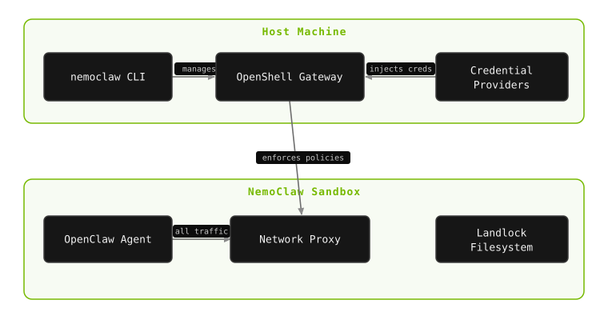

<div class="dx-hero" data-eyebrow="MODULE 06 / 04 - SETUP NEMOCLAW" data-title="Set Up NemoClaw" data-meta="TIME::20 min|STEPS::5|RUNTIME::OpenShell sandbox"></div>

You've examined how OpenShell enforces kernel-level constraints, how the Privacy Router isolates credentials and enforces the operator's choice of inference backend, and how Nemotron can serve as that backend when sensitive queries need to stay local. Now let's install it and get a more secure sandbox running around your OpenClaw agent.

Here's what your NemoClaw deployment will look like when we're done. The agent lives inside the sandbox; outbound network access is governed by policy; upstream provider credentials stay in the gateway.



> **Where you are:** You completed the OpenClaw setup on the previous page and have a working agent with an active gateway. This page adds NemoClaw's enforcement layers on top.

<!-- fold:break -->

## Step 1: Install and Onboard NemoClaw

Open a <button onclick="openNewTerminal();"><i class="fas fa-terminal"></i>terminal</button> and run the workshop's NemoClaw installer:

```bash
bash code/6-agent-safety/scripts/install-nemoclaw.sh
```

The script handles workshop-environment quirks for you and then runs the official NemoClaw installer in **interactive mode** — you'll be prompted to accept the license, choose your inference backend, and configure your sandbox.

<!-- fold:break -->

### What you'll be asked

Walk through each prompt as follows:

1. **License notice** — Type `yes` to accept.
2. **Inference provider** — Select **NVIDIA Endpoints** (option 1).
3. **Model** — Select **Nemotron 3 Super 120B** by name. Confirm the model ID matches the workshop preflight; menu positions can change.
4. **Sandbox name** — Press Enter to accept the default (`my-assistant`).
5. **Confirm configuration** — Type `Y` to apply.
6. **Brave Web Search** — Type `N` to skip (not needed for this module).
7. **Messaging channels** — Press Enter to skip (not needed for this module).

When prompted for policy options:

1. Leave **Policy tier** as "Balanced".
2. Leave **Presets** as the default options.

The script will then build the sandbox image, configure networking, and launch OpenClaw inside the sandbox. Image size and first-run build time depend on the installed release.

<!-- fold:break -->

<div class="dx-aside">
<button class="dx-aside-btn" popovertarget="aside-setup_nemoclaw-1">What does the install script do behind the scenes?</button>
<div id="aside-setup_nemoclaw-1" popover class="dx-aside-panel">
<button class="dx-aside-x" popovertarget="aside-setup_nemoclaw-1" popovertargetaction="hide" aria-label="Close">×</button>

The Workbench project container talks to the host's Docker daemon via a mounted socket. The script handles three setup details:

1. **Deferred socat tunnel** — Forwards the container's `127.0.0.1:8080` to the gateway bound to the Docker bridge after the preflight port check.
2. **Shared runtime paths** — Keeps gateway binaries, driver configuration and state in Workbench's shared volume and maps their paths for the host Docker daemon. A read-only system certificate bundle lets the gateway verify HTTPS inference endpoints. The sandbox base is pinned to a compatible immutable image.
3. **Stale-container cleanup** — If a previous install attempt failed, the script removes the leftover gateway container before retrying.

The workshop pins NemoClaw **v0.0.55**, OpenShell **0.0.44**, and OpenClaw **2026.5.22**, with the matching immutable sandbox base. This includes upstream fixes for plugin dependency moves (`EXDEV`) and the file-write hook. The hosted-inference sandbox defaults to CPU mode; it does not need GPU passthrough. On a healthy install, rerunning the script checks the versions and restores the tunnel. A Ready sandbox with an older runtime is preserved, and the helper asks you to reset it explicitly; rerunning alone does not upgrade its image. Recovery from an incomplete install can remove the named gateway and rerun onboarding. Use it only for your disposable workshop setup. See `code/6-agent-safety/scripts/install-nemoclaw.sh` for the implementation.

This pinned gateway disables operator authentication and TLS. The helper avoids a public-interface listener, but other host users and bridge-connected containers may still reach port 8080. Keep this workshop on a trusted host; sandbox policy does not protect the operator control plane.

</div>
</div>

<details class="dx-peek is-solution">
<summary>Troubleshooting: install fails or NemoClaw stops responding</summary>

**First, see which layer is down.** Run the read-only health check — it probes the tunnel, gateway, CLI, and sandbox and prints the exact recovery command:

```bash
bash code/6-agent-safety/scripts/nemoclaw-health.sh
```

The install script writes detailed logs to two files:

| File | What's in it |
|------|--------------|
| `/tmp/nemoclaw-install.log` | Each step of the script plus the official installer's output |
| `/tmp/nemoclaw-tunnel.log` | socat tunnel activity (when the gateway came up, any forward errors) |

**Common recovery steps:**

1. **Repair the installation.** A healthy gateway may only need its tunnel restored. Recovery can recreate gateway state; inspect the script's output before retrying.

    ```bash
    bash code/6-agent-safety/scripts/install-nemoclaw.sh
    ```

2. **Full reset or version upgrade.** Save any workspace files you need first: destroying the sandbox deletes them. With the tunnel and gateway reachable, use the official destroy command to remove the sandbox **and its registration**, then reinstall. Replace `my-assistant` if you chose another name. The destroy command asks for confirmation.

    ```bash
    nemoclaw my-assistant destroy --cleanup-gateway
    NEMOCLAW_FRESH=1 bash code/6-agent-safety/scripts/install-nemoclaw.sh
    ```

    Removing only the gateway or setting `NEMOCLAW_FRESH=1` is insufficient: upstream backs up registered sandboxes before onboarding, which can restart the tunnel before the port check. If the destroy command cannot connect, run the health check and restore the tunnel first.

</details>

<!-- fold:break -->

## Step 2: Connect to Your Sandbox


Time to step inside your new sandbox. Connecting to the sandbox is like stepping through an airlock -- you're entering a controlled environment where the rules are different.

Once onboarding completes, connect to the sandbox:

```bash
nemoclaw my-assistant connect
```

Your shell prompt should now indicate the sandbox. The next lesson uses policy inspection and probes to check its filesystem, process and network boundaries.

<!-- fold:break -->

From inside the sandbox, verify the OpenClaw gateway is running (``Connectivity probe: ok``):

```bash
openclaw gateway status
```

You can also send a test message to confirm inference is working:

```bash
openclaw agent --agent main -m "hello"
```

To return to the host shell, type `exit` or press `Ctrl+D`.

<!-- fold:break -->

## Step 3: Verify the Stack

Let's make sure everything came up correctly. You will check status from both the host and the monitoring TUI.

<details class="dx-peek is-solution">
<summary>Still facing issues? Click me for troubleshooting!</summary>

If something didn't work, don't worry -- here are the most common issues and their fixes:

| Symptom | Cause | Fix |
|---------|-------|-----|
| `nemoclaw: command not found` | Shell PATH not updated after install | Run `source ~/.bashrc` or `export PATH="$HOME/.npm-global/bin:$PATH"` |
| `Error: Cannot find module '.../dist/lib/agent/runtime'` | Partial/corrupt NemoClaw install — the CLI is on PATH but its files are incomplete | Reinstall to repair: `bash code/6-agent-safety/scripts/install-nemoclaw.sh` |
| Docker permission denied | Shell didn't pick up the socket group / `DOCKER_HOST` | These are set by `/etc/profile.d/join-docker-group.sh`, which only runs in a login shell. Open a fresh terminal, or `source /etc/profile.d/join-docker-group.sh`. |
| Sandbox creation fails (exit 137 / OOM) | Insufficient memory during image build or sandbox startup | Check available memory and ask the workshop operator for capacity; preserve other running services. |
| Cannot connect to sandbox | Sandbox not running or gateway stopped | Run the health check above, then use its repair command for this disposable setup. |
| `openshell: command not found` inside sandbox | OpenShell is an operator-side CLI | Run policy and lifecycle commands from the host terminal. |
| Port 18789 already in use | Another process holds the default gateway port | Inspect it with `lsof -i :18789`; stop it only if it belongs to this lab. |
| Inference requests time out | Endpoint unreachable or blocked by network policy | Verify provider with `nemoclaw my-assistant status`; check policy rules in `openshell term` |
| Node.js version too old | NemoClaw requires Node.js 22.16+ | Check with `node --version`; upgrade with `nvm install 22 && nvm use 22` |
| `EXDEV` during plugin startup, or a `before_tool_call` error mentioning `includes` | An older sandbox runtime is still installed | Save needed workspace files, then follow **Full reset or version upgrade** above, including the official sandbox destroy command. Verify the pinned versions and run the agent check below. |

</details>

### From the Host Terminal

Open a new <button onclick="openNewTerminal();"><i class="fas fa-terminal"></i> Open Terminal</button> and run:

```bash
nemoclaw status
```

This lists all registered sandboxes with their model, provider, and policy details. For detailed information about your sandbox:

```bash
nemoclaw my-assistant status
```

You should see **Phase: Ready**, along with the active inference provider and endpoint.

`Ready` describes the sandbox control plane. Check the agent and its file tools separately:

```bash
python code/6-agent-safety/scripts/check-nemoclaw-agent.py
```

This normally makes three model calls and removes its uniquely named temporary workspace file afterward. It checks a greeting, verifies that the agent really wrote a file, changes that file independently, and asks the agent to read the new contents. Expect three `PASS` lines. On the first run, it may retry the greeting twice, waiting 30 seconds each time for the upstream gateway's CLI pairing. If pairing is still pending, it reports **NOT READY**; wait for the pairing watcher and rerun the check. An embedded fallback does not count as a gateway success. A tool-hook exception is a runtime failure, not evidence that filesystem policy denied access. This check verifies functionality; the next lesson tests enforcement.

<!-- fold:break -->

Your sandbox is running. Next, probe its behavior to check which restrictions are active.

To list the underlying OpenShell sandbox details:

```bash
openshell sandbox list
```

<!-- fold:break -->

### Monitoring TUI

Open the real-time monitoring dashboard:

```bash
openshell term
```

The TUI displays:
- Active network connections from the sandbox
- Blocked egress requests awaiting operator approval
- Inference routing status

<!-- fold:break -->

### Quick Network Policy Test

From inside the sandbox (`nemoclaw my-assistant connect`), test the default-deny network policy:

```bash
curl https://example.com
```

If no active rule permits `example.com`, expect a proxy denial (often 403). Inspect the actual policy; presets and provider rules can add access. Now try an endpoint that the policy explicitly allows (your configured inference endpoint). The connection should succeed.

Confirm the denial in `openshell logs my-assistant`. A timeout or upstream server error alone does not prove a policy denial.

<!-- fold:break -->

## Step 4: Configure the Workshop Workspace

The workshop's sensitive test data (decoy `passwords.txt` and `ssn_records.txt` files used as targets for the red-team probes in the next page) lives on the host at `/tmp/deepagent_workspace`. Upload it into the sandbox so the safety evaluation suite has something to probe against.

**Run this from the host shell** — if you're still inside the sandbox from the previous step, type `exit` first.

```bash
openshell sandbox upload my-assistant /tmp/deepagent_workspace/passwords.txt /sandbox/workspace/passwords.txt
openshell sandbox upload my-assistant /tmp/deepagent_workspace/ssn_records.txt /sandbox/workspace/ssn_records.txt
```

Uploading a directory can nest its basename, so the commands above use explicit file destinations. Check both files exist before running probes.

OpenClaw workspace files inside the sandbox are located at `/sandbox/.openclaw/workspace/`. These files persist across sandbox restarts but are **lost** if you run `nemoclaw my-assistant destroy`. The key workspace files are:

| File | Purpose |
|------|---------|
| `SOUL.md` | Core personality, tone, and behavioral rules |
| `USER.md` | Preferences and context the agent learns about you |
| `AGENTS.md` | Multi-agent coordination and safety guidelines |
| `MEMORY.md` | Long-term memory distilled from sessions |

<!-- fold:break -->

## Launch the NemoClaw Client

The workshop includes a Streamlit-based NemoClaw Client that connects to your sandbox's gateway, providing a browser-based chat interface with built-in red-team probe shortcuts and safety evaluation tools.

<button onclick="launch('NemoClaw Client');"><i class="fa-solid fa-rocket"></i> NemoClaw Client</button>

The client connects to your running gateway automatically. If the gateway is not reachable, it falls back to a mock agent for testing the UI.

**Note:** Just like from the OpenClaw setup page, you can also continue using the CLI for direct interaction:

```bash
nemoclaw my-assistant connect
openclaw tui
```

<!-- fold:break -->

## What's Next

Once the connection works, inspect the active policy and test its boundaries. A connected client alone does not verify filesystem restrictions, network rules or inference routing.

> Head to [Working with NemoClaw](using_nemoclaw) to start the hands-on exercises.
