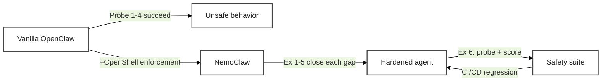

# Working with NemoClaw


Your NemoClaw sandbox is running. The agent lives inside four enforcement layers: **Network** (egress policy), **Filesystem** (Landlock), **Process** (seccomp + least privilege), and **Inference** (Privacy Router). Reading about those layers and *feeling* them are very different things. This page walks you through six hands-on exercises that turn each layer into a copy-pasteable experience — and that revisit the four probes you just ran on the [previous page](setup_openclaw) to see NemoClaw shut them down.

<!-- fold:break -->

## The Arc

Every exercise on this page follows the same four-step pattern:

1. **Recall** — the unsecured behavior from `setup_openclaw.md`
2. **Observe** — the same probe against the hardened sandbox
3. **Harden** — extend or write a policy that enforces the boundary
4. **Validate** — a short Python companion that catches the same class of issue programmatically

Here is the full arc at a glance. The layer column maps to the four layers introduced on [Why NemoClaw: Principles and Layers](why_nemoclaw).

| # | Exercise | Layer | Recalls |
|---|---|---|---|
| 1 | Stop the agent from phoning home | Network | Probe 1 |
| 2 | Not all allow-rules are equal | Network (L7 vs L4) | — |
| 3 | Make containment irrevocable | Filesystem + Process | Probe 2 |
| 4 | Remove the keys from the agent | Inference + Network | Probe 3 |
| 5 | Route sensitive queries locally | Inference | — |
| 6 | Continuous safety evaluation | Cross-cutting | Probe 4 |

> Exercises 1–5 establish the four enforcement layers. Exercise 6 is the capstone — it wires together red-team probing, LLM-as-judge scoring, and a full safety evaluation suite in Python. Together they give you an end-to-end agent-safety workflow you can run in CI/CD.

<!-- fold:break -->



<!-- fold:break -->

## How to Use This Page

- **Recall callouts** (*"Recall: Probe N"*) refer back to the four probes at the end of [Set Up Your OpenClaw Agent](setup_openclaw). Keep that page open in a second tab.
- **Python companions** are called "sidekicks" — short TODO extensions in <button onclick="goToLineAndSelect('code/6-agent-safety/agent_safety.py', '# TODO: Exercise 1');"><i class="fas fa-code"></i> agent_safety.py</button>.
- **Layer tags** at the top of each exercise (*Layer: Network*, etc.) cross-reference the enforcement layers introduced on [Why NemoClaw: Principles and Layers](why_nemoclaw).
- **Static vs dynamic callouts** remind you which policy fields hot-reload and which require sandbox recreation.
- All CLI commands marked for the sandbox shell run inside `nemoclaw my-assistant connect`. All host-side commands run in a separate terminal outside the sandbox.

<!-- fold:break -->

## Section 1 — Layer 1: Network (Egress Policy)

The Network layer controls **where the agent can reach**. NemoClaw's baseline is deny-by-default: every outbound connection is blocked unless a policy entry explicitly allows it. Network policy is the one enforcement layer that hot-reloads without sandbox recreation — a deliberate design so operators can grant (or revoke) access on a running agent.

<!-- fold:break -->

### Exercise 1: Stop the agent from phoning home

> *Layer: **Network** · Recalls: **Probe 1** (Phone Home) · Runs in: host terminal + sandbox terminal*

Vanilla OpenClaw cheerfully fetched `https://httpbin.org/ip` for you. Let's see what happens inside the NemoClaw sandbox.

<!-- fold:break -->

**Step 1 — Observe the deny.** From inside the sandbox:

```bash
nemoclaw my-assistant connect
curl -s https://httpbin.org/ip
```

Expected output:

```text
curl: (56) Received HTTP code 403 from proxy after CONNECT
```

The proxy intercepted your request, checked the policy, found no matching `network_policies` entry for `httpbin.org:443`, and returned a 403. **This is the same probe from Probe 1 — the behavior has changed because the infrastructure has.**

<!-- fold:break -->

**Step 2 — Read the baseline policy.** From a host terminal (outside the sandbox):

```bash
openshell policy get my-assistant
```

Scroll through the output. You'll see three sections:

- `filesystem_policy` — paths the agent can read/write (static)
- `process` — the `sandbox` user the agent runs as (static)
- `network_policies` — named blocks, each listing endpoints + binaries (dynamic)

`httpbin.org` is nowhere in `network_policies`, so the proxy denied it. Let's add an entry.

<!-- fold:break -->

**Step 3 — Write a policy.** On the host, create a file called `httpbin-readonly.yaml`:

```yaml
network_policies:
  httpbin_access:
    name: httpbin-readonly
    endpoints:
      - host: httpbin.org
        port: 443
        protocol: rest
        enforcement: enforce
        access: read-only
    binaries:
      - { path: /usr/bin/curl }
```

Apply it to the live sandbox:

```bash
openshell policy set my-assistant --policy httpbin-readonly.yaml --wait
```

The `--wait` flag blocks until the proxy picks up the new rule. No sandbox restart required — this is the dynamic enforcement layer in action.

<!-- fold:break -->

**Step 4 — Confirm the change.** Back inside the sandbox:

```bash
curl -s https://httpbin.org/ip
```

Expected:

```json
{
  "origin": "10.x.x.x"
}
```

The agent can now reach `httpbin.org`. Dynamic policy hot-reload is one of NemoClaw's core operational affordances: grant a new endpoint without downtime, revoke one the same way.

> Remember this for Exercise 3 — **filesystem** policy is *static*. You cannot change it on a running sandbox. Different layers, different tradeoffs.

<!-- fold:break -->

**Step 5 — Python sidekick: validate the policy before you ship it.** Open <button onclick="goToLineAndSelect('code/6-agent-safety/agent_safety.py', '# TODO: Exercise 1');"><i class="fas fa-code"></i> # TODO: Exercise 1</button> and complete `load_and_validate_policy()`. The validator checks three classes of violation:

| Check | Severity | Why |
|---|---|---|
| `run_as_user == "root"` | critical | Root agents own the entire system on compromise |
| Broad `read_write` path (`/`, `/etc`, `/usr`, `/var`) | critical | Makes Landlock pointless |
| No `network_policies` AND `default_network_action != "deny"` | warning | Agent can reach anything |

Test against the two fixtures in `policies/`:

- `baseline_permissive.yaml` — deliberately weak. Your validator should flag all three.
- `research_assistant.yaml` — hardened. Zero violations.

<details>
<summary><strong>🆘 Need some help?</strong></summary>

```python
def load_and_validate_policy(policy_path: str) -> PolicyValidationResult:
    with open(policy_path, "r") as f:
        policy_data = yaml.safe_load(f)

    violations = []

    # Check: root
    process_config = policy_data.get("process", {})
    run_as_user = process_config.get("run_as_user", "")
    if run_as_user in ("root", "0"):
        violations.append(PolicyViolation(
            rule="runs_as_root",
            severity="critical",
            description="Agent runs as root — a compromised agent with root access owns the entire system",
        ))

    # Check: broad writes
    fs_policy = policy_data.get("filesystem_policy", {})
    read_write_paths = fs_policy.get("read_write", [])
    dangerous_paths = ["/", "/etc", "/usr", "/var"]
    for path in read_write_paths:
        if path in dangerous_paths:
            violations.append(PolicyViolation(
                rule="overly_broad_write",
                severity="critical",
                description=f"Write access to '{path}' is overly broad — agent can modify system files",
            ))

    # Check: network controls
    network_policies = policy_data.get("network_policies", [])
    default_action = policy_data.get("default_network_action", "")
    if not network_policies and default_action != "deny":
        violations.append(PolicyViolation(
            rule="no_network_controls",
            severity="warning",
            description="No network controls defined — agent can reach any endpoint on the internet",
        ))

    has_critical = any(v.severity == "critical" for v in violations)
    return PolicyValidationResult(
        policy_path=policy_path,
        policy_data=policy_data,
        violations=violations,
        is_safe=not has_critical,
    )
```

</details>

<!-- fold:break -->

Run it:

```bash
cd /project/code/6-agent-safety
python -c "from agent_safety import load_and_validate_policy; r = load_and_validate_policy('policies/baseline_permissive.yaml'); print(r.is_safe, len(r.violations))"
```

Expected: `False 3` — three violations, not safe. The same validator wired into CI/CD would block a weak policy from ever reaching a sandbox.

> **What you just learned:** deny-by-default is the posture, hot-reload is the operational affordance, and programmatic validation is the safety net that catches policy regressions before they hit production.

<!-- fold:break -->
