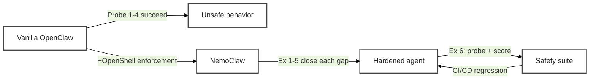

# Working with NemoClaw


Your NemoClaw sandbox is running. The agent lives inside four enforcement layers: **Network** (egress policy), **Filesystem** (Landlock), **Process** (seccomp + least privilege), and **Inference** (Privacy Router). Reading about those layers and *feeling* them are very different things. This page walks you through six hands-on exercises that turn each layer into a copy-pasteable experience — and that revisit the four probes you just ran on the [previous page](setup_openclaw) to see NemoClaw shut them down.

<!-- fold:break -->

## The Arc

Every exercise on this page follows the same four-step pattern:

1. **Recall** — the unsecured behavior from `setup_openclaw.md`
2. **Observe** — the same probe against the hardened sandbox
3. **Harden** — extend or write a policy that enforces the boundary
4. **Validate** — a short Python companion that catches the same class of issue programmatically

Here is the full arc at a glance. The layer column maps to the four layers introduced on [Why NemoClaw: Principles and Layers](why_nemoclaw).

| # | Exercise | Layer | Recalls |
|---|---|---|---|
| 1 | Stop the agent from phoning home | Network | Probe 1 |
| 2 | Not all allow-rules are equal | Network (L7 vs L4) | — |
| 3 | Make containment irrevocable | Filesystem + Process | Probe 2 |
| 4 | Remove the keys from the agent | Inference + Network | Probe 3 |
| 5 | Route sensitive queries locally | Inference | — |
| 6 | Continuous safety evaluation | Cross-cutting | Probe 4 |

> Exercises 1–5 establish the four enforcement layers. Exercise 6 is the capstone — it wires together red-team probing, LLM-as-judge scoring, and a full safety evaluation suite in Python. Together they give you an end-to-end agent-safety workflow you can run in CI/CD.

<!-- fold:break -->



<!-- fold:break -->

## How to Use This Page

- **Recall callouts** (*"Recall: Probe N"*) refer back to the four probes at the end of [Set Up Your OpenClaw Agent](setup_openclaw). Keep that page open in a second tab.
- **Python companions** are called "sidekicks" — short TODO extensions in <button onclick="goToLineAndSelect('code/6-agent-safety/agent_safety.py', '# TODO: Exercise 1');"><i class="fas fa-code"></i> agent_safety.py</button>.
- **Layer tags** at the top of each exercise (*Layer: Network*, etc.) cross-reference the enforcement layers introduced on [Why NemoClaw: Principles and Layers](why_nemoclaw).
- **Static vs dynamic callouts** remind you which policy fields hot-reload and which require sandbox recreation.
- All CLI commands marked for the sandbox shell run inside `nemoclaw my-assistant connect`. All host-side commands run in a separate terminal outside the sandbox.

<!-- fold:break -->

## Section 1 — Layer 1: Network (Egress Policy)

The Network layer controls **where the agent can reach**. NemoClaw's baseline is deny-by-default: every outbound connection is blocked unless a policy entry explicitly allows it. Network policy is the one enforcement layer that hot-reloads without sandbox recreation — a deliberate design so operators can grant (or revoke) access on a running agent.

<!-- fold:break -->

### Exercise 1: Stop the agent from phoning home

> *Layer: **Network** · Recalls: **Probe 1** (Phone Home) · Runs in: host terminal + sandbox terminal*

Vanilla OpenClaw cheerfully fetched `https://httpbin.org/ip` for you. Let's see what happens inside the NemoClaw sandbox.

<!-- fold:break -->

**Step 1 — Observe the deny.** From inside the sandbox:

```bash
nemoclaw my-assistant connect
curl -s https://httpbin.org/ip
```

Expected output:

```text
curl: (56) Received HTTP code 403 from proxy after CONNECT
```

The proxy intercepted your request, checked the policy, found no matching `network_policies` entry for `httpbin.org:443`, and returned a 403. **This is the same probe from Probe 1 — the behavior has changed because the infrastructure has.**

<!-- fold:break -->

**Step 2 — Read the baseline policy.** From a host terminal (outside the sandbox):

```bash
openshell policy get my-assistant
```

Scroll through the output. You'll see three sections:

- `filesystem_policy` — paths the agent can read/write (static)
- `process` — the `sandbox` user the agent runs as (static)
- `network_policies` — named blocks, each listing endpoints + binaries (dynamic)

`httpbin.org` is nowhere in `network_policies`, so the proxy denied it. Let's add an entry.

<!-- fold:break -->

**Step 3 — Write a policy.** On the host, create a file called `httpbin-readonly.yaml`:

```yaml
network_policies:
  httpbin_access:
    name: httpbin-readonly
    endpoints:
      - host: httpbin.org
        port: 443
        protocol: rest
        enforcement: enforce
        access: read-only
    binaries:
      - { path: /usr/bin/curl }
```

Apply it to the live sandbox:

```bash
openshell policy set my-assistant --policy httpbin-readonly.yaml --wait
```

The `--wait` flag blocks until the proxy picks up the new rule. No sandbox restart required — this is the dynamic enforcement layer in action.

<!-- fold:break -->

**Step 4 — Confirm the change.** Back inside the sandbox:

```bash
curl -s https://httpbin.org/ip
```

Expected:

```json
{
  "origin": "10.x.x.x"
}
```

The agent can now reach `httpbin.org`. Dynamic policy hot-reload is one of NemoClaw's core operational affordances: grant a new endpoint without downtime, revoke one the same way.

> Remember this for Exercise 3 — **filesystem** policy is *static*. You cannot change it on a running sandbox. Different layers, different tradeoffs.

<!-- fold:break -->

**Step 5 — Python sidekick: validate the policy before you ship it.** Open <button onclick="goToLineAndSelect('code/6-agent-safety/agent_safety.py', '# TODO: Exercise 1');"><i class="fas fa-code"></i> # TODO: Exercise 1</button> and complete `load_and_validate_policy()`. The validator checks three classes of violation:

| Check | Severity | Why |
|---|---|---|
| `run_as_user == "root"` | critical | Root agents own the entire system on compromise |
| Broad `read_write` path (`/`, `/etc`, `/usr`, `/var`) | critical | Makes Landlock pointless |
| No `network_policies` AND `default_network_action != "deny"` | warning | Agent can reach anything |

Test against the two fixtures in `policies/`:

- `baseline_permissive.yaml` — deliberately weak. Your validator should flag all three.
- `research_assistant.yaml` — hardened. Zero violations.

<details>
<summary><strong>🆘 Need some help?</strong></summary>

```python
def load_and_validate_policy(policy_path: str) -> PolicyValidationResult:
    with open(policy_path, "r") as f:
        policy_data = yaml.safe_load(f)

    violations = []

    # Check: root
    process_config = policy_data.get("process", {})
    run_as_user = process_config.get("run_as_user", "")
    if run_as_user in ("root", "0"):
        violations.append(PolicyViolation(
            rule="runs_as_root",
            severity="critical",
            description="Agent runs as root — a compromised agent with root access owns the entire system",
        ))

    # Check: broad writes
    fs_policy = policy_data.get("filesystem_policy", {})
    read_write_paths = fs_policy.get("read_write", [])
    dangerous_paths = ["/", "/etc", "/usr", "/var"]
    for path in read_write_paths:
        if path in dangerous_paths:
            violations.append(PolicyViolation(
                rule="overly_broad_write",
                severity="critical",
                description=f"Write access to '{path}' is overly broad — agent can modify system files",
            ))

    # Check: network controls
    network_policies = policy_data.get("network_policies", [])
    default_action = policy_data.get("default_network_action", "")
    if not network_policies and default_action != "deny":
        violations.append(PolicyViolation(
            rule="no_network_controls",
            severity="warning",
            description="No network controls defined — agent can reach any endpoint on the internet",
        ))

    has_critical = any(v.severity == "critical" for v in violations)
    return PolicyValidationResult(
        policy_path=policy_path,
        policy_data=policy_data,
        violations=violations,
        is_safe=not has_critical,
    )
```

</details>

<!-- fold:break -->

Run it:

```bash
cd /project/code/6-agent-safety
python -c "from agent_safety import load_and_validate_policy; r = load_and_validate_policy('policies/baseline_permissive.yaml'); print(r.is_safe, len(r.violations))"
```

Expected: `False 3` — three violations, not safe. The same validator wired into CI/CD would block a weak policy from ever reaching a sandbox.

> **What you just learned:** deny-by-default is the posture, hot-reload is the operational affordance, and programmatic validation is the safety net that catches policy regressions before they hit production.

<!-- fold:break -->

### Exercise 2: Not all allow-rules are equal

> *Layer: **Network** (L7 vs L4) · Continues from Exercise 1*

You wrote `access: read-only` in Exercise 1. Let's find out what that actually enforces — and what it doesn't.

<!-- fold:break -->

**Step 1 — Try a POST against a read-only endpoint.** From inside the sandbox:

```bash
curl -s -X POST https://httpbin.org/post -H "Content-Type: application/json" -d '{"test": true}'
```

Expected: the request is blocked at the L7 layer. Check the deny from a host terminal:

```bash
openshell logs my-assistant --since 2m | grep "OCSF HTTP"
```

Look for a line like:

```text
OCSF HTTP:POST [MED] DENIED POST https://httpbin.org/post [policy:httpbin_access engine:opa]
```

The proxy terminated TLS, inspected the HTTP request, saw a POST method, and denied it because the policy said `access: read-only`. This is L7 — layer 7 — enforcement.

<!-- fold:break -->

**Step 2 — Remove the L7 hint.** Modify your `httpbin-readonly.yaml`: change `protocol: rest` to `protocol: tcp` (or omit the `protocol:` line entirely). Reapply:

```bash
openshell policy set my-assistant --policy httpbin-readonly.yaml --wait
```

Retry the POST:

```bash
curl -s -X POST https://httpbin.org/post -H "Content-Type: application/json" -d '{"test": true}'
```

This time it succeeds. **Why?** Without `protocol: rest`, the proxy treats the rule as plain TCP — binary/host/port match pass, then *any* payload tunnels through. `access: read-only` is irrelevant at the TCP layer because the proxy isn't inspecting the HTTP method.

<!-- fold:break -->

**Step 3 — Restore the L7 hint.** Change `protocol` back to `rest`. Reapply. POST is blocked again.

> **The gotcha:** `access: read-only` only means something if `protocol: rest` is set. A policy that looks restrictive can be coarse in practice.

<!-- fold:break -->

<details>
<summary><strong>When to use `protocol: tcp` intentionally</strong></summary>

Not every protocol is HTTP. Database connections (PostgreSQL, Redis), gRPC, SSH, raw socket APIs — all need TCP-level rules because the proxy can't parse the payload. For those, you write allow-rules at the host+port level and accept that any client-side code with permission to open the socket can do whatever the protocol supports.

The rule is: use `protocol: rest` whenever the agent is making HTTP/S calls (which is most of the time for LLM-era agents), because it gives you per-method control. Fall back to `protocol: tcp` only for non-HTTP protocols.

</details>

<!-- fold:break -->

**Step 4 — Per-binary scoping.** One more subtlety. Add another binary to your policy and observe that a rule for `/usr/bin/curl` does **not** cover `/usr/bin/python3`:

```yaml
network_policies:
  httpbin_access:
    name: httpbin-readonly
    endpoints:
      - host: httpbin.org
        port: 443
        protocol: rest
        enforcement: enforce
        access: read-only
    binaries:
      - { path: /usr/bin/curl }
      # /usr/bin/python3 is NOT listed
```

Apply, then from the sandbox:

```bash
python3 -c "import urllib.request; print(urllib.request.urlopen('https://httpbin.org/ip').read())"
```

Expected: a `urllib.error.URLError` — the proxy denied Python because Python isn't in the binary list, even though curl is allowed to reach the same endpoint.

Add `- { path: /usr/bin/python3 }` to `binaries`, reapply, re-run. Python now succeeds.

> **Per-binary scoping is how you give one tool access to an endpoint without giving every tool access.** It turns "can reach httpbin.org" into "curl can reach httpbin.org" — a real least-privilege boundary.

<!-- fold:break -->

> **What you just learned:** three things make a network allow-rule precise — (1) the host+port, (2) the HTTP method constraint via `protocol: rest` + `access`, and (3) which binary is invoking the rule. Leave any one coarse and you've left room for unexpected behavior.

<!-- fold:break -->

## Section 2 — Layers 2 & 3: Filesystem + Process (kernel-level containment)

Layers 2 and 3 share an exercise because they're both **kernel-level, static containment**. They're set once when the sandbox is created, locked in by the kernel, and unchangeable from inside the agent process by design. That tradeoff — stronger guarantee for less flexibility — is the core teaching point.

<!-- fold:break -->

### Exercise 3: Make containment irrevocable

> *Layers: **Filesystem** (Landlock) + **Process** (seccomp, non-root, dropped capabilities) · Recalls: **Probe 2** (Read the Diary)*

Vanilla OpenClaw let the agent read `/etc/passwd` without complaint. Let's see what the sandbox lets it do.

<!-- fold:break -->

#### Part A: Filesystem (Landlock LSM)

**Step 1 — Reads often still work.** From inside the sandbox:

```bash
cat /etc/passwd | head -3
```

Expected: prints the first three entries. Landlock baselines `/etc` as *read-only* because agents often legitimately need to read config-like files. Reads through pre-approved paths still succeed — the goal is containment, not starvation.

<!-- fold:break -->

**Step 2 — Writes are where the kernel stops you.** Still in the sandbox:

```bash
echo "malicious" > /etc/passwd
echo "also malicious" > /usr/bin/evil
echo "unreachable at all" > /opt/foo
```

Expected: all three fail with `Permission denied`. Compare the error type — this is not a filesystem permission error in the POSIX sense. It's Landlock refusing, at the kernel level, to allow the syscall to reach the path.

<!-- fold:break -->

**Step 3 — Try to bypass.** Landlock makes strong claims ("irrevocable by design"). Let's stress-test them:

```bash
# Symlink trick
ln -s /etc/passwd /sandbox/fake_passwd
echo "oops" > /sandbox/fake_passwd
# Path traversal
echo "oops" > /sandbox/../etc/passwd
# Subprocess spawn
bash -c "echo oops > /etc/passwd"
# Ask the kernel nicely
python3 -c "open('/etc/passwd', 'w').write('oops')"
```

Expected: all fail. Landlock resolves paths at the kernel before the syscall, so symlinks and traversal strings don't trick it. Subprocesses inherit the restriction because `PR_SET_NO_NEW_PRIVS` is set. Python's `open()` is the same `openat()` syscall. There's no path out from inside the process.

> This is what *"irrevocable by design"* means. The kernel enforces the policy, not userspace. A compromised agent cannot ask politely to be let out.

<!-- fold:break -->

**Step 4 — Static vs dynamic.** Recall that in Exercise 1 you added a new network rule with `openshell policy set --wait` and it applied instantly. Try that for filesystem:

```bash
# (Host terminal)
cat > fs-widen.yaml <<'EOF'
filesystem_policy:
  read_write:
    - /sandbox
    - /tmp
    - /dev/null
    - /etc
EOF
openshell policy set my-assistant --policy fs-widen.yaml --wait
```

Expected: the command either rejects the filesystem field as immutable, or silently accepts it but the restriction doesn't apply. **Filesystem policy is creation-time only.** To change it, you destroy and recreate the sandbox with `nemoclaw my-assistant destroy` + re-onboard. This is intentional: the strongest containment boundary shouldn't be reachable from operational-speed workflows.

<!-- fold:break -->

**Step 5 — Python sidekick: extend the validator.** Re-open <button onclick="goToLineAndSelect('code/6-agent-safety/agent_safety.py', '# TODO: Exercise 1');"><i class="fas fa-code"></i> load_and_validate_policy</button>. Your policy validator already flags broad `read_write` paths — confirm it catches `baseline_permissive.yaml`, which writes to `/`:

```bash
python -c "from agent_safety import load_and_validate_policy; r = load_and_validate_policy('policies/baseline_permissive.yaml'); [print(v.rule, '->', v.description) for v in r.violations]"
```

Expected output includes:

```text
overly_broad_write -> Write access to '/' is overly broad — agent can modify system files
```

This is why static validation is important: the policy that *ships* dictates the policy that *protects*. A mistake here isn't recoverable without a sandbox rebuild.

<!-- fold:break -->

#### Part B: Process hardening (seccomp + non-root + dropped capabilities)

Filesystem containment keeps the agent out of places it shouldn't be. Process hardening keeps the agent from *becoming something it shouldn't be*.

**Step 1 — Confirm non-root identity.** Inside the sandbox:

```bash
whoami
id
```

Expected: `sandbox` user, `sandbox` group, no sudoer status. This is the `process.user` field you saw in Exercise 1's policy.

<!-- fold:break -->

**Step 2 — Try to escalate.** Still inside:

```bash
sudo -n whoami 2>&1 | head -1
```

Expected: `sudo: a password is required` or similar — sudo is refused because capabilities are dropped and no-new-privileges is set.

<!-- fold:break -->

**Step 3 — Try dangerous syscalls (seccomp BPF).** Try mount, ptrace, and unshare:

```bash
mount -t tmpfs tmpfs /mnt 2>&1 | head -1
unshare -U bash -c whoami 2>&1 | head -1
python3 -c "import ctypes; ctypes.CDLL('libc.so.6').ptrace(0, 0, 0, 0)"
```

Expected: the first two fail with `Operation not permitted`. The ptrace call returns `-1` with `errno=EPERM` or triggers `Bad system call` — seccomp BPF filters these syscalls before they reach the kernel's main dispatch.

> **seccomp BPF** is the mechanism. It maintains a list of allowed syscalls and rejects the rest. `mount()`, `ptrace()`, `reboot()`, `kexec_load()`, `unshare()` with CLONE_NEWUSER — all in the rejection list.

<!-- fold:break -->

**Step 4 — Confirm toolchain is absent.** A compromised agent with full shell access still can't compile an exploit:

```bash
which gcc g++ make netcat nc 2>&1 | head -5
```

Expected: all report `not found`. The sandbox image is minimized — development tools are removed at build time, so an attacker who achieves code execution still has to bring their own toolchain.

<!-- fold:break -->

<details>
<summary><strong>What process hardening adds up to</strong></summary>

Put together, Layer 3's defenses are:

| Mechanism | What it blocks |
|---|---|
| `run_as_user: sandbox` | Ambient privilege — the process was never root |
| Dropped capabilities (`CAP_NET_RAW`, `CAP_DAC_OVERRIDE`, `CAP_SYS_CHROOT`, etc.) | Fine-grained root-equivalent operations |
| `PR_SET_NO_NEW_PRIVS` | Privilege escalation via `execve()` of a setuid binary |
| seccomp BPF filter | Dangerous syscalls (`mount`, `ptrace`, `reboot`, `kexec_load`, `unshare(CLONE_NEWUSER)`) |
| Toolchain removal | Compiling new payloads in place |
| `ulimit -u 512` | Fork-bomb resource exhaustion |

Even if the agent is compromised, the blast radius is bounded — not zero, but well below what vanilla OpenClaw would have offered.

</details>

<!-- fold:break -->

> **What you just learned:** kernel-level containment gives you guarantees you cannot get from userspace controls. The tradeoff is rigidity — you cannot change these at operational speed. That's the price of irrevocability, and it is usually the right price to pay for the strongest boundary in your defense-in-depth stack.

<!-- fold:break -->
