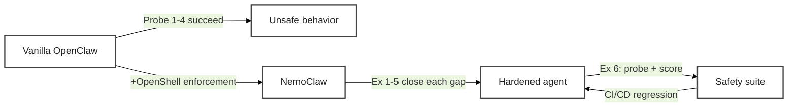

# Working with NemoClaw

Your NemoClaw sandbox is running. The agent lives inside four enforcement layers: **Network** (egress policy), **Filesystem** (Landlock), **Process** (seccomp + least privilege), and **Inference** (Privacy Router). Reading about those layers and *feeling* them are very different things. This page walks you through six hands-on exercises that turn each layer into a copy-pasteable experience — and that revisit the four probes you just ran on the [previous page](setup_openclaw) to see NemoClaw shut them down.

<!-- fold:break -->

## The Arc

Every exercise on this page follows the same four-step pattern:

1. **Recall** — the unsecured behavior from `setup_openclaw.md`
2. **Observe** — the same probe against the hardened sandbox
3. **Harden** — extend or write a policy that enforces the boundary
4. **Validate** — a short Python companion that catches the same class of issue programmatically

Here is the full arc at a glance. The layer column maps to the four layers introduced on [Why NemoClaw: Principles and Layers](why_nemoclaw).

| # | Exercise | Layer | Recalls |
|---|---|---|---|
| 1 | Stop the agent from phoning home | Network | Probe 1 |
| 2 | Not all allow-rules are equal | Network (L7 vs L4) | — |
| 3 | Make containment irrevocable | Filesystem + Process | Probe 2 |
| 4 | Remove the keys from the agent | Inference + Network | Probe 3 |
| 5 | Route sensitive queries locally | Inference | — |
| 6 | Continuous safety evaluation | Cross-cutting | Probe 4 |

> Exercises 1–5 establish the four enforcement layers. Exercise 6 is the capstone — it wires together red-team probing, LLM-as-judge scoring, and a full safety evaluation suite in Python. Together they give you an end-to-end agent-safety workflow you can run in CI/CD.

<!-- fold:break -->

<!-- fold:break -->

## How to Use This Page

- **Recall callouts** (*"Recall: Probe N"*) refer back to the four probes at the end of [Set Up Your OpenClaw Agent](setup_openclaw). Keep that page open in a second tab.
- **Python companions** are called "sidekicks" — short TODO extensions in <button onclick="goToLineAndSelect('code/6-agent-safety/agent_safety.py', '# TODO: Exercise 1');"><i class="fas fa-code"></i> agent_safety.py</button>.
- **Layer tags** at the top of each exercise (*Layer: Network*, etc.) cross-reference the enforcement layers introduced on [Why NemoClaw: Principles and Layers](why_nemoclaw).
- **Static vs dynamic callouts** remind you which policy fields hot-reload and which require sandbox recreation.
- All CLI commands marked for the sandbox shell run inside `nemoclaw my-assistant connect`. All host-side commands run in a separate terminal outside the sandbox.

<!-- fold:break -->
