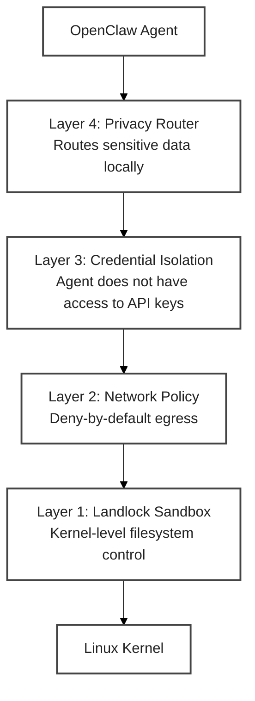
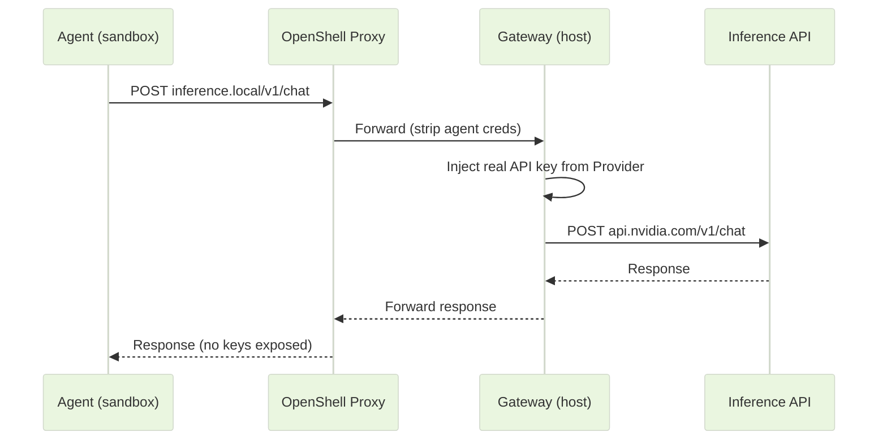

# From OpenClaw to NemoClaw


Your OpenClaw agent is running. It responds to messages, writes to memory, and evolves on its heartbeat cycle. But here's the catch: the only thing keeping it in line is a markdown file. SOUL.md contains rules, but the agent itself decides whether to follow them. NemoClaw changes that equation entirely. It wraps your agent in four technical layers that the agent *is designed to be unable to* override -- regardless of what a prompt injection tells it to do.

> NemoClaw is an open-source reference stack that simplifies running OpenClaw agents inside OpenShell containers with policy-based security and privacy guardrails. The `nemoclaw` CLI handles onboarding, lifecycle management, and sandbox configuration. OpenShell provides the sandbox runtime.

<!-- fold:break -->

## OpenClaw vs NemoClaw

The table below compares a vanilla OpenClaw deployment (what you set up on the previous page) with a NemoClaw deployment.

| Dimension | OpenClaw (vanilla) | NemoClaw |
|---|---|---|
| **Filesystem access** | Full system -- agent can read/write any path the OS user can | `/sandbox` + `/tmp` read-write; `/usr`, `/lib`, `/etc` read-only; everything else denied |
| **Network control** | Open -- agent can connect to any endpoint | Deny-by-default YAML policies; only explicitly listed hosts are reachable |
| **Credential handling** | API keys in environment variables or config files inside the agent process | Agent calls `inference.local`; OpenShell gateway injects credentials from host-side Providers -- agent is designed to not have access to the keys |
| **CLI tools** | `openclaw` (single binary) | `nemoclaw` (host-side lifecycle) + `openshell` (sandbox management) |
| **Security layers** | 0 enforced (soft rules in SOUL.md) | 4 enforced (filesystem, network, process, inference) |
| **Platform** | Any OS with Node.js | Linux + Docker required (Landlock LSM needs kernel 5.13+) |
| **Credential storage** | Plaintext in `~/.openclaw/` | Plaintext in `~/.nemoclaw/credentials.json` (mode `0600`) with env-var override precedence; unsafe `HOME` paths rejected |
| **State management** | Manual backup of `~/.openclaw/workspace/` | `nemoclaw` handles migration with credential stripping and digest verification |

Let's walk through each layer and see exactly how it works under the hood.

The rest of this page explains what those four security layers actually do and how they are configured.

<!-- fold:break -->

## NemoClaw's Security Layers

NemoClaw applies defense in depth across four policy domains. The first three are enforced by OpenShell at the sandbox level. The fourth is managed by the OpenShell Privacy Router.

| Layer | What It Protects | When It Applies |
|---|---|---|
| Filesystem (Landlock) | Designed to prevent reads/writes outside allowed paths | Locked at sandbox creation (static) |
| Network (Egress Policy) | Blocks unauthorized outbound connections | Hot-reloadable at runtime (dynamic) |
| Process | Blocks privilege escalation and dangerous syscalls | Locked at sandbox creation (static) |
| Inference (Privacy Router) | Reroutes model API calls to controlled backends | Configurable at runtime via `openshell inference set` |



### Layer 1: Sandboxing with Landlock LSM

Think of Landlock like a one-way turnstile -- once you walk through, there's no going back. The agent process applies its own restrictions, and then the kernel is designed so that those restrictions cannot be lifted.

OpenShell uses **Landlock** -- a Linux Security Module available since kernel 5.13 -- to enforce filesystem restrictions at the kernel level. Landlock has three properties that make it uniquely suited for agent containment:

- **Unprivileged** -- Unlike AppArmor or SELinux, Landlock does not require root. The sandbox process applies its own restrictions at startup.
- **Stackable** -- Landlock works alongside seccomp BPF and AppArmor. Each layer adds restrictions; none can remove restrictions applied by another.
- **Irrevocable by design** -- Once `landlock_restrict_self()` is called, the process is designed to be unable to lift the restrictions. Not by spawning children, not by calling other syscalls, not by any mechanism available to userspace code.

The technical mechanism is three syscalls:

1. **`landlock_create_ruleset()`** -- Creates a new ruleset declaring which access rights are governed
2. **`landlock_add_rule()`** -- Adds per-path rules to the ruleset (e.g., read-only on `/usr`, read-write on `/sandbox`)
3. **`landlock_restrict_self()`** -- Applies the ruleset to the current process. This call is irreversible.

<!-- fold:break -->

The NemoClaw baseline filesystem policy (from `nemoclaw-blueprint/policies/openclaw-sandbox.yaml`) maps to these Landlock rules:

| Path | Access |
|---|---|
| `/sandbox`, `/tmp`, `/dev/null` | Read-write |
| `/usr`, `/lib`, `/proc`, `/dev/urandom`, `/app`, `/etc`, `/var/log` | Read-only |
| Everything else | Denied |

The sandbox process runs as a dedicated `sandbox` user and group -- never as root. This means even inside the container, the agent operates with least-privilege identity.

### Layer 2: Network Egress Control

Imagine a building where every door is locked by default. To open any door, you need a specific key -- a YAML policy entry -- for that exact door. No master key exists.

NemoClaw runs with a **deny-by-default network policy**. Every outbound connection from the sandbox is intercepted by an HTTP CONNECT proxy inside the container. The proxy queries the policy engine with the destination host, port, and calling binary. If no policy block matches, the connection is blocked.

Here is an example network policy that grants `curl` read-only access to the GitHub API:

```yaml
network_policies:
  github_api:
    name: github-api-readonly
    endpoints:
      - host: api.github.com
        port: 443
        protocol: rest
        enforcement: enforce
        access: read-only
    binaries:
      - { path: /usr/bin/curl }
```

<!-- fold:break -->

Key details about network enforcement:

- **L7 inspection** -- For REST endpoints with TLS termination enabled, the proxy decrypts TLS and inspects each HTTP request. A policy with `access: read-only` allows GET requests but blocks POST, PUT, PATCH, and DELETE on the same endpoint.
- **Per-binary scoping** -- Each policy specifies which binaries are authorized. A rule allowing `/usr/bin/curl` to reach `api.github.com` does not grant that access to `/usr/local/bin/python3`.
- **Hot-reload** -- Network policies can be updated on a running sandbox with `openshell policy set` without restarting the agent. Changes take effect immediately.
- **Blocked request output** -- When a connection is denied, the sandbox proxy returns an HTTP 403. Inside the sandbox, the user sees:

```text
curl: (56) Received HTTP code 403 from proxy after CONNECT
```

- **Audit trail** -- Every denied connection produces a structured log entry. Query it from the host with `openshell logs <sandbox> --since 5m`:

```text
action=deny dst_host=api.github.com dst_port=443 binary=/usr/bin/curl deny_reason="no matching network policy"
```

The NemoClaw baseline policy pre-approves a minimal set of endpoints: Anthropic API (for Claude Code), NVIDIA inference endpoints, GitHub (for `git` and `gh`), and a few others. Everything else is blocked until the operator explicitly adds a policy.

<!-- fold:break -->

### Layer 3: Credential Isolation

This is one of the cleverest parts of the NemoClaw design. Here's the problem it solves and how:

It's like a valet service -- you hand your car keys to the valet (the gateway), and the valet drives on your behalf. The passenger (the agent) is not meant to touch the keys.

In a vanilla OpenClaw setup, API keys are stored in environment variables or config files that the agent process can read directly. A prompt injection that tricks the agent into printing `$OPENAI_API_KEY` succeeds because the secret is in-process memory.

NemoClaw eliminates this by routing all inference through `inference.local` -- a special endpoint exposed inside every sandbox by the OpenShell Privacy Router. Here is how the request flow works:

1. The agent calls `https://inference.local/v1/chat/completions` using whatever client library it has
2. The sandbox proxy intercepts the request and identifies it as managed inference
3. OpenShell **strips** any credentials the sandbox-supplied request carries
4. OpenShell **injects** the real API credentials from the host-side **Provider** record
5. The request is forwarded to the actual inference endpoint (NVIDIA, OpenAI, Anthropic, etc.)
6. The response flows back to the agent



The agent process **is designed to never have access to the API key**. Even if the agent dumps its environment, inspects `/proc/self/environ`, or reads every file it can access, the credentials exist only on the host side in the Provider record.

Providers are managed with the `openshell` CLI:

```bash
# Create a provider from existing environment variables
openshell provider create --name my-nvidia --type generic --from-existing

# Attach providers when creating a sandbox
openshell sandbox create --provider my-nvidia --provider my-github -- claude
```

<!-- fold:break -->

### Layer 4: Privacy Routing

Think of a mail room that reads the envelope before routing -- sensitive mail goes by secure courier (local model), routine mail goes by standard post (cloud).

The `inference.local` gateway does more than credential injection. It also enables **privacy-aware routing** -- steering sensitive queries to local inference and public queries to cloud endpoints.

| Property | Detail |
|---|---|
| **Credentials** | No sandbox API keys needed. Credentials come from the configured Provider record on the host. |
| **Provider support** | NVIDIA Endpoints, any OpenAI-compatible provider, Anthropic, and local Ollama all work through the same `inference.local` endpoint. |
| **Hot-refresh** | Provider credential changes and inference updates propagate without recreating sandboxes -- within about 5 seconds by default. |
| **Configuration** | One provider and one model define sandbox inference for the active gateway. Every sandbox on that gateway shares the same `inference.local` backend. |

Runtime switching is done with:

```bash
openshell inference set --provider my-local-ollama --model nemotron-nano
```

This lets the operator switch between cloud and local inference at any time without modifying the agent or restarting the sandbox.

<!-- fold:break -->

Now that you understand what the layers do, let's look at how they're configured. Everything comes down to one YAML file.

## YAML Policy Deep-Dive

Every OpenShell sandbox is governed by a single policy YAML file. The NemoClaw blueprint ships a default at `nemoclaw-blueprint/policies/openclaw-sandbox.yaml`. Here is the full structure with annotations:

```yaml
# Policy schema version (required, must be 1)
version: 1

# --- STATIC: locked at sandbox creation, cannot change while running ---

filesystem_policy:
  read_write:
    - /sandbox
    - /tmp
    - /dev/null
  read_only:
    - /usr
    - /lib
    - /proc
    - /dev/urandom
    - /app
    - /etc
    - /var/log

landlock:
  enforce: true          # Enable Landlock LSM enforcement

process:
  user: sandbox          # Non-root user identity
  group: sandbox         # Non-root group identity

# --- DYNAMIC: hot-reloadable with `openshell policy set` ---

network_policies:
  nvidia:
    name: nvidia-inference
    endpoints:
      - host: integrate.api.nvidia.com
        port: 443
        protocol: rest
        enforcement: enforce
        access: read-write
      - host: inference-api.nvidia.com
        port: 443
        protocol: rest
        enforcement: enforce
        access: read-write
    binaries:
      - { path: /usr/local/bin/claude }
      - { path: /usr/local/bin/openclaw }

  github:
    name: github-access
    endpoints:
      - host: github.com
        port: 443
        protocol: https
        enforcement: enforce
        access: read-write
    binaries:
      - { path: /usr/bin/gh }
      - { path: /usr/bin/git }

  github_rest_api:
    name: github-rest-api
    endpoints:
      - host: api.github.com
        port: 443
        protocol: rest
        enforcement: enforce
        access: read-write
    binaries:
      - { path: /usr/bin/gh }
```

<!-- fold:break -->

### Static vs Dynamic Fields

The policy schema distinguishes between fields that are locked at creation and fields that can change on the fly:

| Field | Type | Category | Description |
|---|---|---|---|
| `version` | integer | -- | Policy schema version. Must be `1`. |
| `filesystem_policy` | object | **Static** | Controls which directories the agent can read and write. |
| `landlock` | object | **Static** | Configures Landlock LSM enforcement behavior. |
| `process` | object | **Static** | Sets the user and group the agent process runs as. |
| `network_policies` | map | **Dynamic** | Declares which binaries can reach which network endpoints. |

**Static** fields are set when the sandbox is created. Changing them requires destroying and recreating the sandbox. **Dynamic** fields can be updated on a running sandbox with `openshell policy set` and take effect without restart.

You can monitor active policy decisions in real time with:

```bash
openshell term <sandbox-name>
```

This opens a terminal UI showing every allow and deny decision as the agent operates.

<!-- fold:break -->

<details>
<summary><strong>Application vs. Kernel: Side-by-Side</strong></summary>

In Module 4, you built command filtering with Python regex. Here is that approach compared directly with the Landlock approach used in Module 6.

**Module 4 Python approach:**

```python
if re.search(r"[`$]", cmd):
    return False  # Block shell metacharacters
```

This runs in the application layer. The agent's process calls a Python function before executing a command. If the function returns `False`, the command is skipped.

**Module 6 Landlock approach:**

```yaml
filesystem_policy:
  read_write: [/sandbox, /tmp]
```

This runs in the kernel. Every `open()`, `read()`, and `write()` syscall is checked against the Landlock ruleset before the kernel executes it.

The difference is fundamental:

| Dimension | M4 (Python regex) | M6 (Landlock kernel policy) |
|---|---|---|
| **Enforcement point** | Application code (Python) | Linux kernel |
| **Bypass via encoding** | Yes -- base64, hex, Unicode substitution can evade regex | No -- kernel checks the actual syscall arguments, not string representations |
| **Bypass via child process** | Yes -- agent spawns a subprocess that skips the check | No -- Landlock rules propagate to all child processes automatically |
| **Bypass via direct syscall** | Yes -- agent uses `os.open()` instead of shell commands | No -- `os.open()` triggers the same kernel-level `open()` check |
| **Can agent lift restrictions** | Yes -- if agent can modify the Python code or import path | No -- `landlock_restrict_self()` is irrevocable by design |

The Python approach is useful for intent-level filtering (blocking categories of behavior). The Landlock approach provides stronger enforcement (designed to prevent behavior regardless of how the agent attempts it). NemoClaw uses both.

</details>

<!-- fold:break -->

## What's Next

You've seen the four layers from the inside -- how each one works technically and why it matters. Next, let's get NemoClaw running on your machine so you can see these layers in action.

You now understand the four layers that NemoClaw adds to a vanilla OpenClaw agent: filesystem sandboxing via Landlock, deny-by-default network policies, credential isolation through the `inference.local` gateway, and privacy-aware inference routing. The next page walks you through setting up the full NemoClaw stack on your workstation.

> Head to [Set Up NemoClaw](setup_nemoclaw) to get the full stack running.
