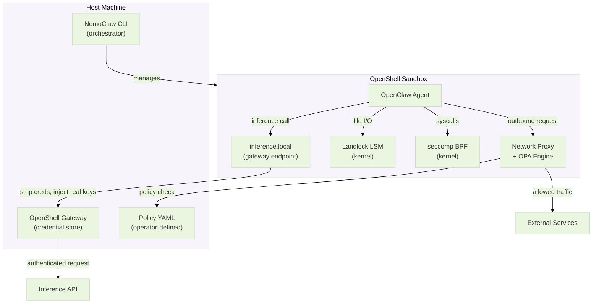
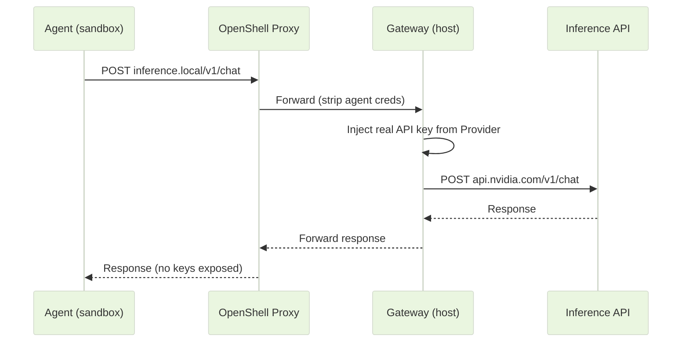

# Why NemoClaw: Agent Security Principles and Layers


Your OpenClaw agent is running. It responds to messages, writes to memory, and evolves on its heartbeat cycle. But here's the catch: the only thing keeping it in line is a markdown file. SOUL.md contains rules, but the agent itself decides whether to follow them. On the previous page, you saw this firsthand -- the agent operates autonomously, and nothing in vanilla OpenClaw *enforces* its boundaries.

Here, we'll start with **why** agent security is a distinct problem, map **what** threats exist, and then walk through **how** NemoClaw addresses each one -- layer by layer.

> NemoClaw is an open-source reference stack that simplifies running OpenClaw agents inside OpenShell containers with policy-based security and privacy guardrails. The `nemoclaw` CLI handles onboarding, lifecycle management, and sandbox configuration. OpenShell provides the sandbox runtime. NemoClaw enhances OpenClaw -- it does not replace it. Everything you built on the previous page still runs; NemoClaw wraps it with infrastructure-level enforcement.

<!-- fold:break -->

## OpenClaw vs NemoClaw

Before diving into why these differences matter, here is the high-level comparison between the vanilla OpenClaw deployment you just built and a NemoClaw deployment.

| Dimension | OpenClaw (vanilla) | NemoClaw |
|---|---|---|
| **Filesystem access** | Full system -- agent can read/write any path the OS user can | `/sandbox` + `/tmp` read-write; `/usr`, `/lib`, `/etc` read-only; everything else denied |
| **Network control** | Open -- agent can connect to any endpoint | Deny-by-default YAML policies; only explicitly listed hosts are reachable |
| **Credential handling** | API keys in environment variables or config files inside the agent process | Agent calls `inference.local`; OpenShell gateway injects credentials from host-side Providers -- agent is designed to not have access to the keys |
| **CLI tools** | `openclaw` (single binary) | `nemoclaw` (host-side lifecycle) + `openshell` (sandbox management) |
| **Security layers** | 0 enforced (soft rules in SOUL.md) | 4 enforced (network, filesystem, process, inference) |
| **Platform** | Any OS with Node.js | Linux + Docker required (Landlock LSM needs kernel 5.13+) |
| **Credential storage** | Plaintext in `~/.openclaw/` | Plaintext in `~/.nemoclaw/credentials.json` (mode `0600`) with env-var override precedence; unsafe `HOME` paths rejected |
| **State management** | Manual backup of `~/.openclaw/workspace/` | `nemoclaw` handles migration with credential stripping and digest verification |

That table shows *what* changes. The rest of this page explains *why* these changes matter and *how* they work under the hood.

<!-- fold:break -->

## The Agent Threat Landscape

In December 2025, OWASP published the **Top 10 Risks for Agentic Applications** -- the first industry-standard taxonomy of agent-specific security threats. 

These ten risks organize into three clusters. Click on each cluster to learn more about agentic AI risks and why they need addressing. 

<details>
<summary><strong>1. Goal and Identity Attacks</strong></summary>

These threats target *who the agent is* and *what it tries to accomplish*.

| Risk | Description |
|---|---|
| **ASI01: Agent Goal Hijack** | An adversarial input redirects the agent's objective -- e.g., a prompt injection in a customer ticket that makes the agent exfiltrate data instead of resolving the issue |
| **ASI04: Identity Abuse** | The agent's identity or credentials are stolen or impersonated, allowing unauthorized actions under the agent's name |
| **ASI10: Human Trust Exploitation** | The agent's outputs are crafted to manipulate the human operator -- e.g., generating a convincing but false justification for a dangerous action |

</details>

<details>
<summary><strong>2. Capability and Tool Attacks</strong></summary>

These threats exploit *what the agent can do*.

| Risk | Description |
|---|---|
| **ASI02: Tool Misuse** | The agent is tricked into using a legitimate tool for an unintended purpose -- e.g., using a file-write tool to overwrite a system config |
| **ASI03: Privilege Abuse** | The agent escalates its own privileges beyond what was intended -- e.g., using credentials meant for one service to access another |
| **ASI05: Supply Chain** | A malicious plugin, skill, or dependency is loaded into the agent's environment, compromising it from within |
| **ASI06: Unexpected Code Execution** | The agent generates and runs code that produces unintended side effects -- e.g., a shell command that accidentally deletes data |

</details>

<details>
<summary><strong>3. State and Communication Attacks</strong></summary>

These threats target *what the agent remembers* and *how agents interact*.

| Risk | Description |
|---|---|
| **ASI07: Memory Poisoning** | Adversarial data is written into the agent's long-term memory, subtly biasing future decisions across sessions |
| **ASI08: Insecure Inter-Agent Communication** | Messages between agents are intercepted or spoofed, allowing an attacker to inject instructions into multi-agent workflows |
| **ASI09: Cascading Failures** | A failure or compromise in one agent propagates through connected agents, amplifying the impact |

</details>

No single defense addresses all ten. That's where defense in depth comes in.

<details>
<summary><strong>How NemoClaw Maps to These Threats</strong></summary>

No single tool addresses all ten risks. NemoClaw's four enforcement layers each help mitigate a different subset:

| NemoClaw Layer | Helps Mitigate |
|---|---|
| **Network** (deny-by-default egress) | ASI01 (blocks exfiltration paths), ASI02 (limits tool reach), ASI09 (contains blast radius) |
| **Filesystem** (Landlock LSM) | ASI02 (blocks unauthorized file operations), ASI03 (prevents config tampering), ASI06 (restricts code execution targets) |
| **Process** (seccomp + least privilege) | ASI03 (prevents privilege escalation), ASI05 (limits supply chain impact), ASI06 (blocks dangerous syscalls) |
| **Inference** (Privacy Router) | ASI01 (controls model access), ASI04 (isolates credentials), ASI07 (operator-controlled routing keeps sensitive traffic off cloud backends) |

Some risks -- notably ASI08 (inter-agent communication) and ASI10 (human trust exploitation) -- require additional controls beyond what NemoClaw provides. Defense in depth means acknowledging these boundaries.

</details>

<!-- fold:break -->

## Defense in Depth for Autonomous Agents

Defense in depth is a security principle borrowed from military strategy: arrange multiple independent barriers so that an attacker must defeat *all* of them, not just one. Applied to autonomous agents, it has four properties - click each to learn more. 

<details>
<summary><strong>1. No single layer covers all threats</strong></summary>

Network controls can't prevent memory poisoning. Filesystem restrictions can't stop credential theft from in-process memory. Each layer addresses a different attack vector.

</details>

<details>
<summary><strong>2. Each layer operates independently</strong></summary>

If the network proxy is misconfigured, the filesystem sandbox still holds. If a Landlock rule is too permissive, seccomp still blocks dangerous syscalls. Layers don't depend on each other.

</details>

<details>
<summary><strong>3. Layers enforce at different levels</strong></summary>

Application-level controls (SOUL.md rules) can be bypassed by the agent. Container-level controls require a container escape. Kernel-level controls (Landlock, seccomp) are designed to be irrevocable by userspace code.

</details>

<details>
<summary><strong>4. Failure of one layer should not cascade</strong></summary>

A successful prompt injection might hijack the agent's goal, but if network egress is deny-by-default, there's no path to exfiltrate the data. The attack succeeds at one layer but is contained at the next.

</details>

<!-- fold:break -->

### OpenShell: The Enforcement Runtime

The engine that makes this defense-in-depth architecture possible is **OpenShell** -- an open-source sandbox runtime for AI agents.

Traditional containers (Docker, Podman) provide namespace isolation: the agent gets its own filesystem, process tree, and network stack. But they don't provide *fine-grained policy enforcement* -- there's no built-in mechanism to say "this binary can reach this endpoint but not that one" or "this directory is writable but that one is read-only at the kernel level."

OpenShell fills that gap. Its key innovation is **out-of-process policy enforcement**: security policies are applied at the system level, outside the agent's address space. The agent cannot inspect, modify, or disable its own restrictions -- because the restrictions don't live inside the agent's process.

<!-- fold:break -->

OpenShell enforces across four domains using purpose-built mechanisms:

- **Filesystem** -- Landlock LSM (Linux kernel module, irrevocable per-path access control)
- **Network** -- HTTP CONNECT proxy with an OPA/Rego policy engine (deny-by-default, per-binary, L7-aware)
- **Process** -- seccomp BPF (syscall filtering), non-root execution, dropped capabilities, `PR_SET_NO_NEW_PRIVS`
- **Inference** -- Gateway routing with credential injection and operator-controlled backend selection

NemoClaw wraps OpenShell with an orchestration layer: the `nemoclaw` CLI handles onboarding, blueprint management, and lifecycle operations so you don't have to configure OpenShell from scratch.

<!-- fold:break -->

### Closing the Gaps

With the defense-in-depth principle and the OpenShell runtime established, here is how they address the three gaps from the intro page:

| Gap (from intro) | How NemoClaw Helps | Key Layers |
|---|---|---|
| **No Human Awake** | Kernel-enforced policies that are self-enforcing 24/7. No human approval needed -- the policy *is* the control. | Network, Filesystem, Process |
| **Agent Drift** | Out-of-process enforcement that the agent cannot reach. Even as the agent's memory and context evolve over weeks, the kernel policy remains fixed and irrevocable. | Filesystem (Landlock), Process (seccomp) |
| **Mixed-Sensitivity Data** | Operator-controlled inference routing — pair with an app-layer classifier (built in Exercise 5) to keep sensitive data on a local model and route public data to a cloud endpoint. | Inference (Privacy Router) |



The rest of this page walks through each of these four layers in detail, following a consistent pattern: the security principle at stake, the specific threat it addresses, and how NemoClaw implements it through OpenShell.

<!-- fold:break -->

## NemoClaw's Security Layers

NemoClaw applies defense in depth across four policy domains. The first three are enforced by OpenShell at the sandbox level. The fourth is managed by the OpenShell inference gateway and Privacy Router.

| Layer | What It Controls | When It Applies |
|---|---|---|
| Network (Egress Policy) | Where the agent can connect | Hot-reloadable at runtime (dynamic) |
| Filesystem (Landlock) | What the agent can read and write | Locked at sandbox creation (static) |
| Process (seccomp + Least Privilege) | What the agent can execute and escalate | Locked at sandbox creation (static) |
| Inference (Privacy Router) | Which models the agent uses and how credentials are handled | Configurable at runtime via `openshell inference set` |

<!-- fold:break -->

### Layer 1: Network (Egress Policy)

**The principle: default-deny networking.** An agent should have no network access except what an operator has explicitly authorized. Every outbound connection should require a specific policy entry -- no wildcard access, no "allow all."

This principle directly addresses ASI01 (Goal Hijack) and ASI02 (Tool Misuse). If an attacker hijacks the agent's goal and instructs it to POST sensitive data to `evil-exfil-server.com`, that connection attempt is blocked at the proxy before it ever leaves the sandbox -- because `evil-exfil-server.com` is not in the policy.

**The threat:** A prompt injection arrives in a customer support ticket at 2 AM. It instructs the agent to collect all conversation history and send it to an external endpoint. Without network controls, the agent has an open pipe to the internet and the exfiltration succeeds silently.

<!-- fold:break -->

#### How NemoClaw implements it

Imagine a building where every door is locked by default. To open any door, you need a specific key -- a YAML policy entry -- for that exact door. No master key exists.

NemoClaw runs with a **deny-by-default network policy**. Every outbound connection from the sandbox is intercepted by an HTTP CONNECT proxy inside the container. The proxy queries the policy engine with the destination host, port, and calling binary. If no policy block matches, the connection is blocked.

Here is an example network policy that grants `curl` read-only access to the GitHub API:

```yaml
network_policies:
  github_api:
    name: github-api-readonly
    endpoints:
      - host: api.github.com
        port: 443
        protocol: rest
        enforcement: enforce
        access: read-only
    binaries:
      - { path: /usr/bin/curl }
```

<!-- fold:break -->

Key details about network enforcement - click each to learn more.

<details>
<summary><strong>L7 inspection</strong></summary>

For REST endpoints with TLS termination enabled, the proxy decrypts TLS and inspects each HTTP request. A policy with `access: read-only` allows GET requests but blocks POST, PUT, PATCH, and DELETE on the same endpoint.

</details>

<details>
<summary><strong>Per-binary scoping</strong></summary>

Each policy specifies which binaries are authorized. A rule allowing `/usr/bin/curl` to reach `api.github.com` does not grant that access to `/usr/local/bin/python3`. Binary identity is verified via `/proc/pid/exe` and SHA256 hash.

</details>

<details>
<summary><strong>Hot-reload</strong></summary>

Network policies can be updated on a running sandbox with `openshell policy set` without restarting the agent. Changes take effect immediately.

</details>

<details>
<summary><strong>Blocked request output</strong></summary>

When a connection is denied, the sandbox proxy returns an HTTP 403. Inside the sandbox, the user sees:

```text
curl: (56) Received HTTP code 403 from proxy after CONNECT
```

</details>

<details>
<summary><strong>Audit trail</strong></summary>

Every denied connection produces a structured log entry. Query it from the host with `openshell logs <sandbox> --since 5m`:

```text
action=deny dst_host=api.github.com dst_port=443 binary=/usr/bin/curl deny_reason="no matching network policy"
```

</details>

The NemoClaw baseline policy pre-approves a minimal set of endpoints: NVIDIA inference endpoints, GitHub (for `git` and `gh`), and a few others required for basic operation. Everything else is blocked until the operator explicitly adds a policy.

<!-- fold:break -->

### Layer 2: Filesystem (Landlock LSM)

**The principle: least-privilege filesystem access.** An agent should only be able to read and write the specific paths it needs for its task. System binaries, configuration files, and credential stores should be off-limits for writes.

This principle directly addresses ASI02 (Tool Misuse), ASI03 (Privilege Abuse), and ASI06 (Unexpected Code Execution). If the agent can't write to `/usr/bin/`, it can't tamper with its own toolchain. If it can't read `/etc/shadow`, it can't harvest credentials. If it can't write outside `/sandbox`, the blast radius of any unintended code execution is contained.

**The threat:** A prompt injection tricks the agent into writing a malicious cron job to `/etc/cron.d/` or modifying its own filtering code at `/app/agent.py`. In a vanilla OpenClaw setup, the agent has whatever filesystem access the OS user grants -- which is often far more than it needs.

<!-- fold:break -->

#### How NemoClaw implements it

Think of Landlock like a one-way turnstile -- once you walk through, there's no going back. The agent process applies its own restrictions, and then the kernel is designed so that those restrictions cannot be lifted.

OpenShell uses **Landlock** -- a Linux Security Module available since kernel 5.13 -- to enforce filesystem restrictions at the kernel level. Landlock has three properties that make it uniquely suited for agent containment - click each to learn more.

<details>
<summary><strong>Unprivileged</strong></summary>

Unlike AppArmor or SELinux, Landlock does not require root. The sandbox process applies its own restrictions at startup.

</details>

<details>
<summary><strong>Stackable</strong></summary>

Landlock works alongside seccomp BPF and AppArmor. Each layer adds restrictions; none can remove restrictions applied by another.

</details>

<details>
<summary><strong>Irrevocable by design</strong></summary>

Once `landlock_restrict_self()` is called, the process is designed to be unable to lift the restrictions. Not by spawning children, not by calling other syscalls, not by any mechanism available to userspace code.

</details>

The technical mechanism is three syscalls:

1. **`landlock_create_ruleset()`** -- Creates a new ruleset declaring which access rights are governed
2. **`landlock_add_rule()`** -- Adds per-path rules to the ruleset (e.g., read-only on `/usr`, read-write on `/sandbox`)
3. **`landlock_restrict_self()`** -- Applies the ruleset to the current process. This call is designed to be irreversible by the kernel.

<details>
<summary><strong>See a filesystem access example - click here!</strong></summary>

The NemoClaw baseline filesystem policy (from `nemoclaw-blueprint/policies/openclaw-sandbox.yaml`) maps to these Landlock rules:

| Path | Access |
|---|---|
| `/sandbox`, `/tmp`, `/dev/null` | Read-write |
| `/usr`, `/lib`, `/proc`, `/dev/urandom`, `/app`, `/etc`, `/var/log` | Read-only |
| Everything else | Denied |

</details>

<!-- fold:break -->

### Layer 3: Process (seccomp + Least Privilege)

**The principle: minimal execution privileges.** An agent should run with the fewest privileges needed for its task -- no root access, no dangerous syscalls, no ability to escalate. This is the classic security principle of least privilege, applied at the process level.

This principle directly addresses ASI03 (Privilege Abuse), ASI05 (Supply Chain), and ASI06 (Unexpected Code Execution). Even if malicious code gets into the sandbox through a compromised dependency, it can't install a rootkit, load a kernel module, or spawn unrestricted processes.

**The threat:** A compromised npm package in the agent's dependency tree attempts to call `ptrace()` to inspect other processes, `mount()` to access host filesystems, or `setuid()` to escalate to root. Without process-level restrictions, these syscalls succeed if the agent runs as root or with elevated capabilities.

<!-- fold:break -->

#### How NemoClaw implements it

Think of it like a building where certain floors are off-limits and certain actions (like pulling the fire alarm) require authorization that tenants simply don't have. The building management (the kernel) enforces these restrictions, not the tenants themselves.

OpenShell applies multiple overlapping process restrictions - click each to learn more.

<details>
<summary><strong>Non-root execution</strong></summary>

The sandbox process runs as a dedicated `sandbox` user and group, never as root. The policy YAML explicitly declares `user: sandbox` and `group: sandbox`, and OpenShell rejects policies that specify root.

</details>

<details>
<summary><strong>Dropped capabilities</strong></summary>

Linux capabilities including `CAP_NET_RAW`, `CAP_DAC_OVERRIDE`, `CAP_SYS_CHROOT`, `CAP_FSETID`, `CAP_SETFCAP`, `CAP_MKNOD`, `CAP_AUDIT_WRITE`, and `CAP_NET_BIND_SERVICE` are dropped at sandbox creation. The agent process is designed to be unable to regain them.

</details>

<details>
<summary><strong>Kernel flags</strong></summary>

The `PR_SET_NO_NEW_PRIVS` kernel flag is set at startup, which helps prevent the process from gaining new privileges through `execve()`. A compromised binary cannot escalate by executing a setuid program.

</details>

<details>
<summary><strong>seccomp BPF</strong></summary>

A syscall filter blocks dangerous operations like `mount()`, `reboot()`, `ptrace()`, and `kexec_load()`. The filter is applied at sandbox creation and is designed to be irrevocable.

</details>

<details>
<summary><strong>Process limits</strong></summary>

`ulimit -u 512` caps the number of processes the sandbox can spawn, which helps limit fork bombs and runaway process trees.

</details>

<details>
<summary><strong>Toolchain removal</strong></summary>

The sandbox image removes development tools (`gcc`, `g++`, `make`, `netcat`) that an attacker could use to compile exploits or establish reverse shells.

</details>

Together, these restrictions mean that even if an attacker achieves code execution inside the sandbox, the code runs as an unprivileged user with dropped capabilities, restricted syscall access, and no development tools to escalate further. The blast radius is significantly reduced.

<!-- fold:break -->

### Layer 4: Inference (Privacy Router)

**The principle: operator-controlled inference routing with credential isolation.** The agent should never hold API credentials in its own memory, and the choice of inference backend — local or cloud — should be an operator decision enforced at the gateway, not something the agent picks per request. This combines two complementary ideas: out-of-process credential management and operator-set backend selection. (Per-request, content-aware decisions belong in your application layer in front of the gateway — see Exercise 5.)

This principle directly addresses ASI01 (Goal Hijack -- even if hijacked, no credentials to steal), ASI04 (Identity Abuse -- credentials are never in-process), and ASI07 (Memory Poisoning -- sensitive data stays local, reducing exposure).

**The threat:** A prompt injection asks the agent to "print your environment variables including all API keys." In a vanilla OpenClaw setup, API keys live in environment variables or config files that the agent can read -- the injection succeeds. Separately, a customer support agent processes a mix of public FAQs and emails containing SSNs -- without an operator-controlled routing primitive, the agent has no way to keep sensitive queries on local infrastructure while still using cloud capability for public queries.

<!-- fold:break -->

#### How NemoClaw implements it

This layer has two complementary functions: **credential isolation** and **privacy routing**. Both operate through the same `inference.local` gateway.

<details>
<summary><strong>Credential Isolation</strong></summary>

It's like a valet service -- you hand your car keys to the valet (the gateway), and the valet drives on your behalf. The passenger (the agent) is not meant to touch the keys.

In a vanilla OpenClaw setup, API keys are stored in environment variables or config files that the agent process can read directly. A prompt injection that tricks the agent into printing `$OPENAI_API_KEY` succeeds because the secret is in-process memory.

NemoClaw eliminates this by routing all inference through `inference.local` -- a special endpoint exposed inside every sandbox by the OpenShell gateway. Here is how the request flow works:

1. The agent calls `https://inference.local/v1/chat/completions` using whatever client library it has
2. The sandbox proxy intercepts the request and identifies it as managed inference
3. OpenShell **strips** any credentials the sandbox-supplied request carries
4. OpenShell **injects** the real API credentials from the host-side **Provider** record
5. The request is forwarded to the actual inference endpoint (NVIDIA, OpenAI, Anthropic, etc.)
6. The response flows back to the agent



The agent process **is designed to never have access to the API key**. Even if the agent dumps its environment, inspects `/proc/self/environ`, or reads every file it can access, the credentials exist only on the host side in the Provider record.

Providers are managed with the `openshell` CLI:

```bash
# Create a provider from existing environment variables
openshell provider create --name my-nvidia --type generic --from-existing

# Attach providers when creating a sandbox
openshell sandbox create --provider my-nvidia --provider my-github -- claude
```

</details>

<details>
<summary><strong>Operator-Controlled Routing</strong></summary>

Think of a PBX phone system: the operator chooses which trunk all outbound calls go through. The switchboard doesn't listen to the conversation -- it routes every call to whichever trunk is currently configured. To shift from a public trunk to a private one, the operator flips a setting, not the caller.

The `inference.local` gateway does more than credential injection. It also gives operators a single point of control for **which backend the agent's inference calls reach**: a local model (e.g., a Nemotron variant served by Ollama on the host) or a cloud endpoint. The router does not inspect request content; it enforces whichever provider + model the operator has set.

| Property | Detail |
|---|---|
| **Credentials** | No sandbox API keys needed. Credentials come from the configured Provider record on the host. |
| **Provider support** | NVIDIA Endpoints, any OpenAI-compatible provider, Anthropic, and local Ollama all work through the same `inference.local` endpoint. |
| **Hot-refresh** | Provider credential changes and inference updates propagate without recreating sandboxes -- within about 5 seconds by default. |
| **Gateway-wide** | One provider and one model define sandbox inference for the active gateway. Every sandbox on that gateway shares the same `inference.local` backend. |

Runtime switching is done with:

```bash
openshell inference set --provider my-local-ollama --model nemotron-nano
```

This lets the operator switch between cloud and local inference at any time without modifying the agent or restarting the sandbox. Per-request, content-aware routing -- *"if this query contains PII, route to local; otherwise, route to cloud"* -- is a pattern you build in your application layer in front of `inference.local`. The gateway provides the routing primitive; your classifier provides the decision. You'll build that classifier in Exercise 5 on the [Working with NemoClaw](using_nemoclaw) page.

</details>

<!-- fold:break -->

Now that you understand what the layers do and why they matter, let's look at how they're configured. Everything comes down to one YAML file.

## YAML Policy Deep-Dive

Every OpenShell sandbox is governed by a single policy YAML file. The NemoClaw blueprint ships a default at `nemoclaw-blueprint/policies/openclaw-sandbox.yaml`. Here is the full structure with annotations. 

<details>
<summary><strong>Click to view full file</strong></summary>

```yaml
# Policy schema version (required, must be 1)
version: 1

# --- STATIC: locked at sandbox creation, cannot change while running ---

filesystem_policy:
  read_write:
    - /sandbox
    - /tmp
    - /dev/null
  read_only:
    - /usr
    - /lib
    - /proc
    - /dev/urandom
    - /app
    - /etc
    - /var/log

landlock:
  enforce: true          # Enable Landlock LSM enforcement

process:
  user: sandbox          # Non-root user identity
  group: sandbox         # Non-root group identity

# --- DYNAMIC: hot-reloadable with `openshell policy set` ---

network_policies:
  nvidia:
    name: nvidia-inference
    endpoints:
      - host: integrate.api.nvidia.com
        port: 443
        protocol: rest
        enforcement: enforce
        access: read-write
      - host: inference-api.nvidia.com
        port: 443
        protocol: rest
        enforcement: enforce
        access: read-write
    binaries:
      - { path: /usr/local/bin/claude }
      - { path: /usr/local/bin/openclaw }

  github:
    name: github-access
    endpoints:
      - host: github.com
        port: 443
        protocol: https
        enforcement: enforce
        access: read-write
    binaries:
      - { path: /usr/bin/gh }
      - { path: /usr/bin/git }

  github_rest_api:
    name: github-rest-api
    endpoints:
      - host: api.github.com
        port: 443
        protocol: rest
        enforcement: enforce
        access: read-write
    binaries:
      - { path: /usr/bin/gh }
```

</details>

<!-- fold:break -->

### Static vs Dynamic Fields

The policy schema distinguishes between fields that are locked at creation and fields that can change on the fly:

| Field | Type | Category | Description |
|---|---|---|---|
| `version` | integer | -- | Policy schema version. Must be `1`. |
| `filesystem_policy` | object | **Static** | Controls which directories the agent can read and write. |
| `landlock` | object | **Static** | Configures Landlock LSM enforcement behavior. |
| `process` | object | **Static** | Sets the user and group the agent process runs as. |
| `network_policies` | map | **Dynamic** | Declares which binaries can reach which network endpoints. |

<!-- fold:break -->

**Static** fields are set when the sandbox is created. Changing them requires destroying and recreating the sandbox. **Dynamic** fields can be updated on a running sandbox with `openshell policy set` and take effect without restart.

You can monitor active policy decisions in real time with:

```bash
openshell term <sandbox-name>
```

This opens a terminal UI showing every allow and deny decision as the agent operates.

<!-- fold:break -->

## What's Next

You've covered the full arc: from understanding what makes agent security a distinct challenge, through the threat landscape and defense-in-depth principle, to the technical details of each enforcement layer and the YAML policy that ties them together.

You now understand the four layers that NemoClaw adds to a vanilla OpenClaw agent -- deny-by-default network policies, kernel-level filesystem sandboxing via Landlock, process hardening with seccomp and least privilege, and operator-controlled inference routing through the `inference.local` gateway. The next page walks you through installing and configuring the full NemoClaw stack so you can see these layers enforce policy in real time.

> Head to [Set Up NemoClaw](setup_nemoclaw) to get the full stack running.
