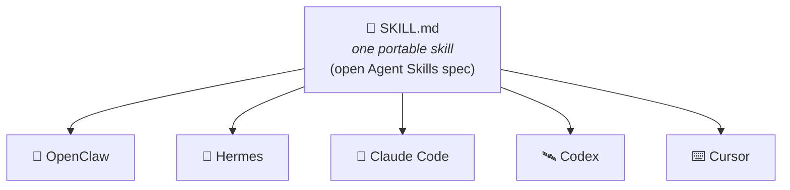

<div class="dx-hero" data-eyebrow="MODULE 07 / 03 - SKILLS" data-title="Capability that travels." data-sub="One SKILL.md, written once, runs in every harness on the market." data-meta="SPEC::agentskills.io|CATALOG::github.com/NVIDIA/skills"></div>

If harnesses are where agents are won or lost, **skills** are how capability moves between them.

A skill is a packaged set of instructions — procedural knowledge an agent loads *on demand* when a task calls for it. You've brushed against them twice already: the Superpowers skills in Module 4, and the skill toggles in Module 5's deep agent. Now let's take one apart.

<!-- fold:break -->

## Anatomy of a Skill


A skill is a folder with a `SKILL.md` at its root. The file has two parts:

```markdown
---
name: code_review
description: Systematic approach to reviewing code for quality and correctness
---

# Code Review Skill

You are now operating as a code reviewer. Follow this systematic approach.
...full instructions, checklists, examples...
```

- **Frontmatter** — the `name` and a one-line `description`. This is the *only* part the harness keeps in context at all times.
- **Body** — the full instructions. Loaded into context *only* when the description matches the task at hand.

This repo ships two examples you can open right now: <button onclick="openOrCreateFileInJupyterLab('skills/code_review/SKILL.md');"><i class="fa-solid fa-book"></i> code_review</button> and <button onclick="openOrCreateFileInJupyterLab('skills/technical_writing/SKILL.md');"><i class="fa-solid fa-book"></i> technical_writing</button>.

<!-- fold:break -->

## Lazy Loading: Token Efficiency in Action

Here's where skills connect back to the context tax. A harness with 30 installed skills does **not** pay for 30 sets of instructions per turn. It pays for 30 *one-line descriptions* — and loads a full body only when invoked.

```text
Per-turn cost, 30 installed skills:

  Eager loading:   30 × ~1,500 tokens  =  ~45,000 tokens  💸
  Lazy loading:    30 × ~25 tokens     =     ~750 tokens  ✅
                   (+1 full skill body only when actually used)
```

This is pi's signature design generalized — and it's now how every serious harness handles skills. In the lab, you'll implement lazy loading yourself and measure the savings.

<!-- fold:break -->

## One Skill, Every Harness: The Open Spec

The format above isn't proprietary to any harness. It's the open **Agent Skills specification** ([agentskills.io](https://agentskills.io)) — and because the major harnesses all consume it, the *same SKILL.md* runs in OpenClaw, Hermes, Claude Code, Codex, Cursor, and more.



Stop and appreciate how unusual this is. The harness market is fiercely competitive — open vs. closed, maximal vs. minimal — yet capability packaged as a skill is **portable across all of it**. Write once, supercharge any agent.

<!-- fold:break -->

## NVIDIA Verified Skills

This is exactly the layer where NVIDIA contributes to *every* harness at once: **[github.com/NVIDIA/skills](https://github.com/NVIDIA/skills)** — official, NVIDIA-verified skills that teach agents to use NVIDIA software optimally: CUDA-X libraries, AI Blueprints, and platform tools.

The catalog is synced daily from the NVIDIA product teams that own each skill, and spans **cuOpt** (optimization), **cuDF** (GPU DataFrames), **CUDA-Q**, **NeMo**, **Dynamo**, **Holoscan**, **Earth2Studio**, **PhysicsNeMo**, and more. Skills syndicate out to the marketplaces — skills.sh, the Claude Code and Codex plugin ecosystems, ClawHub, and Hermes Hub.

Installation is one command, and the `--agent` flag *is* the portability story in miniature:

```bash
# Same skill, five harnesses:
npx skills add nvidia/skills --skill accelerated-computing-cudf \
  --agent hermes-agent \
  --agent claude-code \
  --agent codex \
  --agent cursor \
  --agent kiro-cli
```

Hermes goes one better — `NVIDIA/skills` is a built-in tap, so its own CLI installs the verified skill directly: `hermes skills install nvidia/skills/accelerated-computing-cudf`. You'll do exactly this in the lab.

<!-- fold:break -->

## Verified, Not Just Published

Remember Module 6's lesson: an autonomous agent will eventually encounter adversarial content. A skill is *instructions you inject into your agent* — which makes an unvetted skill a prompt-injection delivery vehicle. NVIDIA's answer is capability governance: every skill passes an eight-step pipeline (review → security scan → evaluation → skill card → cryptographic signing → catalog → sync) before publication.

Here's what a verified skill looks like in the catalog:

<div class="dx-skillcard dx-reveal">
  <div class="dx-skillcard-head"><span class="dx-skillcard-name">accelerated-computing-cudf</span><span class="dx-chip is-green">NVIDIA VERIFIED ✓</span></div>
  <p>Official NVIDIA-authored guidance for cuDF GPU DataFrames, pandas acceleration, dask-cuDF, ETL, joins, groupby, CSV/Parquet I/O, and multi-GPU DataFrame workloads.</p>
  <ul>
    <li><b>Owner</b> NVIDIA · <b>License</b> CC-BY-4.0 AND Apache-2.0</li>
    <li><b>SkillSpector</b> <span class="dx-check">✓</span> prompt injection <span class="dx-check">✓</span> tool poisoning <span class="dx-check">✓</span> dangerous code</li>
    <li><b>Signature</b> skill.oms.sig - OpenSSF Model Signing</li>
    <li><b>Skill card</b> use case, risks & mitigations, dependencies, eval agents (claude-code, codex)</li>
  </ul>
</div>

The principle, straight from the program: *trust should come from verifiable integrity and authenticity, not from implied provenance alone.* In the lab, you'll verify that signature yourself before letting the skill anywhere near your agent.

<div class="dx-island dx-quiz">
  <p class="dx-island-title">CHECK YOUR UNDERSTANDING</p>
  <p class="dx-quiz-q">Your agent has 30 skills installed but is not using any right now - what is in its context?</p>
  <button class="dx-quiz-opt" data-fb="That is eager loading - about 45,000 tokens of tax every turn.">All 30 full skill bodies</button>
  <button class="dx-quiz-opt" data-fb="Then the model could never know when to load one.">Nothing at all</button>
  <button class="dx-quiz-opt" data-right data-fb="About 750 tokens - the descriptions are the trigger surface, bodies load on demand.">Thirty one-line descriptions</button>
  <button class="dx-quiz-opt" data-fb="Recency is not how skills trigger - descriptions match against the task.">Only the most recently used skill</button>
</div>

> Time for the punchline of this module: what happens when a verified skill meets the GPU sitting under this very workshop. Head to [GPU Skills in Any Harness](gpu_skills).
