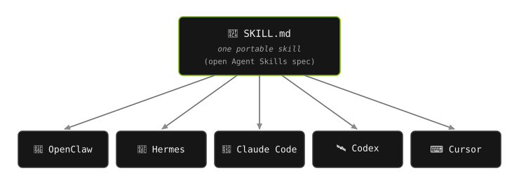

<div class="dx-hero" data-eyebrow="MODULE 07 / 03 - SKILLS" data-title="Capability that travels." data-sub="One SKILL.md can travel between compatible harnesses." data-meta="SPEC::agentskills.io|CATALOG::github.com/NVIDIA/skills"></div>

If harnesses are where agents succeed or fail, **skills** are how capability moves between them.

A skill is a packaged set of procedural knowledge an agent loads *on demand* whenever a task calls for it. You've already seen skill loading in Module 2 and skill toggles in Module 5's deep agent. Now, let's take one apart.

<!-- fold:break -->

## Anatomy of a Skill


A skill is a folder with a `SKILL.md` at its root. The file has two parts:

```markdown
---
name: code-review
description: Systematic approach to reviewing code for quality and correctness
---

# Code Review Skill

You are now operating as a code reviewer. Follow this systematic approach.
...full instructions, checklists, examples...
```

- **Frontmatter** — the `name` and `description`. YAML descriptions may span lines; the lab normalizes them into a compact index.
- **Body** — the full instructions. The lab model requests them through `load_skill` when relevant.

This repo ships two examples you can open right now: <button onclick="openOrCreateFileInJupyterLab('skills/code-review/SKILL.md');"><i class="fa-solid fa-book"></i> code-review</button> and <button onclick="openOrCreateFileInJupyterLab('skills/technical-writing/SKILL.md');"><i class="fa-solid fa-book"></i> technical-writing</button>.

<!-- fold:break -->

## Lazy Loading: Token Efficiency in Action

Here's where skills connect back to the context tax. With lazy loading, a new conversation starts with skill descriptions and adds full bodies when requested.

```text
Illustrative prompt size, 30 installed skills:

  Eager loading:   30 × ~1,500 tokens  =  ~45,000 tokens  💸
  Lazy loading:    30 × ~25 tokens     =     ~750 tokens  ✅
                   (+1 full skill body only when actually used)
```

Lazy loading reduces the initial prompt. Once loaded, a skill body can remain in conversation history until it is removed or compacted. In the lab, you'll measure that initial difference.

<!-- fold:break -->

## Portable Instructions: The Open Spec

The format follows the open **Agent Skills specification** ([agentskills.io](https://agentskills.io)). Compatible harnesses, including Hermes, Claude Code, and Codex, can discover the same `SKILL.md` instructions.



The instructions are portable; tool names, dependencies, and permissions still need to match the destination harness.

<!-- fold:break -->

## NVIDIA Verified Skills

NVIDIA publishes skills for compatible harnesses: **[github.com/NVIDIA/skills](https://github.com/NVIDIA/skills)** — official, NVIDIA-verified skills that teach agents to use NVIDIA software optimally: CUDA-X libraries, AI Blueprints, and platform tools.

The catalog is synced daily from the NVIDIA product teams that own each skill, and spans **cuOpt** (optimization), **cuDF** (GPU DataFrames), **CUDA-Q**, **NeMo**, **Dynamo**, **Holoscan**, **Earth2Studio**, **PhysicsNeMo**, and more. Skills syndicate out to the marketplaces — skills.sh, the Claude Code and Codex plugin ecosystems, ClawHub, and Hermes Hub.

The catalog supports several installer targets. This lab uses a local verification step before installation:

```bash
bash code/7-agent-harnesses/scripts/install_nvidia_skill.sh accelerated-computing-cudf
```

For Hermes, copy the complete verified folder as shown in the lab. A remote hub install can omit supporting files when fetching fails; a skill listing or security scan alone does not verify its signed payload.

<!-- fold:break -->

## Verified, Not Just Published

Remember Module 6's lesson: an autonomous agent will eventually encounter adversarial content. Skills are *instructions you inject directly into your agent*. An unvetted skill, therefore, is a prompt-injection delivery vehicle. NVIDIA's answer is capability governance: every skill passes a verification pipeline (review → security scan → evaluation → skill card → cryptographic signing → catalog → sync) before publication.

Here's what a verified skill looks like in the catalog:

<div class="dx-skillcard dx-reveal">
  <div class="dx-skillcard-head"><span class="dx-skillcard-name">accelerated-computing-cudf</span><span class="dx-chip is-green">NVIDIA VERIFIED ✓</span></div>
  <p>Official NVIDIA-authored guidance for cuDF GPU DataFrames, pandas acceleration, dask-cuDF, ETL, joins, groupby, CSV/Parquet I/O, and multi-GPU DataFrame workloads.</p>
  <ul>
    <li><b>Owner</b> NVIDIA · <b>License</b> CC-BY-4.0 AND Apache-2.0</li>
    <li><b>SkillSpector</b> <span class="dx-check">✓</span> prompt injection <span class="dx-check">✓</span> tool poisoning <span class="dx-check">✓</span> dangerous code</li>
    <li><b>Signature</b> skill.oms.sig - OpenSSF Model Signing</li>
    <li><b>Skill card</b> use case, risks & mitigations, dependencies, eval agents (claude-code, codex)</li>
  </ul>
</div>

A valid signature establishes provenance and integrity of the signed files, not safety or suitability for every task. The lab verifies the staged copy and rejects unexpected unsigned payload files before installation.

<div class="dx-island dx-quiz">
  <p class="dx-island-title">CHECK YOUR UNDERSTANDING</p>
  <p class="dx-quiz-q">A new conversation uses the lab’s lazy loader with 30 installed skills, before any skill is loaded. What skill content is in its context?</p>
  <button class="dx-quiz-opt" data-fb="That is eager loading: about 45,000 initial tokens using the illustrative body size above.">All 30 full skill bodies</button>
  <button class="dx-quiz-opt" data-fb="Then the model could never know when to load one.">Nothing at all</button>
  <button class="dx-quiz-opt" data-right data-fb="The initial context includes descriptions; bodies load on demand. The 750-token figure above is illustrative.">Thirty one-line descriptions</button>
  <button class="dx-quiz-opt" data-fb="Recency is not how skills trigger - descriptions match against the task.">Only the most recently used skill</button>
</div>

> Time for the punchline of this module: what happens when a verified skill meets the GPU sitting under this very workshop. Head to [GPU Skills in Any Harness](gpu_skills).
