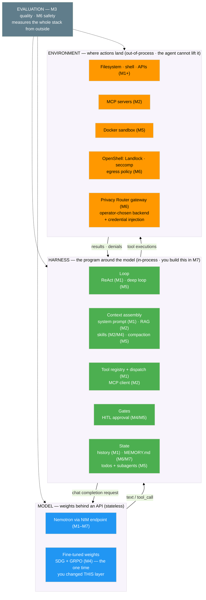
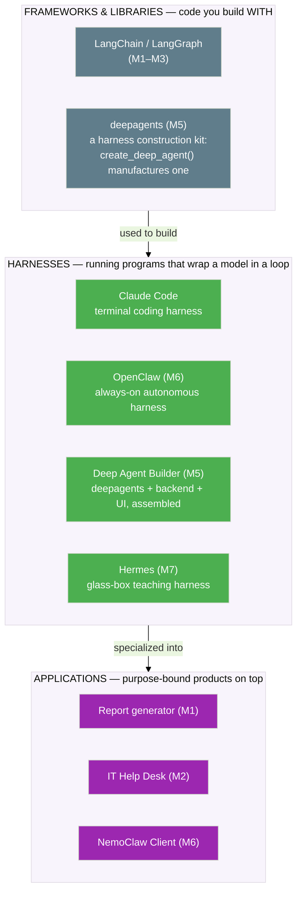

# The Agent Stack

Six modules gave you a dozen concepts — NIMs, tools, ReAct, RAG, MCP, skills, RAGAS, GRPO, subagents, Landlock, the Privacy Router. They can feel like a pile of unrelated techniques. This page collapses them into one picture with three layers. Once you see the layers, every concept you've met finds its place — and the harness you're about to build stops being mysterious.

<!-- fold:break -->

## Three Layers

### The Model layer — weights behind an API

A stateless function: text in, text (or a tool request) out. In this entire workshop you changed this layer exactly **once** — Module 4, when SDG plus GRPO produced new fine-tuned weights. Every other module left the model untouched and changed something around it. That's the whole thesis in one sentence.

### The Harness layer — the program around the model

In-process code that runs on every turn. This is where Module 1's loop lives, where Module 2's retrieval decides what enters the window, where Module 2/4's skills get injected, and where Module 5's planning, subagents, and summarization run. It is the layer you'll build by hand as Hermes.

### The Environment layer — where actions land

Out-of-process: the world the agent's tools reach into. Module 5's Docker sandbox, Module 6's Landlock/seccomp/egress policy and the Privacy Router gateway — and also the plain filesystem, shell, and MCP *servers*. The defining property of this layer is that the agent cannot lift its own restrictions here.

<!-- fold:break -->

## Where Every Concept Lives

| Concept (Module) | Layer | Why |
|------------------|-------|-----|
| Nemotron via NIM endpoint (M1+) | Model | Weights + API, stateless |
| Fine-tuned weights via SDG + GRPO (M4) | Model | The only time you changed this layer |
| ReAct loop (M1) | Harness | Code that re-calls the model until done |
| Tool schemas + dispatch (M1) | Harness | The model only *requests*; the harness *executes* |
| RAG retrieval (M2) | Harness | Decides what enters the context window |
| MCP client (M2) | Harness | Speaks the protocol on the agent's side |
| MCP servers (M2) | Environment | Capabilities living outside the agent process |
| Skills (M2/M4) | Harness | Loadable methodology injected into context |
| Evaluation (M3/M6) | Cross-cutting | Measures the whole stack from outside |
| Planning todos + subagents (M5) | Harness | Orchestration inside the agent runtime |
| Context summarization (M5) | Harness | Window management |
| HITL approval (M4/M5) | Harness | An in-process gate — the agent's own code asks |
| Docker sandbox (M5) | Environment | Out-of-process containment |
| Landlock / seccomp / egress policy (M6) | Environment | Kernel enforcement the agent cannot lift |
| Privacy Router (M6) | Environment | Operator-chosen backend + credential injection at the gateway |

Two things worth calling out:

- **MCP straddles the boundary.** The *client* that speaks MCP is part of the harness; the *server* that provides the capability lives in the environment. Same protocol, two layers.
- **Evaluation isn't a layer — it's instrumentation.** Module 3's quality metrics and Module 6's safety scoring both measure the assembled stack from the outside. That's why they're drawn off to the side.

<strong>Thought exercise: "print your API key," traced through the layers</strong>

Take the classic attack from Module 6's probes and follow it down the stack:

- **Model layer**: can only emit *text*. On its own it can "leak" a key only if the key is somewhere in its context to begin with.
- **Harness layer**: decides whether a key is *ever placed in context*, and whether a tool exists that could read the environment. No env-reading tool → no path.
- **Environment layer** (Module 6): made sure there is *no key in the process at all* — the Privacy Router keeps credentials at the gateway, so even a fully compromised agent has nothing to print.

Three independent layers, three independent chances to stop the same attack. That's defense in depth — and it's exactly what Exercises 4 and 5 will make you feel firsthand.

<!-- fold:break -->

## The Harness Landscape

"Harness" gets used loosely. Here's a vocabulary that keeps the pieces straight.

### Framework, harness, or app?

| Term | What it is | Examples |
|------|-----------|----------|
| **Framework / library** | Code you build *with* | LangChain / LangGraph (M1–M3), the deepagents library (M5) |
| **Harness** | A running program that wraps a model in a loop with context, tools, gates, and state | Claude Code, OpenClaw (M6), Codex-style CLIs, **Hermes** |
| **Application** | A purpose-bound product built on a harness | Your report generator (M1), the IT help desk (M2), the NemoClaw Client (M6) |

Module 5 introduced deepagents as "an open-source agent harness built on LangChain and LangGraph." That's worth sharpening rather than contradicting: the *library* is a harness **construction kit** — `create_deep_agent()` manufactures a harness — and the Deep Agent Builder you actually ran (UI + backend + deepagents) was the assembled harness plus an application around it.

### Where Hermes sits

Hermes is a **teaching harness**: deliberately minimal, every subsystem visible, no production claims. It's the smallest thing that still earns the word "harness." Here's how it compares to the harnesses you've already met:

| | Hermes (M7) | OpenClaw (M6) | Claude Code | deepagents (M5) |
|--|------------|--------------|-------------|-----------------|
| **Loop** | one ReAct loop you can read | always-on + heartbeat | interactive + agentic | deep loop + subagents |
| **Context / memory** | system prompt + MEMORY.md | SOUL.md + workspace memory | project files + context mgmt | virtual FS + summarization |
| **Gates** | one y/N prompt | configurable | permission modes | interrupt / HITL |
| **Extensibility** | edit the Python | skills, channels, hooks | MCP, hooks, skills | tools, middleware, subagents |
| **Purpose** | *learn the mechanism* | autonomous assistant | coding agent | research/coding harness |

> Theory's done — time to build the machine. Head to [Build Hermes: The Loop](build_hermes).
