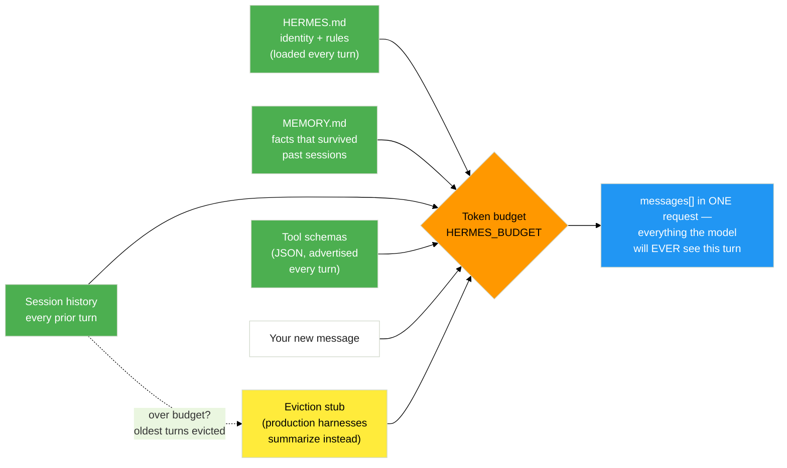

# Build Hermes: The Loop


Time to build the green layer from [The Agent Stack](agent_stack) — the harness — by hand. You'll start with the absolute minimum that earns the word "agent": a loop that talks to the model and remembers the conversation. Then you'll give it a personality and a memory that survives a restart.

Everything lives in <button onclick="openOrCreateFileInJupyterLab('code/7-agent-harnesses/hermes/');"><i class="fa-solid fa-folder"></i> code/7-agent-harnesses/hermes/</button>. Five files, five subsystems — plus `config.py` (the knobs) and `HERMES.md` (the soul):

| File | Subsystem | You build it in |
|------|-----------|-----------------|
| `client.py` | the wire to the model | Exercise 1 |
| `harness.py` | the loop + the REPL | Exercises 1 & 3 |
| `context.py` | what enters the window | Exercise 2 |
| `state.py` | memory that persists | Exercise 2 |
| `tools.py` / `gates.py` | doing + asking permission | Exercise 3 |

Open a terminal with <button onclick="openNewTerminal();"><i class="fas fa-terminal"></i> New Terminal</button> and `cd code/7-agent-harnesses`. Stuck on any step? A complete, runnable copy lives in `answer_key/hermes/` — peek, don't paste.

<!-- fold:break -->

## Exercise 1: The Loop

> *Subsystem: **Loop** · Files: `hermes/client.py`, `hermes/harness.py` · Goal: a conversation that remembers itself*

A "chat" with an LLM is an illusion the harness maintains. The model is stateless; the harness re-sends the whole conversation every turn. In this exercise you build the smallest thing that creates that illusion.

<details>
<summary><strong>Step 1 — Make one raw call</strong></summary>

Open <button onclick="goToLineAndSelect('code/7-agent-harnesses/hermes/client.py', 'TODO: Exercise 1.1');"><i class="fas fa-code"></i> client.py — Exercise 1.1</button>. Module 1 used the `openai` SDK; here you build the request by hand with `urllib` so you can see the literal JSON on the wire (and so the same file runs later inside the sandbox, with no pip installs).

Fill in **1.1** (assemble the payload dict) and **1.2** (send it and parse the reply). The normalization below the TODO — turning the raw response into Module 1's `{"role": "assistant", "content": ..., "tool_calls": [...]}` shape — is written for you. Study it: that's exactly what the SDK did behind your back.

Verify the wire works:

```bash
python3 -m hermes --once "Reply with exactly: LOOP-OK"
```

Expected output:

```text
LOOP-OK
```

</details>

<details>
<summary><strong>Step 2 — The REPL</strong></summary>

Open <button onclick="goToLineAndSelect('code/7-agent-harnesses/hermes/harness.py', 'TODO: Exercise 1.3');"><i class="fas fa-code"></i> harness.py — Exercise 1.3</button>. Fill in **1.3** (append the user message, call the model, append the reply) and **1.4** (print the reply in the REPL loop, a few lines down).

Now run the harness with no arguments:

```bash
python3 -m hermes
```

Expected output:

```text
Hermes v0.1 - a glass-box agent harness
  model : nvidia/nemotron-3-super-120b-a12b @ https://integrate.api.nvidia.com/v1
  soul  : not wired (Exercise 2)
  memory: not wired (Exercise 2)
  tools : none registered (Exercise 3)
  /quit /remember <text> /memory /context /history
you> Hello! Who am I talking to?
hermes> Hello! I'm an AI assistant. How can I help you today?
```

The banner is honest about what you haven't built yet — `soul` and `tools` say "not wired." You'll light those up in the next exercises.

</details>

<details>
<summary><strong>Step 3 — Prove statelessness, then watch the harness fix it</strong></summary>

The single most important idea in this module. In `harness.py`, temporarily comment out the line that appends the *user* message to `self.messages` (the first line of your 1.3 answer). Restart and try:

```text
you> My name is Ada.
hermes> Nice to meet you, Ada!
you> What is my name?
hermes> I'm sorry, I don't have access to your name.
```

The model has no idea — because you stopped re-sending the history. Now restore the line. Ask again:

```text
you> My name is Ada.
you> What is my name?
hermes> Your name is Ada.
```

> 💡 **Memory is not a model feature. It is a harness feature.** The model didn't "learn" your name — your harness re-sent it.

</details>

<details>
<summary><strong>Step 4 — Watch the window grow</strong></summary>

Use the built-in REPL commands to see the machine working:

```text
you> /history
  system    You are Hermes, a helpful assistant.
  user      My name is Ada.
  assistant Nice to meet you, Ada!
  user      What is my name?
  assistant Your name is Ada.
you> /context
messages: 5 | est tokens: 47 | budget: 4000
```

Every turn, that entire `messages` list is what the model sees. That list *is* the conversation.

</details>

<details>
<summary>🆘 Need some help?</summary>

The complete `chat()` (client.py) and `send()`/`repl()` (harness.py) are in `answer_key/hermes/`. The two lines that matter most:

```python
# harness.py, Exercise 1.3
self.messages.append({"role": "user", "content": user_text})
reply = client.chat(self.messages, tools=tools.tool_schemas())
self.messages.append(reply)
```

</details>

> **What you just learned:** "chat" is an illusion the harness maintains by re-sending everything, every turn.

<!-- fold:break -->

## Exercise 2: Context and Memory


> *Subsystems: **Context** + **State** · Files: `hermes/context.py`, `hermes/state.py`, `hermes/HERMES.md` · Builds on: Exercise 1*

Right now every turn sends `messages` straight to the model. But what enters that window is a *decision* the harness makes — and the window is a finite budget. In this exercise you assemble the system prompt from a soul file, give Hermes a memory that survives a restart, and teach it to compact the conversation when it grows too long.

Here's what the harness assembles into one request, every single turn:



<details>
<summary><strong>Step 1 — The soul file</strong></summary>


Open <button onclick="openOrCreateFileInJupyterLab('code/7-agent-harnesses/hermes/HERMES.md');"><i class="fa-solid fa-file-lines"></i> HERMES.md</button>. This is Hermes' identity, tone, and rules — deliberately the same idea as OpenClaw's `SOUL.md` from Module 6. It's provided; read it.

Now open <button onclick="goToLineAndSelect('code/7-agent-harnesses/hermes/context.py', 'TODO: Exercise 2.1');"><i class="fas fa-code"></i> context.py — Exercise 2.1</button> and assemble the system prompt: the soul, then a memory section, then a runtime header. Restart and ask who it is:

```text
you> Who are you?
hermes> I am Hermes, a glass-box agent harness built in Module 7. My personality
        comes from HERMES.md — a file — not from the model weights.
```

The banner now reads `soul : HERMES.md loaded`. Same model as Step 2; different agent. That's the thesis, live.

</details>

<details>
<summary><strong>Step 2 — Budget the window</strong></summary>

The context window is finite, so the harness has to estimate how full it is. Open <button onclick="goToLineAndSelect('code/7-agent-harnesses/hermes/context.py', 'TODO: Exercise 2.2');"><i class="fas fa-code"></i> context.py — Exercise 2.2</button> and implement `estimate_tokens()` with the cheap, dependency-free `~4 chars per token` heuristic (no `tiktoken` — it isn't installed here, and it would be falsely precise for Nemotron's tokenizer anyway).

```text
you> /context
messages: 5 | est tokens: 47 | budget: 4000
```

</details>

<details>
<summary><strong>Step 3 — Compaction</strong></summary>

When the conversation exceeds the budget, the harness has to make room. Open <button onclick="goToLineAndSelect('code/7-agent-harnesses/hermes/context.py', 'TODO: Exercise 2.3');"><i class="fas fa-code"></i> context.py — Exercise 2.3</button> and implement `compact()`: keep the system message and the most recent turns, drop the oldest, and leave a one-line stub where they were.

To see it fire without a 4000-token conversation, shrink the budget:

```bash
HERMES_BUDGET=500 python3 -m hermes
```

Then have a four-turn conversation (ask for a few multi-sentence explanations). Watch for:

```text
[context] compacted 3 old messages (est 854 -> 680 tokens, budget 500)
```

> ⚠️ One real-world gotcha baked into the code: never evict a `tool` result without the assistant message that requested it — the model needs the pair. The provided scaffold walks the cut boundary forward to keep them together.

<details>
<summary>Why drop, when Module 5 summarized?</summary>

Dropping-with-a-stub is the simplest thing that teaches the concept, and it's deterministic — no extra model call, no surprise. Production harnesses (Module 5's summarization middleware, Claude Code's context management) instead *summarize* the evicted span with the model so less is lost. Same problem — a finite window — different cost/fidelity trade-off. You've now built the floor; you know what the ceiling buys.

</details>

</details>

<details>
<summary><strong>Step 4 — Memory that survives a restart</strong></summary>

Short-term memory is the `messages` list — it dies when the process exits. Long-term memory is a *file*. Open <button onclick="goToLineAndSelect('code/7-agent-harnesses/hermes/state.py', 'TODO: Exercise 2.4');"><i class="fas fa-code"></i> state.py — Exercise 2.4</button> and implement `remember()` to append a dated bullet to `MEMORY.md`. `build_system_prompt()` (Step 1) already reloads that file every boot.

Prove it across a real process restart:

```text
you> /remember my favorite GPU is the GB300
Noted. MEMORY.md now has 1 entries.
you> /quit
```

```bash
python3 -m hermes --once "What is my favorite GPU?"
```

Expected output:

```text
Your favorite GPU is the GB300.
```

A brand-new process knew a fact from the last one — because the harness wrote it to disk and reloaded it.

> 💡 This file is the same mechanism OpenClaw uses — and the same mechanism Module 6 poisoned in **Probe 4**. Persistence is power and attack surface at once.

</details>

<details>
<summary>🆘 Need some help?</summary>

The full `build_system_prompt()`, `estimate_tokens()`, `compact()` (context.py) and `remember()` (state.py) are in `answer_key/hermes/`. The assembly order that matters:

```python
# context.py, Exercise 2.1 — stable content first (cache-friendly), volatile last
return soul + "\n\n## Long-term memory (MEMORY.md)\n" + memory + runtime_header
```

</details>

> **What you just learned:** the context window is a budget the harness spends on your behalf — and memory is a file the harness chooses to reload.

<!-- fold:break -->

Hermes can talk, hold a personality, and remember across restarts. But it still can't *do* anything in the world. Next, you'll give it hands — and the discipline to ask before using them. Head to [Build Hermes: Tools and Gates](tools_and_gates).
