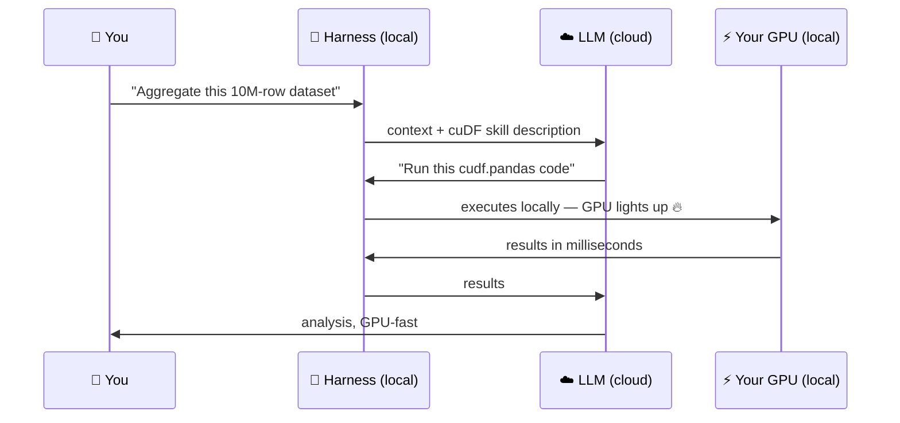

# GPU Skills in Any Harness


Here's a question that trips up almost everyone:

> *"If I pay for Claude Code or Codex, isn't my GPU just sitting idle while some cloud model does all the work?"*

**No — and this page is about why.** The model loop may run in someone else's datacenter, but tools and skills execute **locally, on your machine**. A subscription buys the brain; the muscles are yours. Skills are how you teach that brain to flex *your* GPU.

<!-- fold:break -->

## The Division of Labor



The cloud model never touches your data at GPU scale — it writes a few hundred tokens of code. Your GPU does the heavy compute. This is true in **every** harness: OpenClaw, pi, Claude Code, Codex. The skill is what makes the model reach for the GPU *correctly* — right library, right API, right performance patterns.

<!-- fold:break -->

## Why the Skill Matters

Without the skill, a model asked to process a big DataFrame writes... pandas. Single-threaded, CPU-bound pandas. It doesn't know your machine has a GPU, and it doesn't know the patterns that make cuDF fast.

The `accelerated-computing-cudf` verified skill teaches it, among other things:

- Use `cudf.pandas` for minimal-change acceleration; explicit cuDF for hot ETL paths
- The 100K-row size gate (below that, transfer overhead beats the speedup)
- Keep intermediate data on GPU; convert at boundaries only
- Scale past GPU memory with dask-cuDF and spilling

One installed skill turns "an agent that writes pandas" into "an agent that drives CUDA-X." That's the pattern for the whole [NVIDIA/skills](https://github.com/NVIDIA/skills) catalog — cuOpt for optimization, CUDA-Q for quantum, NeMo for training, Holoscan for sensor pipelines.

<!-- fold:break -->

## See It With Your Own Eyes

In the lab, you'll prove the GPU is working with the bluntest possible instrument. Open a <button onclick="openNewTerminal();"><i class="fas fa-terminal"></i>terminal</button> and run:

```bash
watch -n 1 nvidia-smi
```

Keep it visible while your agent runs the cuDF exercise. When the agent hits the aggregation step, you'll see GPU utilization and memory jump — your subscription-or-otherwise agent, doing real work on your silicon.

<!-- fold:break -->

## Optional: The Closed-Harness Track

Everything in this module's lab runs in open harnesses with Nemotron — **no subscription required**. But if you have Claude Code or Codex access, the portability claim takes 30 seconds to verify yourself:

<!-- tabs:start -->

#### **Claude Code**

```bash
npx skills add nvidia/skills --skill accelerated-computing-cudf --agent claude-code
```

Then, inside Claude Code, with `watch nvidia-smi` running:

> *Load test_data/sensor_readings.csv with cuDF and compute per-device aggregates on the GPU.*

#### **Codex**

```bash
npx skills add nvidia/skills --skill accelerated-computing-cudf --agent codex
```

Then, inside Codex, with `watch nvidia-smi` running:

> *Load test_data/sensor_readings.csv with cuDF and compute per-device aggregates on the GPU.*

<!-- tabs:end -->

Same SKILL.md. Same GPU. Different harness. **That's the open skills layer doing its job** — and it's why NVIDIA publishes skills for every harness rather than betting on one: rising GPU capability in every agent lifts the whole ecosystem.

> Enough theory — time to build. Head to [The Harness Lab](harness_lab) for the hands-on exercises.
