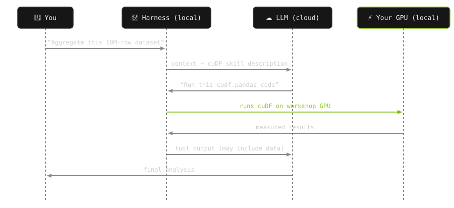

<div class="dx-hero" data-eyebrow="MODULE 07 / 04 - GPU SKILLS" data-title="Put your GPU to work." data-sub="A skill can guide a cloud model to use tools on your GPU machine." data-meta="SKILL::accelerated-computing-cudf|PROOF::nvidia-smi"></div>

Here's a question that trips up almost everyone:

> *"If I pay for Claude Code or Codex, isn't my GPU just sitting idle while some cloud model does all the work?"*

A cloud model can write code for your GPU. The harness must run that code on a machine with GPU access — here, the workshop machine. A remote sandbox or MCP server may run tools somewhere else.

<!-- fold:break -->

## The Division of Labor



In this lab, the model proposes code and the harness runs it locally. Tool output goes back to the model, so local computation alone does not guarantee that data stays local.

<!-- fold:break -->

## Why the Skill Matters


A model may reach for pandas by default. The skill adds guidance on when cuDF helps and how to use it.

The `accelerated-computing-cudf` verified skill teaches it, among other things:

- Use `cudf.pandas` for minimal-change acceleration; explicit cuDF for hot ETL paths
- Size and transfer overhead — measure whether the GPU helps your workload
- Keep intermediate data on GPU; convert at boundaries only
- Scale past GPU memory with dask-cuDF and spilling

One installed skill turns "an agent that writes pandas" into "an agent that drives CUDA-X." That's the pattern for the whole [NVIDIA/skills](https://github.com/NVIDIA/skills) catalog — cuOpt for optimization, CUDA-Q for quantum, NeMo for training, Holoscan for sensor pipelines.

<!-- fold:break -->

## See It With Your Own Eyes

In the lab, you'll prove the GPU is working with the bluntest possible instrument. Open a <button onclick="openNewTerminal();"><i class="fas fa-terminal"></i>terminal</button> and run:

```bash
watch -n 0.5 nvidia-smi
```

Keep it visible while your agent runs the cuDF exercise. GPU activity can be brief; also inspect the executed code and output to confirm that cuDF performed the aggregation.

<!-- fold:break -->

## Optional: The Closed-Harness Track

Everything in this module's lab runs in open harnesses with Nemotron — **no subscription required**. But if you have Claude Code or Codex access, the portability claim takes 30 seconds to verify yourself:

<!-- tabs:start -->

#### **Claude Code**

```bash
npx skills add nvidia/skills --skill accelerated-computing-cudf --agent claude-code
```

Then, inside Claude Code, with `watch nvidia-smi` running:

> *Load test_data/sensor_readings.csv with cuDF and compute per-device aggregates on the GPU. Repeat the full load-and-aggregate 10 times in a loop — don't hoist the CSV read out of the loop — so the GPU stays visibly busy in nvidia-smi.*

#### **Codex**

```bash
npx skills add nvidia/skills --skill accelerated-computing-cudf --agent codex
```

Then, inside Codex, with `watch nvidia-smi` running:

> *Load test_data/sensor_readings.csv with cuDF and compute per-device aggregates on the GPU. Repeat the full load-and-aggregate 10 times in a loop — don't hoist the CSV read out of the loop — so the GPU stays visibly busy in nvidia-smi.*

<!-- tabs:end -->

The same instructions can guide different compatible harnesses. Each still needs the required libraries and a tool backend with GPU access.

<div class="dx-island dx-quiz dx-reveal">
  <p class="dx-island-title">CHECK YOUR UNDERSTANDING</p>
  <p class="dx-quiz-q">Your workshop harness runs generated cuDF code on this GPU machine. Where does the aggregation run?</p>
  <button class="dx-quiz-opt" data-fb="The cloud model proposes the code; this lab executes it on the workshop GPU.">In Anthropic's datacenter</button>
  <button class="dx-quiz-opt" data-right data-fb="The harness executes the generated cudf code on your machine - watch nvidia-smi.">On your local GPU</button>
  <button class="dx-quiz-opt" data-fb="Execution location follows the tool setup. This lab runs its tools locally.">Nowhere - subscriptions cannot use local hardware</button>
  <button class="dx-quiz-opt" data-fb="There is a clean division: cloud writes code, your GPU runs it.">Split 50/50</button>
</div>

> Enough theory — time to build. Head to [The Harness Lab](harness_lab) for the hands-on exercises.
