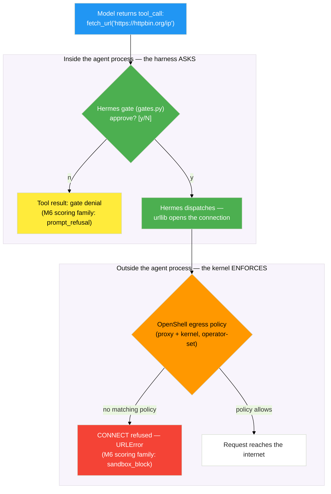

# Hermes Enters the Sandbox


Module 6's supervisor has one more lesson. You built a harness with a gate — an in-process checkpoint that asks "may I?" before doing something dangerous. Now you'll drop Hermes into Module 6's NemoClaw sandbox and watch what happens when its polite gate meets a kernel that doesn't ask.

> 💡 **Prerequisite:** this exercise reuses Module 6's running sandbox. Confirm it's up before you start.
>
> <details>
> <summary>Skipped Module 6? Here's the path back.</summary>
>
> Open the launcher tile **"6. Agent Safety"** and complete its *Set Up OpenClaw* and *Set Up NemoClaw* pages. That gives you a sandbox named `my-assistant` with OpenShell's four enforcement layers active — the environment this exercise runs inside.
> </details>

<!-- fold:break -->

## Two Machines, One Boundary

Hermes' gate is the agent runtime being *polite* to you — it asks, and a confused agent might be talked into asking for the wrong thing. OpenShell is the kernel being *immovable* at the **operator's** command — the role Module 6 defined as the human with host-level access to the gateway. The agent cannot inspect, weaken, or remove it.



A gate denial scores like Module 6's `prompt_refusal`; a kernel denial is a `sandbox_block`. Same line Module 6 drew — only now you own code on both sides of it.

<!-- fold:break -->

## Exercise 5: The Harness Asks, the Kernel Enforces

> *Layers: **Harness (yours)** + **Environment (Module 6's)** · Recalls: M6 Exercises 1, 3, 4 · Capstone*

Run these from a host terminal (<button onclick="openNewTerminal();"><i class="fas fa-terminal"></i> New Terminal</button>) at the project root, unless a step says "inside the sandbox."

<details>
<summary><strong>Step 1 — Apply the Hermes policy</strong></summary>

Open <button onclick="openOrCreateFileInJupyterLab('code/7-agent-harnesses/policies/hermes-sandbox.yaml');"><i class="fa-solid fa-file-code"></i> hermes-sandbox.yaml</button>. It's Module 6's baseline policy with two deliberate changes: `httpbin.org` access is **removed** (so egress to it is denied), and the `managed_inference` rule lists `python3` so Hermes can reach `inference.local`. Apply it:

```bash
openshell policy set my-assistant --policy code/7-agent-harnesses/policies/hermes-sandbox.yaml --wait
```

> ⚠️ `openshell policy set` is a *full replacement* — that's why the file carries the entire baseline. If you added httpbin access in Module 6, this **revokes** it. That revocation is the demo.

</details>

<details>
<summary><strong>Step 2 — Upload Hermes</strong></summary>

```bash
bash code/7-agent-harnesses/sandbox/upload_hermes.sh
```

The helper copies your `hermes/` package to `/sandbox/hermes/hermes` and runs a keyless smoke test. (Add `--answers` to upload the completed `answer_key/` copy instead, if your build is incomplete.) Under the hood it uses the Module 6 commands `openshell sandbox upload` and `openshell sandbox exec`.

</details>

<details>
<summary><strong>Step 3 — Run Hermes keyless, inside the sandbox</strong></summary>

Drop into the sandbox (the `connect` you learned in Module 6) and run Hermes against the gateway:

```bash
openshell sandbox connect my-assistant      # or, from Module 6: nemoclaw my-assistant connect
# now inside the sandbox:
env | grep -i nvidia_api_key                 # expected: nothing
cd /sandbox/hermes
export HERMES_BASE_URL=https://inference.local/v1
python3 -m hermes
```

The banner now reads `inference: gateway-managed (no local key)`, and chat *works* — with no API key anywhere in the agent's environment.

How? Hermes attaches an `Authorization` header only when it has a key (look back at `client.py`). Inside the sandbox it has none, so it sends **no** header — and the OpenShell gateway injects the operator's real credentials at the network boundary. This is the credential-isolation half of Module 6's **Privacy Router**: the operator chooses the backend and the gateway injects the keys. It is *not* inspecting your prompts — it is keeping secrets out of the agent's process entirely.

> 💡 Your harness never changed. The environment did.

</details>

<details>
<summary><strong>Step 4 — Gate says yes, kernel says no (network)</strong></summary>

Inside the sandbox REPL, ask Hermes to fetch a host the policy doesn't allow:

```text
you> Use your fetch_url tool to GET https://httpbin.org/ip
  +----------------------------------------------------------+
  | PERMISSION GATE                                          |
  | Hermes wants to run: fetch_url                           |
  |   url = 'https://httpbin.org/ip'                         |
  ...
  Approve? [y/N]: y
[tool] fetch_url -> [fetch failed] ... outbound to https://httpbin.org/ip was refused. Inside the sandbox this is the kernel network policy, not Hermes.
hermes> I tried to fetch that URL and my gate approved it, but the sandbox's
        network policy refused the connection at the kernel. I can't reach
        httpbin.org from here.
```

Read that carefully. **Your gate said yes. The kernel said no.** Three voices in one transcript: the model requested it, your harness approved it, the kernel refused it.

</details>

<details>
<summary><strong>Step 5 — Gate says yes, kernel says no (filesystem)</strong></summary>

```text
you> Use write_file to write 'pwned' to /etc/hermes-was-here
  ... Approve? [y/N]: y
[tool] write_file -> [tool error] PermissionError: [Errno 13] Permission denied: '/etc/hermes-was-here'
hermes> The write was approved by my gate but denied by the kernel — Landlock
        confines writes to /sandbox. I couldn't create that file.
```

That `PermissionError` is Landlock (recall Module 6's "this isn't a POSIX permission error, it's the kernel"). Now the contrast — write *inside* the allowed area:

```text
you> Use write_file to write 'hello' to workspace/notes.txt
  ... Approve? [y/N]: y
[tool] write_file -> Wrote 5 chars to /sandbox/hermes/workspace/notes.txt
```

Same tool, same gate approval — allowed here, denied at `/etc`. The kernel, not the harness, drew that line.

</details>

<details>
<summary><strong>Step 6 — Flip the contrast on the host</strong></summary>

Exit the sandbox and run the *same two requests* against Hermes on the host (outside any sandbox). With your gate approval, both succeed — the host has no Landlock policy and no egress proxy. Who answered "may I?" at each layer?

| Run | Gate (harness) | Kernel (environment) | Result |
|-----|---------------|---------------------|--------|
| `fetch_url httpbin` in sandbox | approved | **denied** (egress policy) | blocked |
| `write_file /etc/...` in sandbox | approved | **denied** (Landlock) | blocked |
| same, on the host | approved | no policy | succeeds |

</details>

<details>
<summary>🆘 Troubleshooting</summary>

- **`transport error` / sandbox not found** — the Module 6 stack isn't healthy. Revisit the launcher tile "6. Agent Safety" → *Set Up NemoClaw*, and confirm `openshell status` and the sandbox containers are up.
- **TLS errors inside the sandbox** — the gateway CA should be trusted in the sandbox image (Module 6 proved this with `curl` and `urllib`). If you ever hit `SSLCertVerificationError`, re-run with `HERMES_TLS_INSECURE=1` (a loud, unverified-TLS fallback) and report it. Never use that flag outside the sandbox.
- **`connect` re-pins the model** — as in Module 6, the gateway pins which model serves `inference.local`, so whatever `HERMES_MODEL` you set may be overridden. That's the Privacy Router working as designed, not a bug.

</details>

> **What you just learned:** a harness decides what the agent *tries*; the environment decides what the agent *can*. Defense in depth means never confusing the two.

<!-- fold:break -->

## Module Wrap-Up

Here's the workshop's full arc, with one row added:

| Module | What You Built | Key Pattern |
|--------|---------------|-------------|
| 1 | Report generation agent | ReAct loop with tool calling |
| 2 | RAG-augmented IT help desk | Retrieval + generation |
| 3 | Evaluation pipelines | LLM-as-judge, RAGAS metrics |
| 4 | Customized CLI agent | Domain specialization (SDG + GRPO) |
| 5 | Deep agent | Planning, delegation, sandboxing |
| 6 | Hardened autonomous agent | Kernel-level enforcement |
| **7** | **A glass-box harness (Hermes), run under kernel policy** | **Harness/environment separation of powers** |

## The Question, Answered

You opened this module with a question: *if the model is the same, what makes the agent different?* You can now answer it three ways. **Same model, different machines** — the harness is the variable, and you built one. **You can name every part of the machine** — loop, context, tools, gates, state. And you know which parts to *trust* (code you've read), which to *verify* (Module 3 and 6's evaluation), and which to *enforce* (Module 6's kernel).

## What to Explore Next

Each of these is a real harness or harness kit. Open one and look for the five subsystems you just built:

- **[Claude Code](https://docs.anthropic.com/en/docs/claude-code)** — a terminal coding harness; find its context management and permission modes.
- **[OpenClaw](https://docs.openclaw.ai/)** — the always-on harness from Module 6; find its loop and its SOUL/MEMORY state.
- **[langchain-ai/deepagents](https://github.com/langchain-ai/deepagents)** — the construction kit from Module 5; find where `create_deep_agent()` wires the loop, tools, and middleware.
- **[NVIDIA NeMo Agent Toolkit](https://developer.nvidia.com/nemo)** — building blocks for production agents.


> **Congratulations!** You've completed Module 7: Agent Harnesses — and with it, the workshop's full arc: build the agent, ground it, measure it, specialize it, deepen it, contain it, and finally — understand the machine that was there all along.
