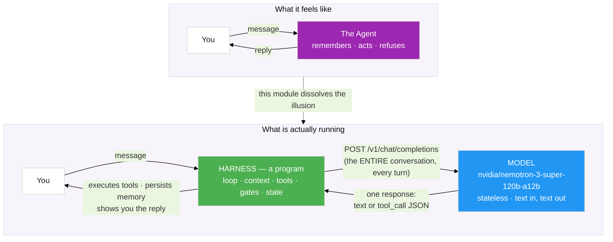

# The Invisible Machine

In Modules 1 through 6, you built increasingly capable — and increasingly safe — agents. A report writer. A help desk. A bash expert. A deep researcher. A hardened autonomous assistant.

Before this module adds anything new, look back at what you actually *changed* each time.

<!-- fold:break -->

## The Story So Far

| Module | What You Built | The Model | What Actually Changed |
|--------|---------------|-----------|----------------------|
| 1 | Report generation agent | `nemotron-3-super-120b-a12b` | The loop and the tools |
| 2 | RAG-augmented IT help desk | same model | What enters the context (retrieval, MCP, skills) |
| 3 | Evaluation pipelines | same model (as judge) | How behavior is measured |
| 4 | Customized CLI agent | **a fine-tuned Nemotron — the one exception** | The weights themselves |
| 5 | Deep agent | same model | Planning, delegation, middleware |
| 6 | Hardened autonomous agent | same model | The environment around everything |

Five of those six rows share one model. You never swapped brains — you reached for `nvidia/nemotron-3-super-120b-a12b` over and over — yet a report writer and an autonomous assistant feel like different creatures. So here is the question this entire module exists to answer:

> ***"If the model is the same, what makes the agent different?"***

The variable is the **harness** — the invisible machine wrapped around the model. This module makes it visible by making you build it.

<!-- fold:break -->

## You Have Never Talked to a Model

Here is the uncomfortable truth underneath every agent you've built: a model is stateless weights behind a single HTTP endpoint, `POST /v1/chat/completions`. It cannot remember your last message. It cannot run a tool. It cannot read a file or refuse to `rm -rf /`. Every one of those behaviors you've been attributing to "the agent" was performed by a *program in front of the model*.

> 💡 **Every turn, the model is born with amnesia.** The only reason conversations feel continuous is that the harness re-sends the entire history every single time. You'll see this with your own eyes in Exercise 1.

<!-- fold:break -->

## What a Harness Is (and Is Not)

### The five subsystems

Back in Module 1 you learned an agent has four components: a **model**, **tools**, **memory**, and **routing**. The harness is what *implements* the last three around the model. Concretely, Hermes — the harness you'll build — has five subsystems:

| Subsystem | The question it answers | Where you saw it before |
|-----------|------------------------|------------------------|
| **Loop** | When do we call the model again? | ReAct loop (M1), deep loop (M5) |
| **Context** | What does the model see this turn? | System prompts (M1), RAG (M2), skills (M2/M4), summarization (M5) |
| **Tools** | What can the model *do*, and who runs it? | Tool calling (M1), MCP (M2) |
| **Gates** | What needs a human's yes first? | Human-in-the-loop approval (M4/M5) |
| **State** | What survives between turns and restarts? | Conversation history (M1), memory files (M6) |

Every agent you've ever used has these five boxes somewhere. Production harnesses just have more of each.

### A harness is not a sandbox

This distinction is the spine of the whole module, so we draw it now: a **harness** is *in-process orchestration* — code the agent runtime itself runs, and which a sufficiently clever (or compromised) agent can sometimes be talked around. A **sandbox** like Module 6's OpenShell is *out-of-process enforcement* — kernel policy the agent cannot touch, inspect, or disable.

Module 6 already split these two when it scored your agent's refusals: a `prompt_refusal` (the model declining) is a different, weaker thing than a `sandbox_block` (the kernel refusing). This module builds the left half of that split — the in-process machine — and then, in Exercise 5, carries it back into the right half.

<strong>Refresher: Module 6's defense families</strong>

Module 6's red-team scoring distinguished *how* an unsafe action was stopped:

- **`prompt_refusal`** — the model's training made it say no. Real, but only as reliable as the model.
- **`sandbox_block`** — the kernel (Landlock, seccomp, the network proxy) made the action impossible. Reliable regardless of what the model "decides."

A harness gate (the y/N prompt you'll build in Exercise 3) lives in the first family: it's honest code, but it's in-process. Hold that thought for Exercise 5.

<!-- fold:break -->

## Meet Hermes

Your hands-on vehicle is **Hermes** — named for the messenger who carries words between you and the model. The build philosophy:

- **Glass-box** — every line is readable; there is no framework hiding the mechanism.
- **Zero-framework** — just Python's standard library and raw HTTP. No LangChain, no SDK.
- **Same endpoint as Module 1** — `https://integrate.api.nvidia.com/v1`, same model.
- **A terminal REPL** — you talk to it, watch it think, and inspect every message it sends.

<strong>Why build from scratch when frameworks exist?</strong>

The same reason Module 1 had you build a ReAct loop by hand before introducing LangChain: you cannot reason about — or debug, or secure — a machine whose moving parts you've never seen. Frameworks like deepagents (Module 5) are excellent, but they make the harness *invisible* again. Hermes is deliberately the opposite: small enough to read in one sitting, so that when you later use a production harness, you know exactly what each knob does.

<!-- fold:break -->

## What's Ahead

| Page | What You'll Do | Exercise |
|------|---------------|----------|
| [The Agent Stack](agent_stack) | Put every concept from Modules 1–6 on one map | Concepts |
| [Build Hermes: The Loop](build_hermes) | Model client, REPL, history, context, memory | Exercises 1–2 |
| [Build Hermes: Tools and Gates](tools_and_gates) | Tool registry, dispatch, permission gates | Exercise 3 |
| [The Harness Face-Off](harness_faceoff) | Same probes vs bare model, Hermes, OpenClaw | Exercise 4 |
| [Hermes Enters the Sandbox](into_the_sandbox) | Run Hermes under Module 6's kernel policy | Exercise 5 |

> Head to [The Agent Stack](agent_stack) to put every module you've completed on one map.
