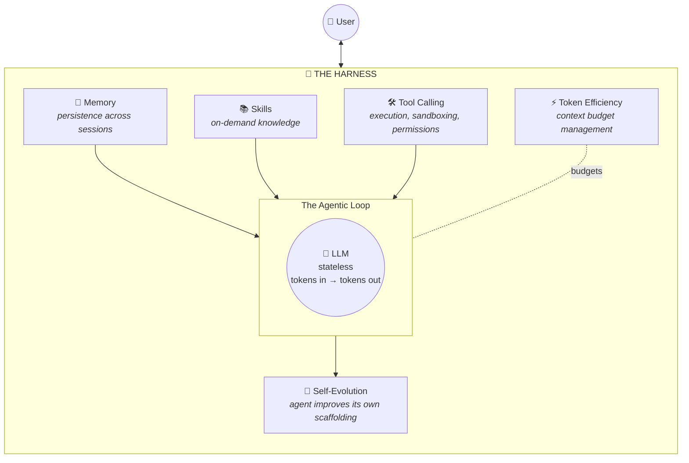

# The Harness Layer

Here's an uncomfortable truth about every agent you've built in this workshop: the LLM never remembered anything, never called a tool, and never planned a single step.

The model is a stateless function. Tokens in, tokens out. Everything that made your agents feel like *agents* — the memory, the tool execution, the planning loops, the self-evolving SOUL.md files from Module 6 — lived in a layer you've been using all along without naming it: the **harness**.

<!-- fold:break -->

## Engine vs. Car

A useful analogy: the LLM is the **engine**, and the harness is **the rest of the car** — chassis, transmission, fuel system, steering. An engine on a stand is impressive but goes nowhere. A car without an engine is furniture.

```mermaid
flowchart TB
    subgraph HARNESS["🔧 THE HARNESS"]
        direction TB
        MEM["📁 Memory<br/><i>persistence across sessions</i>"]
        SKILLS["📚 Skills<br/><i>on-demand knowledge</i>"]
        TOOLS["🛠️ Tool Calling<br/><i>execution, sandboxing, permissions</i>"]
        EVOLVE["🌱 Self-Evolution<br/><i>agent improves its own scaffolding</i>"]
        TOKENS["⚡ Token Efficiency<br/><i>context budget management</i>"]
        subgraph LOOP["The Agentic Loop"]
            LLM(("🧠 LLM<br/>stateless<br/>tokens in → tokens out"))
        end
        MEM --> LOOP
        SKILLS --> LOOP
        TOOLS --> LOOP
        LOOP --> EVOLVE
        TOKENS -.budgets.- LOOP
    end
    USER(("👤 User")) <--> HARNESS
```

This separation matters because the two layers are **independent choices**:

<ul style="margin-left:1em;">
  <li><b>Same model, different harness</b> → a very different agent. Nemotron in a bare completion loop vs. Nemotron inside OpenClaw are night and day.</li>
  <li><b>Same harness, different model</b> → the capability ceiling moves, but the behavior and UX stay consistent.</li>
</ul>

And it's why the performance race in agents is increasingly a **harness race**. Models are converging; harnesses are differentiating.

<!-- fold:break -->

## The Five Things Harnesses Own

Every harness — from a 50-line loop to Claude Code — owns the same five responsibilities. You've already touched each one in this workshop:

| # | Responsibility | What it means | Where you've seen it |
|---|---|---|---|
| 1 | **Memory** | What persists across sessions; what gets written, indexed, and recalled into context | OpenClaw's `MEMORY.md` and `USER.md` (Module 6); `MemorySaver` in deepagents (Module 5) |
| 2 | **Self-evolution** | The agent improving its own scaffolding: writing its own memories, skills, and config | Your OpenClaw agent rewriting `IDENTITY.md` after every heartbeat (Module 6) |
| 3 | **Skills** | Packaged procedural knowledge, loaded into context only when relevant | The Superpowers skills in Module 4; skill toggles in the Module 5 client |
| 4 | **Tool calling** | Tool schemas, execution, sandboxing, permissions, retries | MCP servers (Module 2); Docker sandboxing and HITL approval (Module 5) |
| 5 | **Token efficiency** | The context window is the scarce resource — compaction, lazy loading, sub-agent isolation | Sub-agent delegation in Module 5 keeping the main context clean |

<!-- fold:break -->

## Token Efficiency: The One That Sorts the Landscape

Four of these responsibilities are table stakes. The fifth — **token efficiency** — is where harness designers genuinely disagree, and it's the cleanest axis for understanding the whole ecosystem.

Every piece of harness machinery has a price, paid in context tokens on **every single model call**:

- The system prompt explaining how the harness works
- Tool schemas for every registered tool
- Skill descriptions, memory excerpts, environment state

We call this recurring overhead the **context tax**. A maximal harness might spend 7,000–10,000 tokens per turn before the user says a word. A minimal harness can get under 1,000. Neither is wrong — they're different bets:

> **The maximal bet:** rich built-in capability (sub-agents, plan modes, large tool suites) is worth the overhead, because the model uses it to do more per turn.
>
> **The minimal bet:** most of that machinery is documentation the model could load *on demand*. Strip the core, lazy-load the rest, and bet on the model itself.

In the lab, you'll measure this tax yourself — token by token — and implement the single most effective tax cut there is: **lazy skill loading**.

<!-- fold:break -->

## You've Been Using a Harness All Along

One more reframe before the tour. In Module 6 you watched OpenClaw run an always-on assistant from nothing but markdown files. Map it to the five responsibilities:

- `MEMORY.md`, `USER.md`, `state/` → **memory**
- The agent rewriting its own workspace files on every heartbeat → **self-evolution**
- The skills option in the setup wizard → **skills**
- The gateway brokering filesystem, shell, and network access → **tool calling**
- The `contextWindow` setting you bumped to 131,072 → **token efficiency**

OpenClaw *is* a harness. So is deepagents. So is the bare ReAct loop from Module 1 — just a very small one.

> Now that you know what a harness is, let's meet the major ones. Head to [The Harness Landscape](harness_landscape).
