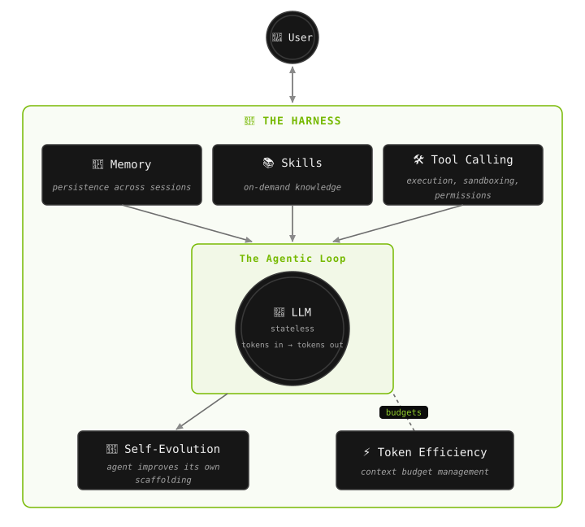

Here's an uncomfortable truth about every agent you've built in this workshop: the LLM never remembered anything, never called a tool, and never planned a single step.

The model is a stateless function. Tokens in, tokens out. Everything that made your agents feel like *agents* — the memory, the tool execution, the planning loops, the self-evolving IDENTITY.md and MEMORY.md files from Module 6 — lived in a layer you've been using all along without naming it: the **harness**.

<!-- fold:break -->

## The Story So Far

Every module so far handed you an agent. Seen through this module's lens, it also handed you a harness — six of them, and you've already driven them all:

  
<h4>MODULE 1</h4>Report agentA ReAct loop written by hand

  
<h4>MODULE 2</h4>RAG help deskLangGraph + MCP tools

  
<h4>MODULE 3</h4>EvaluationJudging what the loop produced

  
<h4>MODULE 4</h4>Custom CLI agentTraining + Superpowers skills

  
<h4>MODULE 5</h4>Deep agentdeepagents + Docker sandboxing

  
<h4>MODULE 6</h4>Hardened OpenClawAn always-on agent under kernel enforcement

This module names the pattern those six have in common — and takes it apart.

<!-- fold:break -->

## Engine vs. Car

A useful analogy: the LLM is the **engine**, and the harness is **the rest of the car** — chassis, transmission, fuel system, steering. An engine on a stand is impressive but goes nowhere. A car without an engine is furniture.

Here's what one turn of that agentic loop looks like from the harness's side — the model only ever sees tokens, while the harness does all the reading, running, and budgeting:

  the agentic loop
  summarize the errors in build.log
  thinking...
  [tool] read_file(build.log)
  tokens: 1,847 / 128,000
  [tool] run_bash(grep -c ERROR build.log)
  tokens: 2,210 / 128,000
  3 errors, all missing CUDA headers - fix: install cuda-toolkit-12-8

This separation matters because the two layers are **independent choices**:

- **Same model, different harness** → a very different agent. Nemotron in a bare completion loop vs. Nemotron inside OpenClaw are night and day.
- **Same harness, different model** → the capability ceiling moves, but the behavior and UX stay consistent.

And it's why understanding the harness matters more than ever. Models are converging. Harnesses are differentiating. To shape the behavior, reliability, and UX of the agent you're driving, you have to engineer its harness.

<!-- fold:break -->

## The Five Things Harnesses Own

Every harness — from a 50-line loop to Claude Code — owns the same five responsibilities. You've already touched each one in this workshop:

| # | Responsibility | What it means | Where you've seen it |
|---|---|---|---|
| 1 | **Memory** | What persists across sessions; what gets written, indexed, and recalled into context | OpenClaw's `MEMORY.md` and `USER.md` (Module 6); `MemorySaver` in deepagents (Module 5) |
| 2 | **Self-evolution** | The agent improving its own scaffolding: writing its own memories, skills, and config | Your OpenClaw agent rewriting its `IDENTITY.md` and `MEMORY.md` as it learns (Module 6) |
| 3 | **Skills** | Packaged procedural knowledge, loaded into context only when relevant | The Superpowers skills in Module 4; skill toggles in the Module 5 client |
| 4 | **Tool calling** | Tool schemas, execution, sandboxing, permissions, retries | MCP servers (Module 2); Docker sandboxing and HITL approval (Module 5) |
| 5 | **Token efficiency** | The context window is the scarce resource — compaction, lazy loading, sub-agent isolation | Sub-agent delegation in Module 5 keeping the main context clean |

<!-- fold:break -->

## The Context Tax

Every piece of harness machinery has a price, paid in context tokens on **every single model call**:

- The system prompt explaining how the harness works
- Tool schemas for every registered tool
- Skill descriptions, memory excerpts, environment state

We call this recurring overhead the **context tax**. A maximal harness might spend 7,000–10,000 tokens per turn before the user says a word. A minimal harness can get under 1,000. Neither is wrong — they're different approaches:

> **The maximal approach:** rich built-in capability (sub-agents, plan modes, large tool suites) is worth the overhead, because the model uses it to do more per turn.
>
> **The minimal approach:** most of that machinery is documentation the model could load *on demand*. Strip the core, lazy-load the rest, and lean on the model itself.

  
WHO EATS A 32K-TOKEN TURN?

  

    

0%

<b>maximal harness</b> 3,922 tokens

    

0%

<b>10 eager skills</b> ~15,000 tokens

    

0%

<b>10 lazy skills</b> ~240 tokens

  

In the lab, you'll measure this tax yourself — token by token — and implement the single most effective tax cut there is: **lazy skill loading**.

<!-- fold:break -->

## You've Been Using a Harness All Along

Let's map the OpenClaw always-on assistant that ran on markdown files in Module 6 to the five harness responsibilities:

- `MEMORY.md`, `USER.md`, `state/` → **memory**
- The agent rewriting its own workspace files on every heartbeat → **self-evolution**
- The skills option in the setup wizard → **skills**
- The gateway brokering filesystem, shell, and network access → **tool calling**
- The `contextWindow` setting you bumped to 131,072 → **token efficiency**

OpenClaw *is* a harness. So is deepagents. So is the bare ReAct loop from Module 1 — just a very small one.

  
CHECK YOUR UNDERSTANDING

  
Lazy skill loading — keeping skills as one-line descriptions until the agent invokes them — belongs to which harness responsibility?

  <button class="dx-quiz-opt" data-fb="Memory is cross-session persistence - lazy loading happens within a single turn's context.">Memory</button>
  <button class="dx-quiz-opt" data-fb="Tool schemas are part of the context tax, but lazy loading is a budget decision, not an execution mechanism.">Tool calling</button>
  <button class="dx-quiz-opt" data-right data-fb="Right - keeping one-line descriptions until a skill is invoked is spending the context budget deliberately.">Token efficiency</button>
  <button class="dx-quiz-opt" data-fb="Self-evolution is the agent rewriting its own scaffolding - lazy loading is the harness managing what enters context.">Self-evolution</button>

> Now that you know what a harness is, let's meet the major ones. Head to [The Harness Landscape](harness_landscape).
