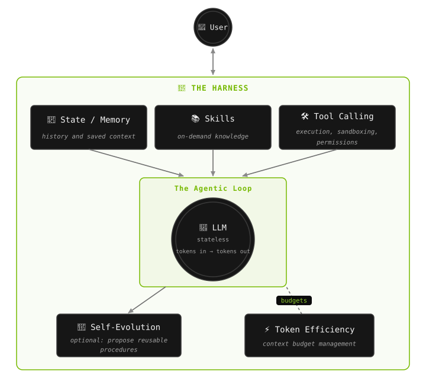

The model reasons over the context it receives: it can propose plans and request tools. The **harness** runs those tools, carries messages forward, and supplies saved memory. You have used this layer throughout Modules 1–6.

<!-- fold:break -->

## The Story So Far

Every module so far handed you an agent. Seen through this module's lens, it also handed you a harness — six of them, and you've already driven them all:

  
<h4>MODULE 1</h4>Report agentA hand-rolled ReAct loop

  
<h4>MODULE 2</h4>RAG help deskLangGraph + MCP tools

  
<h4>MODULE 3</h4>EvaluationJudging what the loop produced

  
<h4>MODULE 4</h4>Custom CLI agentSynthetic data + policy training

  
<h4>MODULE 5</h4>Deep agentdeepagents + Docker sandboxing

  
<h4>MODULE 6</h4>Hardened OpenClawAn always-on agent under kernel enforcement

This module names the pattern those six have in common — and takes it apart.

<!-- fold:break -->

## Engine vs. Car

A useful analogy: the LLM is the **engine**, and the harness is **the rest of the car** — chassis, transmission, fuel system, steering. An engine on a stand is impressive but goes nowhere. A car without an engine is furniture.

Here's what one turn of that agentic loop looks like from the harness's side — the model only ever sees tokens, while the harness does all the reading, running, and budgeting:

  the agentic loop
  summarize the errors in build.log
  thinking...
  [tool] read_file(build.log)
  tokens: 1,847 / 128,000
  [tool] run_bash(grep -c ERROR build.log)
  tokens: 2,210 / 128,000
  3 errors, all missing CUDA headers - fix: install cuda-toolkit-12-8

This separation matters because the two layers are **independent choices**:

- **Same model, different harness** → a very different agent. Nemotron in a bare completion loop vs. Nemotron inside OpenClaw are night and day.
- **Same harness, different model** → the interface can stay familiar while reasoning, tool use, latency, and results change.

The model and the harness both shape behavior, reliability, and the user experience. Evaluate them together.

<!-- fold:break -->

## Five Harness Design Choices

Harnesses differ in which capabilities they provide. These five choices connect the earlier modules to this lab:

| # | Responsibility | What it means | Where you've seen it |
|---|---|---|---|
| 1 | **State and memory** | What carries across turns; durable memory needs persistent storage | Message history (Module 1); checkpointing and files (Module 5) |
| 2 | **Optional self-evolution** | Proposing reusable instructions from experience, with validation and review | The skill-writing exercise at the end of this lab |
| 3 | **Skills** | Packaged procedures loaded when requested | Skill loading (Module 2); skill toggles (Module 5) |
| 4 | **Tool calling** | Tool schemas, execution, sandboxing, permissions, retries | MCP servers (Module 2); Docker sandboxing and HITL approval (Module 5) |
| 5 | **Token efficiency** | The context window is the scarce resource — compaction, lazy loading, sub-agent isolation | Sub-agent delegation in Module 5 keeping the main context clean |

<!-- fold:break -->

## The Context Tax

Every item included in a model request occupies context:

- The system prompt explaining how the harness works
- Tool schemas for every registered tool
- Skill descriptions, memory excerpts, environment state

We call this recurring overhead the **context tax**. The lab estimates about 400 tokens for its minimal setup and 3,922 for its larger bundled example. These are prompt-size estimates, not vendor benchmarks or billing totals:

> **The maximal approach:** rich built-in capability (sub-agents, plan modes, large tool suites) is worth the overhead, because the model uses it to do more per turn.
>
> **The minimal approach:** most of that machinery is documentation the model could load *on demand*. Strip the core, lazy-load the rest, and lean on the model itself.

  
WHO EATS A 32K-TOKEN TURN?

  

    

0%

<b>maximal harness</b> 3,922 tokens

    

0%

<b>10 eager skills</b> ~15,000 tokens

    

0%

<b>10 lazy skills</b> ~240 tokens

  

In the lab, you'll estimate this overhead and reduce the initial skill context with **lazy loading**.

<!-- fold:break -->

## You've Been Using a Harness All Along

In an OpenClaw deployment, these choices appear in configuration and workspace files:

- `MEMORY.md`, `USER.md`, `state/` → **memory**
- Permission to propose and save reusable procedures → **optional self-evolution**
- The skills option in the setup wizard → **skills**
- The gateway brokering filesystem, shell, and network access → **tool calling**
- Model context limits and history compaction → **context management**

OpenClaw *is* a harness. So is deepagents. So is the bare ReAct loop from Module 1 — just a very small one.

  
CHECK YOUR UNDERSTANDING

  
Lazy skill loading — keeping skills as one-line descriptions until the agent invokes them — belongs to which harness responsibility?

  <button class="dx-quiz-opt" data-fb="Memory retains information within or across sessions. Here the focus is how much skill text enters the initial context.">Memory</button>
  <button class="dx-quiz-opt" data-fb="Tool schemas are part of the context tax, but lazy loading is a budget decision, not an execution mechanism.">Tool calling</button>
  <button class="dx-quiz-opt" data-right data-fb="Right - keeping one-line descriptions until a skill is invoked is spending the context budget deliberately.">Token efficiency</button>
  <button class="dx-quiz-opt" data-fb="Self-evolution is the agent rewriting its own scaffolding - lazy loading is the harness managing what enters context.">Self-evolution</button>

> Now that you know what a harness is, let's meet the major ones. Head to [The Harness Landscape](harness_landscape).
