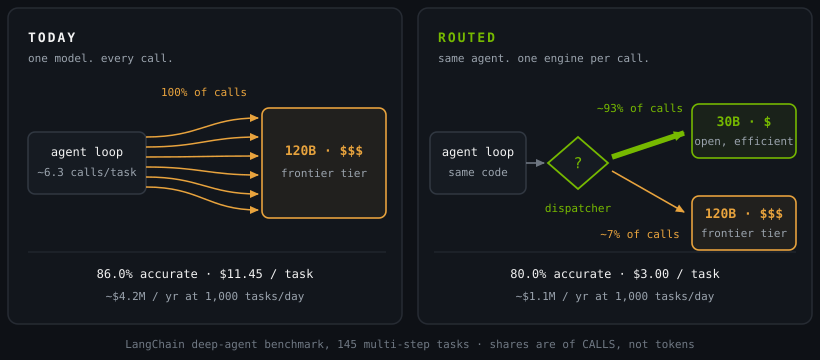

Here's the bill nobody sends you.

Every agent in this workshop is a token machine, and not by ones: LangChain's deep-agent benchmark averages **~6.3 model calls per task**, each one carrying the whole conversation, the tool schemas, and the harness overhead you learned to measure last module. Seven modules, seven agents — and all seven made those calls the same way. Module 1 opened `docgen_agent.py` with `MODEL_NAME = "nvidia/nemotron-3-super-120b-a12b"`, and every module since has done the same thing under a different variable name. One brain, hardwired, answering the trivial calls and the hard calls at exactly the same price.

**Tokenomics** is the name for what that costs you: the unit economics of LLM work — dollars and seconds per call, per task, per user, per month. It's the number that decides whether an agent feature ships or dies in review, and it's why this module exists.

> Module 7 taught you every token has a harness-level **cost** (the context tax). Module 8 teaches you every token also has a **price** — and the price depends on who generates it.

<!-- fold:break -->

## The Bill, Concretely

How big is the gap between those prices? Big enough that someone published it. LangChain ran the same deep agent across 145 multi-step tasks twice: once with a frontier model answering every call, once with a router in front of a 30B open model that escalated only when the work got hard.

<!-- CALIBRATE: published benchmark figures - cost/task, accuracy, and the annualized lines -->

  
TOKENOMICS, CONCRETELY

  

    
frontier-only

$11.45 / task

86.0% accurate

    
routed

$3.00 / task

80.0% accurate

  

At 1,000 tasks a day that's **~$4.2M a year against ~$1.1M a year** — a 74% cut — bought with a **6-point accuracy giveback**, 86.0% down to 80.0%. Both halves are the deal. 

Source: [LangChain's agent-routing benchmark](https://www.langchain.com/blog/switchyard-agent-routing-benchmark)

Read both rows before you get excited about the second one. Routing didn't make anything smarter; it made a **choice** — six points of accuracy, traded for three quarters of the bill. That trade is obvious for a bulk-summarization pipeline and unacceptable for a clinical-coding agent, and nothing in the router tells you which one you're building. Your eval suite does. This module's voice is measuring, not marketing: by the end of the lab you'll have produced your own version of that table, with your own agent, in your own account.

<!-- fold:break -->

## Frontier or Open? The Wrong Question

The industry is having this argument right now, and it's usually framed as a procurement decision: pick a side, sign a contract.

Two things changed at once to force it. Open-weight models crossed into frontier-adjacent capability — a 30B you can download today handles work that needed a frontier API a year ago — while frontier per-token prices stayed premium. And agents multiplied the volume: a user request is no longer one call, it's roughly six, so a price gap that used to be a rounding error on a chat app now compounds six times per task, every task, all day.

**Team Frontier.** Maximum capability, zero infrastructure, the best scores on the hardest reasoning. You pay for it with per-token pricing that never amortizes, data that leaves your walls on every call, and a single-vendor dependency wired through the middle of your product *(the role Nemotron Super 120B will play in your lab — see the "stand-in" aside in Exercise 1)*.

**Team Open.** Nemotron-class weights you can run anywhere: cheap at scale, private by construction, customizable down to your exact task — your Module 4 specialist is exactly this, and you trained it yourself. You pay for it with a capability ceiling that shows up on the hardest calls, and a serving stack you now own.

Both cases are honest. Companies are litigating them as a binary — one model, one vendor, one bill — and that's the assumption that doesn't survive contact with a transcript: **the debate silently assumes every call is equally hard — and your own agent transcripts prove it isn't**. Open your Module 7 harness log and look. "Summarize this tool output" and "plan a five-step investigation across these three files" sit one line apart, and today they cost the same.

  
PLACE YOUR BET

  
An agent benchmark routed between a 30B open model and a frontier model. What fraction of calls actually needed the frontier?

  

    <button class="dx-bet-opt">75%</button>
    <button class="dx-bet-opt">40%</button>
    <button class="dx-bet-opt">20%</button>
    <button class="dx-bet-opt">7%</button>
  

<!-- fold:break -->

## Use Both, Efficiently

NVIDIA's answer is to refuse the binary. Treat your models as a **portfolio** rather than a pick: commodity calls go to open models — most of them — and the genuinely hard calls go to a frontier model — few of them. In LangChain's run, "most" measured **~93% of calls** and "few" measured **~7% of calls**.

<!-- CALIBRATE: 93/7 are the benchmark's CALL shares as published - always label the denominator wherever this number reappears -->

The mental model for the rest of this module is a rail switchyard. A switchyard doesn't make locomotives faster — it stops you hauling the mail with your heaviest engine. Requests are trains, models are locomotives, and the dispatcher is the routing algorithm deciding which engine pulls which train. Module 7 taught you that the car is not the engine. Module 8 says: now stop welding the engine in.

On the left is every agent you've built so far. On the right is the same agent — same loop, same tools, same code — with a dispatcher in front of the model call. Notice what didn't change: the agent. Routing is a layer, not a rewrite, which is why you can retrofit it onto systems you've already shipped. Exercise 4 does it in a config file, with zero edits to the Python.

<!-- fold:break -->

## Wait — Module 1 Had "Routing" Too

It did, and it meant something else. Module 1 gave you the four components every agent is built from.

  
<h4>MODEL</h4>The brain that reads the conversation and decides. <b>Module 8 makes this a per-call choice.</b>

  
<h4>TOOLS</h4>Functions that let the agent act - search, calculate, query APIs.

  
<h4>MEMORY / STATE</h4>What the agent knows during and between conversations.

  
<h4>ROUTING</h4>The logic that orchestrates flow between reasoning and acting.

Routing in Module 1 was **control flow**: which *step* runs next inside of a particular query — think, act, or answer. Module 6 added a second sense, **policy** routing: the Privacy Router, where an operator decides which backend the agent is *permitted* to reach and injects the credentials outside the agent's reach. Module 8 adds the third, **model routing**: which brain answers this call, chosen on difficulty and cost.

Same word, three layers, and they compose — policy decides who *may* answer, the router decides who *should* answer, and the agent's own loop decides what to do next in getting that answer. 

  
CHECK YOUR UNDERSTANDING

  
Module 1 also had "routing." What did it decide?

  <button class="dx-quiz-opt" data-fb="That is this module's job - model routing. In Module 1 the model was a constant pinned at the top of the file, never a decision.">which model</button>
  <button class="dx-quiz-opt" data-right data-fb="M1 routing = control flow. M8 completes the component: which brain.">which tool or step</button>
  <button class="dx-quiz-opt" data-fb="Nothing in the agent loop routes users - that is a tenancy or load-balancing concern one floor below the agent. Module 6's operator policy is the closest thing, and it routes backends, not people.">which user</button>
  <button class="dx-quiz-opt" data-fb="Placement is the serving layer's job (NIM, Dynamo). A router picks a model; the serving stack picks the silicon it runs on.">which GPU</button>

<!-- fold:break -->

## What You'll Build

Five exercises — and when they're done, a **Routing Client** playground that runs your finished lab file live:

1. **Measure the bill** — instrument every call with tokens, dollars, and latency, then run the same 12-task suite through two model tiers.
2. **Route by hand** — write the classifier yourself, meet the misroute asymmetry, and put a number on the **router tax**.
3. **Route with NeMo Switchyard** — the same decision, production-grade and in-process, reading tool signals your agent already emits.
4. **Route at the gateway** — the NeMo Switchyard routing policy becomes a config file, and your agent code doesn't change at all.
5. **Prove the savings** — accuracy, cost, frontier share, and router tax on one scoreboard, at suite scale and annualized.

By the last one you'll be able to say what routing cost you and what it bought you, in numbers you generated. That's the whole module: frontier quality where it's needed, open-model prices where it isn't — *use both, efficiently*.

> First, how a router actually decides — what evidence it looks at, and what that evidence costs. Head to [How Routers Decide](routing_decisions).
