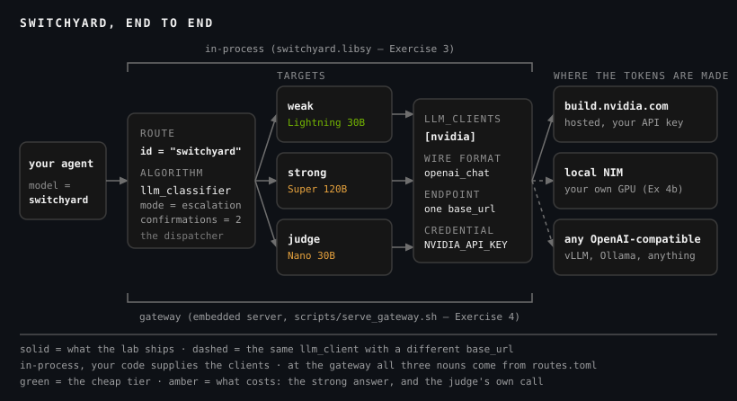

<div class="dx-hero" data-eyebrow="MODULE 08 / 03 - MEET NEMO SWITCHYARD" data-title="Three nouns and a config file." data-sub="NVIDIA's open-source router - embed it in your process, or stand it in front of your models. Either way, the routing decision stops being logic you write." data-meta="LICENSE::Apache-2.0|SURFACES::library, gateway, launcher|TESTED::0.2.0"></div>

Five algorithm families, one open-source implementation. [NeMo Switchyard](https://github.com/NVIDIA-NeMo/Switchyard) is Apache-2.0, it shipped alongside Nemotron 3.5 Lightning — the model your lab uses as its efficient tier — and it's what the rest of this module runs on.

It comes in three sizes: same routing core, three places to put it.

<div class="dx-bento dx-reveal">
  <div class="dx-cell"><h4>THE LIBRARY</h4><b>switchyard.libsy</b> - build targets and an algorithm in your own process. The router decides; your code still owns the call. <b>Exercise 3.</b></div>
  <div class="dx-cell is-wide"><h4>THE GATEWAY</h4>An OpenAI-compatible server in front of your app: your agent asks for the model <b>switchyard</b> and the yard picks the locomotive. It ships <i>inside</i> the Python package - no separate binary to install - and <b>scripts/serve_gateway.sh</b> starts it. <b>Exercise 4.</b></div>
  <div class="dx-cell"><h4>THE LAUNCHER</h4><b>switchyard launch claude</b> (or codex, or openclaw) starts a harness already pointed at a router - the harnesses you toured last module.</div>
</div>

<!-- fold:break -->

## Two Placements, One Core



Read it left to right and the product is one pipeline: your agent names a **route**, the route's algorithm picks a **target**, the target names the **client** that carries the call, and the client points at whoever actually makes the tokens.

The two brackets are the only real decision. **In-process**, you construct the targets and the algorithm in Python and hand each target a client object you wrote; libsy takes the decision and your code makes the HTTP call. **At the gateway**, those same three nouns come out of a `routes.toml` and your application sends exactly one string — a model id. It never has to choose which model answers; the yard does.

The algorithm drawn inside the core is the gateway's, from Exercise 4. Exercise 3 runs the same in-process placement with `stage_router` and two targets — no judge, and no router tax.


Both placements run the same routing core; what differs is who owns the transport, and how the decision comes back: the library reports the **target name** you chose (`weak`), while the gateway reports the **upstream model id**, on the standard `model` field of the response. The lab prints both.

<!-- fold:break -->

## The Three Nouns

In dependency order, because that's how you fill them in:

- **`llm_clients`** — *where requests go*: an endpoint, the wire format to speak to it, and the **name** of the environment variable holding the key.
- **`targets`** — *which model*: an upstream model id on one of those clients, under a short name you pick.
- **`routes`** — *what your app asks for*: a public model id, plus the algorithm that chooses among targets.

Here's this module's entire routing policy — the file you complete in Exercise 4, shipped there as a commented skeleton, shown finished:

```toml
schema_version = 1

# --------------------------------------------------------------- llm_clients --
[llm_clients.nvidia]
format = "openai_chat"
base_url = "https://integrate.api.nvidia.com/v1"
api_key_env = "NVIDIA_API_KEY"          # read from the environment of the serving process

# ------------------------------------------------------------------- targets --

# The judge — the model that reads each turn and decides whether the run is in trouble.
#
# TRAP 1 (its own model id). The judge cannot reuse the weak target's model id: two
# targets sharing an id on one llm_client are deduplicated, one is dropped, and the
# tier split silently collapses — every request lands on `strong` while /v1/stats
# reports no tiers at all. Give it a distinct id (here: Nano), or a second llm_client.
#
# TRAP 2 (it must not think). With thinking on, the judge spends its whole verdict
# budget deliberating, never emits the required JSON, and the router does not raise —
# it quietly falls through to `strong`. Both traps look like a healthy router and bill
# like a frontier-only one. See docs/specs/switchyard-api-notes.md, Deviations 5 and 6.
[targets.judge]
id = "nvidia/nemotron-3-nano-30b-a3b"
llm_client = "nvidia"
extra_body = { chat_template_kwargs = { thinking = false } }

[targets.weak]
id = "nvidia/nemotron-3.5-lightning-30b-a3b"
llm_client = "nvidia"

[targets.strong]
id = "nvidia/nemotron-3-super-120b-a12b"
llm_client = "nvidia"

# -------------------------------------------------------------------- routes --
# `id` is the public model id: what your app puts in `model`. It never changes when
# the policy underneath it does — that is the whole point of the gateway.
[routes.switchyard]
id = "switchyard"
type = "llm_classifier"
mode = "escalation"
classifier_target = "judge"
weak_target = "weak"
strong_target = "strong"
# Every session starts on `weak`. The judge watches the trajectory and only moves to
# `strong` after this many consecutive escalate verdicts — and the move is one-way for
# the rest of the session. One bad turn is noise; two in a row is a pattern.
escalation = { confirmations = 2 }
```

**`schema_version`** declares the config dialect; 0.2.0 speaks `1`.

**`[llm_clients.nvidia]`** is one endpoint described three ways: the dialect to speak (`format`), where (`base_url`), and the **name** of the variable holding the key — never the key. The serving process reads it at startup, which is why you export your key in the terminal you start the gateway from.

**Three targets, not two.** `weak` and `strong` are the pool from Exercise 1; `judge` is the model the algorithm consults before it picks. The two comments above it are this module's most expensive lessons, both found by running the thing:

- **The judge needs its own model id.** Two targets naming the same model on the same client get deduplicated — one is dropped, and the tier split collapses: every request lands on `strong` while the gateway's `/v1/stats` reports no tiers at all.
- **The judge must not think.** `extra_body` merges arbitrary keys into the upstream request; here it switches the reasoning template off. Leave it on and the judge burns its whole verdict budget deliberating, never emits the JSON the classifier asked for — and the classifier doesn't raise. It falls through to `strong`.

Both failures look like a healthy router and bill like a frontier-only one. That's the shape of most routing bugs worth knowing: not an exception, a bill.

**`[routes.switchyard]`** is the only part your application ever sees. `id` is the public model id — the string your agent puts in `model` — and it doesn't change when the policy under it does. `mode = "escalation"` starts every session on `weak`, and `escalation = { confirmations = 2 }` promotes it to `strong` after two consecutive escalate verdicts: one way, for the rest of that session.

The shipped file carries one more block, commented out — Exercise 4b's GPU path. It adds a second `llm_clients` entry for a local NIM (no `api_key_env`: it's your GPU, not a vendor's) and re-points `targets.weak` at it. Same route id, same algorithm, same agent; the tokens are just made somewhere else.

Notice what isn't in that file: your application. Routing logic is separated from the providers behind it, so a model, a provider, or the whole algorithm changes without rebuilding anything upstream — Module 7's decouple-the-layer lesson, one floor down. It's also what makes a frontier/open portfolio **governable**: open models improve every month, and *"should we rebalance the mix?"* becomes a `routes.toml` edit plus an eval run, not a migration.

<!-- fold:break -->

## The Gateway Is Also An Adapter

<div class="dx-island dx-reveal">
  <p class="dx-island-title">ONE ROUTER, MANY DIALECTS</p>

The server accepts **OpenAI Chat**, **Anthropic Messages**, and **OpenAI Responses** requests, normalizes them into one internal shape, and speaks whatever dialect each `llm_client` declares on the way out. Inbound and outbound are independent — an Anthropic-shaped client can be served from an OpenAI-compatible endpoint, and the other way around.

And that endpoint can be anything that speaks the protocol: a hosted NIM on build.nvidia.com, a NIM on your own GPU, vLLM, Ollama, any OpenAI-compatible server. A router that reaches exactly one vendor isn't managing a portfolio — it's a client library.

</div>

<details class="dx-peek">
<summary>Optional: put a closed frontier model in the pool</summary>

Nothing in this module needs this — the whole lab runs on one `NVIDIA_API_KEY`, and Nemotron Super 120B plays the frontier role. But `anthropic_messages` is a first-class client format, so a closed model joins the pool as **config, not code**. With your own key exported as `ANTHROPIC_API_KEY`:

```toml
[llm_clients.anthropic]
format = "anthropic_messages"
base_url = "https://api.anthropic.com/v1"
api_key_env = "ANTHROPIC_API_KEY"

[targets.strong]
id = "..."                 # the Claude model id your key can reach
llm_client = "anthropic"
```

`[routes.switchyard]` doesn't move and neither does your agent — `targets.strong` just resolves somewhere else. It's the two-line version of the Exercise 1 stand-in aside: same routing logic, same economics, a wider price gap. Your key, your bill, and the one thing on this page the workshop's smoke test doesn't cover.

</details>

<!-- fold:break -->

## Where It Sits

Switchyard is the dispatcher in a stack you've used all workshop: **Nemotron** models to route *to*, **NIM** to serve them wherever you want them served, and NVIDIA's inference layer under both. The router doesn't serve models and the serving stack doesn't pick them.

At launch NVIDIA named who was already building on it: **LiteLLM** adding it as a plug-in to its proxy layer, **Kong** delivering it natively through Kong AI Gateway, **Cognition** running the staged router inside Devin Desktop, **LangChain** publishing the 145-task routing evaluation this module keeps quoting, and Nous Research wiring it into **Hermes** — the harness you toured in Module 7 — as an easy-to-configure routing system ([NVIDIA's launch post](https://blogs.nvidia.com/blog/nemotron-lightning-switchyard-rtx-dgx/)).

Read that as direction, not as a shopping list. Some of it is announced-and-arriving: there's no LangChain or LiteLLM Switchyard middleware to `pip install` today, and searching PyPI for "switchyard" turns up two unrelated projects that will install happily and teach you nothing. The package this module pins is **`nemo-switchyard`**, installed by `scripts/install_switchyard.sh`; the lab's in-process path is `switchyard.libsy`, reached through the module's own `switchyard_shim.py`.

<div class="dx-aside">
<button class="dx-aside-btn" popovertarget="aside-meetsy-1">Version-stamped: this module was built against Switchyard 0.2.0</button>
<div id="aside-meetsy-1" popover class="dx-aside-panel">
<button class="dx-aside-x" popovertarget="aside-meetsy-1" popovertargetaction="hide" aria-label="Close">×</button>

This module was built and tested against **Switchyard 0.2.0**, pinned in the lab, so everything here runs as printed. Switchyard is young and moving fast: the concepts on this page are stable, but exact imports and flags may differ in the latest release — the [docs](https://github.com/NVIDIA-NeMo/Switchyard) are the source of truth.

Module 7 said the same thing about harnesses, for the same reason: **a layer moving this fast is evidence of the thesis, not a caveat to hide.** Routing is where the industry is currently doing its thinking, and nobody churns a solved problem.

One specific, so it doesn't cost you an afternoon: the published package needs **Python 3.12 or newer**, even though the upstream README still prints a 3.10 install line that can't resolve.

</div>
</div>

<!-- fold:break -->

## What It Bought Somebody Else

<div class="dx-island dx-bet" data-answer="~28% lower mean cost per run" data-explain="Cognition ran a Switchyard staged router in Devin Desktop and measured it on FrontierCode Main: 50.6% accuracy at $3.11 mean cost per run, about 28% below the frontier-only baseline and within 2.8 accuracy points of it. Two numbers, two denominators - the 28% is cost per run against that baseline, the 50.6% is an absolute score on the benchmark.">
  <p class="dx-island-title">PLACE YOUR BET</p>
  <p class="dx-quiz-q">Cognition put a Switchyard staged router inside Devin Desktop and measured it on its own production-coding benchmark. How much did the routed mix cut mean cost per run, against sending every request to the frontier model?</p>
  <div class="dx-bet-opts">
    <button class="dx-bet-opt">~5%</button>
    <button class="dx-bet-opt">~15%</button>
    <button class="dx-bet-opt">~28%</button>
    <button class="dx-bet-opt">~70%</button>
  </div>
</div>

<!-- CALIBRATE: Cognition's FrontierCode Main figures as published in NVIDIA's launch coverage
     (2026-08-11): 50.6% accuracy at $3.11 mean cost per run, ~28% below the frontier-only
     baseline, within 2.8 accuracy POINTS of it, routing between Opus 5 and Kimi K2.7.
     DENOMINATORS: the 28% and the $3.11 are cost PER RUN measured against the frontier-only
     baseline; the 50.6% is an ABSOLUTE accuracy on that benchmark - never a fraction of the
     baseline. Re-verify both against the source at the calibration pass. -->

<div class="dx-island dx-reveal">
  <p class="dx-island-title">TWO NUMBERS, TWO DENOMINATORS</p>

**50.6% is an accuracy** — the routed run's absolute score on FrontierCode Main, Cognition's own benchmark of production-grade coding tasks, landing **within 2.8 accuracy points** of the frontier-only baseline. It is not 50.6% *of* that baseline. **~28% is a cost** — mean spend per run against that same baseline, at $3.11 a run.

And it routed between Opus 5 and Kimi K2.7 — neither of them NVIDIA's. The dispatcher doesn't care whose locomotives are in the yard.

</div>

Two numbers, two denominators, both stated. That's the discipline you'll owe your own results in Exercise 5.

<div class="dx-island dx-quiz">
  <p class="dx-island-title">CHECK YOUR UNDERSTANDING</p>
  <p class="dx-quiz-q">Your <code>routes.toml</code> gives the judge the same model id as the weak target, on the same client. What happens?</p>
  <button class="dx-quiz-opt" data-fb="It starts fine. That is the problem - the gateway logs one warning and serves happily.">The gateway refuses to start</button>
  <button class="dx-quiz-opt" data-right data-fb="The duplicate is deduplicated on (client, model id), one target is dropped, and the router loses the tier it was going to name. Looks healthy, bills like frontier-only.">Routing silently collapses onto the strong target</button>
  <button class="dx-quiz-opt" data-fb="Nothing is shared. Dedupe happens when the config loads, and it costs you a target.">Both targets share one connection - a small optimization</button>
  <button class="dx-quiz-opt" data-fb="The opposite. When a verdict is missing the router falls through to the strong target - failing up is the safe default.">Everything routes weak, since the judge picks itself</button>
</div>

> You've seen the three nouns and the two placements. Time to fill them in yourself — five exercises, one meter, and a client that comes alive as you go. Head to [The Routing Lab](routing_lab).
