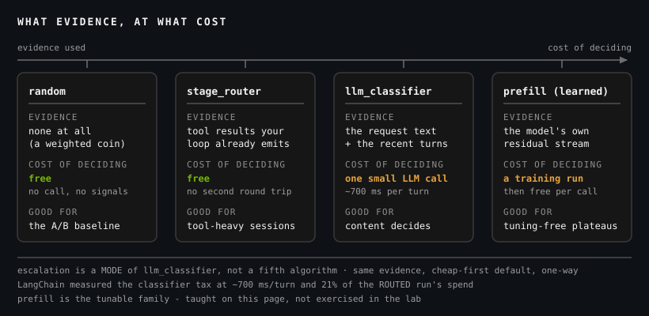

A router is a decision, and every decision runs on evidence. That's the whole taxonomy: the five families below differ mainly in *what they're allowed to look at* before they pick a model, and in what looking costs.

Some evidence is already lying around — the request text, the tool result that just came back, how the session has gone so far. Some has to be manufactured: a second model call to read the request, or a training run to learn what each model is genuinely good at. Sort the algorithms that way and the ecosystem stops being a list of names. The names in backticks are NeMo Switchyard's algorithm ids; you'll configure two of them by hand before this module is over.

Left to right, the evidence gets richer and the decision gets more expensive. Nothing in that ordering says *go right* — the cheapest decision that's good enough for your workload wins. That's why there are five and not one.

<!-- fold:break -->

## Nothing To Go On: Static Splits

The simplest router looks at nothing at all. `random` takes a list of targets and an optional weight for each, then flips a weighted coin — 70% of requests to the efficient model, 30% to the frontier one — regardless of what anybody asked for.

As a production strategy that's mostly indefensible. As an *instrument* it's the most useful thing on this page. A weighted split is an A/B test, and it settles the question every routing argument stalls on: is the cheap model actually worse **on my traffic**? Run 70/30 for a day and you've got two matched samples — same users, same task mix, different models — and a difference you can defend in a review. Module 3 taught you not to claim a result you didn't measure. Here's the routing version: **you can't credit the router if you never ran the split.**

Two degenerate cousins round out the family. `passthrough` sends everything to one target — a router that doesn't route, which is precisely what every agent you've built so far has been. `noop` doesn't even carry an upstream; it's the offline, config-only case. Both matter, because *no router* has to be a nameable, runnable configuration before it can be the control row on a scoreboard. Exercise 1 runs two `passthrough` configs for exactly that reason.

<!-- fold:break -->

## Reading The Request: `llm_classifier` (capability mode)

Now the router opens the envelope. In capability mode, `llm_classifier` hands the request to a small **judge** model, and the judge forecasts exactly one number: how likely the *efficient* model is to finish this whole task correctly. That score is compared against `base_threshold` — anything **below** it goes to the strong target, and everything above rides the cheap one.

Which way the dial points is the part people get backwards. `base_threshold` isn't a magic number somebody tuned for you; it's a **policy dial** that sets how much confidence you demand before you trust the cheap model. Raise it and you're demanding more, so more traffic escalates: you spend more, you fail less. Lower it and you save more, and drop more tasks on the floor. It's the dial you'd sweep to trace the cost-accuracy frontier on your own workload.

Two more knobs exist because a classifier that re-decides every turn is its own failure mode. `session_affinity` pins a session to the tier it started on, so the agent doesn't flap between brains mid-conversation. `message_hash_fallback` is its backstop for clients that send no session id: hash the conversation prefix and pin on that instead — it needs `session_affinity` switched on, and the SDK rejects it without one. Both are cheap insurance against the thing content routing does worst: changing its mind. And when the judge comes back with nothing usable, the classifier doesn't invent a verdict — it **abstains**, and the request falls through to the default tier. Served, not errored.

And then there's the bill. **The judge is itself an LLM call**, on every turn, before any work happens. That's the **router tax** — Module 7's context tax pointed at dollars and milliseconds instead of tokens: before you adopt a mechanism, measure the permanent per-turn overhead it adds.

<!-- CALIBRATE: ~700 ms/turn and 21% are LangChain's published router-tax measurements from its
     145-task deep-agent routing benchmark (measured Aug 2026). DENOMINATOR for the 21% is the
     ROUTED configuration's own total spend - not the frontier-only baseline, and not a token
     share. Re-verify against the source post at the calibration pass. -->
<!-- CALIBRATE: ~2-5% is this module's own Exercise 2 classifier tax, as a share of the ROUTED
     12-task suite's total spend on the lab workload. Shape-only: the learner measures their own
     and it moves with answer length, model pricing, and task mix. -->

  
ROUTER TAX - THE CLASSIFIER'S SHARE OF THE ROUTED BILL

  

    
LangChain benchmark

21%

~700 ms/turn

    
this lab, Exercise 2

~2-5%

12-task suite

  

Same quantity, two workloads, bars to scale. Both percentages share one denominator: **the routed run's own total spend** — what the judge cost, out of everything that run cost. LangChain's judge read long multi-step trajectories across [145 tasks](https://www.langchain.com/blog/switchyard-agent-routing-benchmark) and added roughly **700 ms to every turn**; this lab's judge reads one short prompt and replies with a single token, against work that's cheap to begin with. Router tax is a *ratio*, so it swings with how expensive the work underneath it is.

None of that argues for skipping content routing. It argues for putting the tax **on the receipt**. In Exercise 2 you'll write this classifier by hand, bill its call to the same meter as the work, and print the tax as its own line — because a router that hides what it costs isn't measuring, it's marketing.

<!-- fold:break -->

## Reading The Trajectory: `stage_router`

There's a whole class of evidence you're already producing and throwing away. An agent loop emits tool calls and tool results every turn, and that stream says a lot about where the agent *is* — still exploring, or deep in an implementation that's started to bite. The scorer reads the tool-result *text*, not just the count: a run that starts failing — errors piling up across turns — is what flips it to the capable tier, while a clean run rides the efficient one no matter how long it gets. `stage_router` scores that recent trajectory and picks the tier — with no second model call, because the signals were already in the request.

You built the source of those signals last module. The Module 7 minimal harness — a model, four tools, and a loop that appends `ToolMessage`s and goes around again — is exactly the thing a stage router reads. Two knobs govern it: `picker` sets which tier is the default (`efficient_first` or `capable_first`), and `confidence_threshold` sets how sure the scorer has to be before it leaves that default.

The economics are why this family is the workshop's favourite. Zero router tax, no added latency, no second round trip — the decision is free because the evidence was free. The trade is that it reads *behaviour* rather than meaning: a genuinely hard question asked in one short turn with no tool history looks identical to an easy one. Long, tool-heavy sessions are where it earns its keep — the exact shape of the agents you've built since Module 5.

<!-- fold:break -->

## Start Cheap, Escalate: `llm_classifier` with `mode="escalation"`

Same algorithm, different default. In escalation mode every session **starts on the weak target** and only moves up when the trajectory keeps saying it should. `confirmations` is how many consecutive escalate verdicts that takes — the config you'll write in Exercise 4 uses `confirmations = 2` — and the move is **one-way**: once a session escalates, it stays escalated for the rest of the session.

Both halves earn their place. Requiring two in a row filters noise: one confused turn is a bad sentence, two in a row is a pattern. Never de-escalating avoids the pathology where a session that genuinely needed the strong model gets demoted the moment things look calm, and immediately falls over again.

The analogy that sticks: **a junior engineer with a senior on call.** The junior takes every ticket. If two consecutive turns go badly, the senior takes the ticket over — and doesn't hand it back halfway through.

One constraint is worth stating plainly, because it's easy to demo wrong: escalation needs **multi-turn trajectories** to read. Fire single-shot prompts at it and it never escalates — correctly, and unhelpfully. That's why Exercise 4's gateway task is deliberately two-phase: it gives the confirmations something to accumulate on, and you watch the second one land.

<!-- fold:break -->

## Reading The Model Itself: Learned Routers

The four families above are **tuning-free**. You configure them and they work on day one. The fifth one trains.

A **prefill router** doesn't read your request as text at all. It runs the prompt through the model's prefill pass and reads the **residual stream** — the model's own internal activations — and a small trained head predicts, per target, how likely that model is to succeed on this input. That's the richest evidence anywhere on this page, and at inference time the decision is nearly free. What isn't free is getting there: you need labelled outcomes from your own workload and a training run to fit the head.

You've made this call before, one level down. Module 4 asked when to stop prompting a model and start training it, and the answer was: when tuning-free approaches plateau on *your* task and you have the data to prove it. **Learned routing is the same decision, one level up.** When tuning-free routing plateaus on your workload, you train the router — and your GRPO experience is exactly the right muscle for it. This page teaches the family; the lab doesn't run it, because a training run doesn't fit in a 95-minute session.

<!-- fold:break -->

## Who MAY Answer vs Who SHOULD

Module 6 already handed you something called a router, and it decides something else entirely. These two get conflated more than anything else in the workshop, so let's be exact.

  
<h4>POLICY ROUTING - MODULE 6</h4>Who <b>may</b> answer. The operator picks one inference backend per gateway; the gateway strips sandbox credentials and injects host-side ones. It never reads the request.

  
<h4>PERFORMANCE ROUTING - MODULE 8</h4>Who <b>should</b> answer. A judge or a signal scorer reads each request and picks the cheapest target that can handle it. It never decides what is permitted.

NemoClaw's **Privacy Router** is an operator-chosen, credential-isolating HTTP forwarder, set with `openshell inference set`. It does **not** inspect content — it doesn't classify requests and it doesn't pick a model per query. The "keep sensitive data private" line gets misread that way constantly, and Module 6 spends a whole exercise correcting it: content-aware routing is something you build *in front of* that gateway.

Module 8's `llm_classifier` **is** that content classification — a judge model reading each request and choosing a target on what it finds there. Same English word, opposite mechanisms, which is why this gets a section instead of a footnote.

They compose, and in a hardened deployment both are on. Policy sits outside: the operator decides which backends are reachable at all and holds the keys. Performance sits inside: within the reachable set, Switchyard picks the cheapest model that can do this call. Neither substitutes for the other — a performance router will happily route to a backend your compliance team never approved, and a policy gateway will happily spend frontier money converting 2 hours into minutes.

<!-- fold:break -->

## Specialists Change The Game

Everything above quietly assumed the pool is weak-versus-strong generalists. It doesn't have to be.

<!-- CALIBRATE: Boomi's published figures - 100% accuracy on their domain-routing decisions,
     59% of their production traffic served by the fine-tuned model, ~5x faster than the
     model it replaced on that traffic. Cited + dated; re-verify at the calibration pass. -->

Boomi reports **100% accuracy on its domain-routing decisions** while sending **59% of its production traffic** to a **5× faster fine-tuned model** ([Boomi, *Why Open Model Routing Matters*](https://boomi.com/blog/why-open-model-routing-matters/)). Read the middle number twice. The efficient target wasn't a smaller general model giving up quality — it was a model *customized for their domain*, which on their traffic is both faster and better. Routing to it isn't a compromise; it's an upgrade that happens to be cheaper.

That completes an argument Module 4 started. Fine-tuning always had a capability case; what it lacked was an economic one, because "we trained a specialist" doesn't pay for itself if you still send every call to the generalist. Routing is the missing half: **customize small, then route to it.** The specialist earns back its training run on the traffic it handles better *and* cheaper, and the generalist stays on call for the rest.

Which is where the module's thesis stops being abstract: you can only own a specialist if you can own the weights. That's what open models make possible, and it's what your Module 4 GRPO run produced. Teams routing only between other people's frontier APIs are picking from a menu; the open side of the portfolio is the part you get to shape.

  
CHECK YOUR UNDERSTANDING

  
Your agent does long tool-heavy sessions and you can't afford an extra LLM call per turn — which algorithm?

  <button class="dx-quiz-opt" data-fb="Reads content well, but that's an extra LLM call every turn.">llm_classifier</button>
  <button class="dx-quiz-opt" data-right data-fb="Routes on tool signals you already produce - no classifier call, no tax.">stage_router</button>
  <button class="dx-quiz-opt" data-fb="A baseline, not a decision.">random</button>
  <button class="dx-quiz-opt" data-fb="That's not routing at all.">passthrough</button>

> You've met the algorithms. Now meet the library that implements them — and the gateway that turns your model choice into a config file. Head to [Meet NeMo Switchyard](meet_switchyard).
